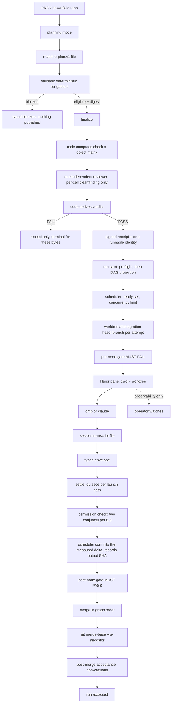

# MAESTRO — Architecture and Implementation Plan

**Baseline:** Maestro at `de31374882e7a4e3e5b7bb9bd09e69dc2f779356`, byte-identical to upstream `disler/super-simple-software-factory`. The Strav repository is read-only evidence throughout; no code is ported from it.

**Mode:** architecture only. This document is the sole repository file produced by this session.

**Scope:** Slice 1 is one canonical plan finalized once; a DAG whose independent ready nodes execute concurrently; each node attempt isolated in its own git worktree; **each agent node launched in a visible Herdr pane via omp or Claude**; deterministic merge with ancestry proof; and typed envelopes, gates, and a SQLite lifecycle store. Additional routes are decided later by measurement.

**Status, stated plainly:** the architecture has been through fifteen review rounds, R1 through R15 — adversarial passes alternating with repair rounds, closing with an independent-model-family read-only verification pass — and **no pass has been clean**, which is what its own stability rule counts. R2 produced fourteen P0 findings, all resolved. R3 attacked those resolutions together with a late corpus sweep: it confirmed eight P0s, refuted two, dissolved three by supplying a missing definition, and found a merge deadlock nothing else had. R4 attacked R3's fixes and found three P0s the fixes themselves had introduced, plus three stale paragraphs. A verification pass then attacked R4's fixes and found no P0s and six smaller defects, all repaired. R5 and R6 landed the measurement bracket and its quiesce machinery. R7 attacked them and found one P0 — the liveness backstop declaring a healthy run `STUCK` while a long integration gate ran silently — which R8 repaired by giving the gate its own timeout. R9 attacked R8's repairs and found the identical defect one execution step over — the untimed union of merged specs inside the same final acceptance — plus three P1s in the same fixes. R10 closed that recurring shape generally, with a single silence rule bounding every long-running execution window (§11.2), rather than patching its third instance. R11 attacked R10's fixes and returned zero P0s — the first zero-P0 adversarial pass — with the first clean consistency sweep this document has had; it confirmed the silence rule genuinely general over run execution, and convicted two P1s at its edges: plan finalization's reviewer sat outside every window (the corpus's own B14 shape), and the survivor fail-closed chain left the staging-to-commit interval open. R12 closed both — the finalization window as the silence rule's third instance (§6.5, §11.2), and a commit built from a harness-private index with the attempt ref advanced by compare-and-swap and the merge consuming the SHA (§8.4, §8.6) — together with R11's five P2s. R13 attacked R12's repairs and found one P0 inside them: the private-index commit leaves the worktree's own index stale, so the cleanliness evaluations and cleanup convict every honest non-empty node — a regression R12's own verification had certified "deliberately unchanged". It also found two P1s the silence rule's rescope does not cover — the gate-executability collection executing the runner's collector at plan time outside every window, and the finalization launch path running before the window opens — and two P2s. R14 repaired the P0 with a one-call refresh of the worktree index from the committed tree after the compare-and-swap (§8.4), leaving the private-index closure intact, registered the four remaining findings as §16.3 items 32–35 rather than fixing them, and narrowed §11.2's generality claim to match. R15 was then run read-only against the frozen document by a reviewer from a different model family than every prior round — the first review this document has had outside the one-family evidence problem item 4 exists to track — and returned one P1: §8.3's post-commit cleanliness check convicts an attempt over baseline-present untracked content that provision or the pre-gate created, contradicting §13.3's own required negative control. It is registered as §16.3 item 36 rather than repaired. R15's coverage was not demonstrated, and §16.3 item 37 records that limitation rather than reading its single finding as evidence that the rest of the document is clean.

The P0 curve across the adversarial passes — fourteen, eight, three, zero, then one (R7), one (R9), zero (R11), one (R13), and zero at R15 with one P1 — fell fast, touched zero once, returned to one with a regression a repair round introduced into its own fix, and returned to zero on a pass whose coverage was not demonstrated: a falling curve is not a converged one, and a zero-P0 pass is not a clean pass — R11's zero still convicted two P1s, R13's P0 sat inside R12's repair of one of them, and R15's zero came with a P1 on §8.3's baseline-versus-cleanliness surface, which every prior round reviewed in one wording or another without convicting it. **R14's fixes have had exactly one pass over them — R15, read-only, from a different model family — and that pass's coverage was not demonstrated (§16.3 item 37), so they cannot be called attacked**, and every round so far has found real defects in the previous round's repairs, so the honest expectation is that the next pass finds something. Stability requires two *consecutive clean* passes; the count of clean passes is zero. Nothing here is presented as proven that has not been proven.

The unproven surface is listed in **two** places, and neither is complete on its own: §16.3 holds forty predicates — the eight known when it was written, three that R3 could not close inside Slice 1, four that R4 added or exposed, one recording that a round of fixes was itself unattacked, thirteen registered after the seventh pass recording what it found and the eighth knowingly left unfixed, one registered by R10 for a receipt four sections cite that §9.8 never registers, one registered by R12 recording that the silence rule's enforcement is review rather than mechanism, four registered by R14 from R13's adversarial pass — two plan-time silence-rule gaps R14 was not scoped to fix, and two P2s — two registered after R15, its single P1 and the undemonstrated coverage of the pass that found it — and three registered directly from execution rather than from any adversarial round: a cross-process residual `Run.save_agent_map`'s in-process fix does not reach, the undecidable remainder of node-gate scope a two-node composition probe exposed, and a count §10.2's own conjunction parsed and never consulted — of which items 18, 23, 27, and 28 now stand discharged and are retained as records rather than removed, per the register's own convention. Per item 23's rule, these counts are derived from §17's dated additions and §16.3's numbering, never restated by hand from memory. §16.5 holds the independent corpus sweep's nineteen gaps with their R3 adjudication of the fourteen P0s, together with the adjudication of its five P1 items — of which four are closed or reduced to a one-line fix and one, oversized-plan splitting, is bounded rather than closed. The two lists are deliberately not merged: §16.3 records what the design knew it had not proven, and §16.5 records what an independent pass found it had not noticed. Collapsing them would erase that distinction, which is itself evidence about how this design was produced.

---

## 1. Acceptance predicate

Slice 1 is: one canonical plan, finalized once; a DAG whose independent ready nodes execute concurrently; each node attempt in its own git worktree; **each agent node launched in a visible Herdr pane** via omp or Claude; deterministic merge with ancestry proof; typed envelopes, gates, and a SQLite lifecycle store.

No criterion below is satisfied by prose, by a file existing, by an agent's self-report, or by a mock disconnected from the seam it stands for.

### 1.1 Success — all must hold simultaneously

1. **The golden offline scenario passes by execution** (§13.1), against a fixture git repository with a fake Herdr adapter. Exit zero, and the run's own trace shows the expected terminal state.
2. **Independent ready nodes demonstrably overlap in wall-clock time** — the barrier test (§13.2), which cannot pass under serial execution and cannot pass by luck, plus its two controls.
3. **Every agent node ran in a visible Herdr pane whose working directory equals that node attempt's worktree path**, proven from the durable correlation record, not from pane text.
4. **Every merged node carries a complete evidence chain, scoped to its node kind** (§7.3). Every merged **agent** node: typed envelope, attempt row, pane correlation, worktree path, output commit SHA, a pre-node gate result that FAILED, a post-node gate result that PASSED, a permission-check result over the measured inventory delta (§8.3), and a git ancestry proof against the integration head. Every merged **code** node: attempt row, worktree path, output commit SHA, a recorded zero exit, its declared-expectation result, the same permission-check result, and the same ancestry proof — a code node has no gate, no `min_cases`, and no pane, so demanding gate rows or a pane correlation of it would re-create the unscoped-`VERIFIED` defect §7.3 exists to prevent.
5. **Every negative in §13.3 goes red and its named control stays green.** A row missing either half is an unproven predicate (§16.3), not a satisfied one.
6. **Every executed detector convicts its planted violation and acquits the real tree** — one test, two assertions (§13.4).
7. **Every ledger row marked `enforced` names a pytest node that exists** in `pytest --collect-only`, and one full mutation audit has been executed and recorded.
8. **The write budget holds, counted from the golden run's own trace**: ≤3 authority writes and ≤2 audit writes per transition, reported as two counts and never summed (§7.9).
9. **Both routes have execution receipts** (§12.2 step 8). A route that is budgeted but never run is not admitted.
10. **Installed-bytes and verb-existence tests pass**, and no document carries a superseded normative body.

### 1.2 Failure — any one, not a caveat

- The golden scenario passes only because a mock stands in for a seam Slice 1 must prove.
- A negative's red test still passes with its mutation applied — the wiring is inert.
- A detector has never been shown to convict a planted violation.
- Concurrency is claimed but the barrier test would also pass at `concurrency=1`.
- A node reaches `MERGED` without `git merge-base --is-ancestor` exiting zero.
- **Any lifecycle transition is caused by pane text, prompt text, a free-text envelope field, or an agent's claim about its own work.**
- Replay of a finalized digest performs a second review or publishes a second identity.
- Production lines exceed the Slice-1 cap, or concepts exceed 13.

### 1.3 What this predicate does not claim

- It does not claim **launcher generality**. omp is a fork of pi — same lineage, same argv surface, same event schema — so omp alone proves one family. **Claude is the genuine second implementation**, and until its receipts land the adapter contract is provisional.
- It does not claim `pi` compatibility is execution-proven. `pi` is not installed here; a golden-fixture contract test is the only available proof (§16.3).
- It does not claim the transcript-tailing mechanism works for every route. Step 0 has been run for **both** omp and Claude (§9.4): records always parse — zero unparseable lines across both probes — but the transcript is turn-granular and does not stream, so liveness was moved to process state (§7.6). What is still unproven is not the transcript contract but the **envelope-to-gate loop for Claude**, which has never produced an envelope that drove a gate (§16.3 item 4).

---

---

## 2. SSSF/Maestro baseline map

### 2.1 Repository state

Maestro is byte-identical to upstream SSSF at commit `de31374882e7a4e3e5b7bb9bd09e69dc2f779356`. That commit is HEAD, subject "🚀", and it is the sole commit on `main` — a root commit with no parent. Both `origin/main` and `upstream/main` point at the same SHA, which is the direct substantiation of "identical to upstream" (re-verified in this audit pass via `git for-each-ref`; the repository also carries an unrelated `origin/example` / `upstream/example` branch at a separate root commit `b2dcb8e`, which is not an ancestor of `main` and contributes nothing to the working tree). `git diff de31374 --stat` returns empty — zero tracked-file changes since that commit. `git status --short --branch` shows only untracked, non-code additions (`.cbmignore`, `.omc/`, `FABLE prompt.md`, `maestro_prompt.md`), none of which touch `.claude/skills/sssf/**`. Everything documented in this section describes vendored upstream SSSF, not a Maestro-specific modification.

Citation convention for this section: all code file:line citations are against `.claude/skills/sssf/templates/adws/` at this commit. All `README.md` citations are against the **repository-root** `README.md` (431 lines) — there is no `README.md` inside `.claude/skills/sssf/`, a point worth stating explicitly because the source reports cite it without qualifying the path.

### 2.2 The spine — exact call chain

Every ADW workflow begins in an `adw_*.py` script's `main()` (e.g. `adw_simple_sdlc.py::main`, adw_simple_sdlc.py:61) and proceeds through the following call chain:

```
main()                                                    adw_simple_sdlc.py:61
  agents.load_config(config)                              agents.py::load_config, agents.py:33
  agents.validate(cfg, REQUIRED_AGENTS)                    agents.py::validate, agents.py:52 (fail-fast, pre-spawn)
  session.ensure(cfg, adw_id)                               session.py::ensure, session.py:38
    -> Tracer(db, events.jsonl)                             tracer.py::Tracer.__init__, tracer.py:103
    -> Run(cfg, adw_id, tracer, engineer)                    runner.py::Run.__init__, runner.py:43
    -> tracer.session_start(...)                             tracer.py::Tracer.session_start, tracer.py:139
    -> tracer.process_start(adw_id,"adw",...,os.getpid())    tracer.py::Tracer.process_start, tracer.py:174
    -> _finalize_when_killed(run)                            session.py::_finalize_when_killed, session.py:21 (SIGTERM/SIGINT handler)
  with run.phase(PhaseParams(...)) as ph:                    runner.py::Run.phase, runner.py:72 (@contextmanager)
     -> Phase(...) built, seq incremented, tracer.phase_upsert, EventRecord "phase_start", console.phase_started
     -> yields PhaseHandle(run, phase)                       runner.py::PhaseHandle, runner.py:22-39
     ph.call(AgentCall(...))                                 runner.py::PhaseHandle.call, runner.py:36
       -> agents.execute(run, phase, call)                   agents.py::execute, agents.py:78
       resolve(run.cfg, phase.params.owner)                  agents.py::resolve, agents.py:44
       prompts.render(system/user templates, variables)      prompts.py::render, prompts.py:8
       _agent_session_id(run, agent)                         agents.py::_agent_session_id, agents.py:228
       send(user_text) -> agent_pi.run(PiRequest,...)         agent_pi.py::run, agent_pi.py:208
       _parse_with_retries(...)                               agents.py::_parse_with_retries, agents.py:267
       for gate in call.gates: gate(envelope, run)             agents.py::execute (gate loop), agents.py:150
       permissions.enforce(run, phase, agent, tree_before)     agents.py:179 -> permissions.py::enforce, permissions.py:163
       _persist_envelope(...)                                  agents.py::_persist_envelope, agents.py:290
       tracer.agent_session_row / save_agent_map / events       agents.py:195-212
     phase.status = "success"/"fail" on context-manager exit    runner.py:88-111
  run.finish(accepted=<bool>, reason=...)                      runner.py::Run.finish, runner.py:114
```

Sequencing is 100% hardcoded straight-line Python: `with run.phase(...)`, `for i in range(1, N+1)`, and `if/break` statements written directly into each of the 12 `adw_*.py` scripts (count re-verified in this pass: `adw_build`, `adw_build_review`, `adw_build_test`, `adw_document`, `adw_plan`, `adw_plan_build`, `adw_plan_build_test`, `adw_plan_build_test_quality`, `adw_prompt`, `adw_quality`, `adw_scout`, `adw_simple_sdlc`). There is no scheduler and no declarative phase list consumed by an interpreter — each ADW file *is* the DAG, expressed as ordinary imperative Python. This was confirmed by reading `adw_simple_sdlc.py`, `adw_plan_build_test_quality.py`, `adw_scout.py`, `adw_prompt.py`, and `adw_quality.py` in full, and via codemap for the remaining seven, all of which follow the identical `with run.phase(...)` pattern with bounded `for i in range(1, MAX_*+1)` loops for fix/revise cycles.

### 2.3 The `run.phase` / `PhaseParams` contract

`PhaseParams` (data_types.py::PhaseParams, data_types.py:22-53) is a Pydantic model with the following fields:

| Field | Type | Default | Set by | Controls |
|---|---|---|---|---|
| `name` | str | required | ADW script author | Uniqueness within the run; feeds `phase_id = f"{adw_id}_{seq:02d}_{name}"` (runner.py::Run.phase, runner.py:75) |
| `kind` | `PhaseKind` (Literal `"engineer"`/`"agent"`/`"code"`) | required | ADW script author | Which capabilities `PhaseHandle` exposes — only `kind="agent"` may call `.call()` |
| `owner` | str | required | ADW script author | Which `AgentConfig`, engineer, or deterministic-code label the phase is attributed to |
| `description` | str | required | ADW script author | A `@field_validator` (data_types.py::PhaseParams._description_must_be_earned, data_types.py:31-53) rejects a blank description or one that merely restates `name`, at construction time |
| `retries` | int | `0` | ADW script author | Agent phases only — the gate-failure correction budget consumed in the gate loop (§2.5) |

`Run.phase(params)` (runner.py::Run.phase, runner.py:72, `@contextmanager`) increments `self._seq` (a counter that continues across joined sessions via `tracer.max_phase_seq`), builds a `Phase(phase_id=f"{adw_id}_{seq:02d}_{name}", status="running", started_at=now())` (runner.py:75-77), calls `tracer.phase_upsert(phase)`, records an `EventRecord(type="phase_start")`, and emits a `console.phase_started` line. It then yields a `PhaseHandle(run, phase)` — the only object the caller touches. On an exception raised inside the `with` block: `phase.status="fail"`, the error is recorded, `tracer.session_finish(ok=False)` is called, and the exception is **re-raised**, killing the whole ADW process — there is no catch-and-continue at the phase level. On clean exit, `phase.status="success"`.

`PhaseHandle` (runner.py::PhaseHandle, runner.py:22-39) exposes exactly two methods: `.log(**payload)`, which writes a `type="log"` `EventRecord` plus a console note (and, for `kind="engineer"` phases, also a `tracer.session_request` call), and `.call(AgentCall)`, which asserts `kind=="agent"` and delegates to `agents.execute`. This is the system's one execution primitive: every phase, regardless of `kind`, passes through the same context manager. `kind="code"` phases (e.g. `git_helper.commit_all`, `quality.run_tests`) run plain Python inside the `with` block and call `ph.log(...)` for tracing — there is no special-cased code path for deterministic work.

### 2.4 Typed envelopes

`data_types.py` (447 lines total) declares 31 Pydantic classes (both figures re-verified in this pass). `EnvelopeBase` (data_types.py::EnvelopeBase, data_types.py:72) — fields `status: Literal["success","fail"]`, `summary`, `artifacts: list[str]`, `notes_for_next_agent` — is the one typed door every agent's output must pass through, and exactly eight subclasses extend it for specific agent roles:

| Subclass | Added fields | Crosses seam |
|---|---|---|
| `GenericOutput` (data_types.py:81) | none | `adw_prompt.py` generic call |
| `PlanOutput` (data_types.py:85) | `commit_message` | planner -> git commit phase |
| `BuildOutput` (data_types.py:93) | `changed_files`, `commit_message` | builder -> reviewer/quality/git |
| `ScoutOutput` (data_types.py:103, with `ScoutFinding` at data_types.py:98) | `findings: list[ScoutFinding]` | scout -> report only |
| `ReviewOutput` (data_types.py:115, with `ReviewFinding` at data_types.py:107) | `approved`, `findings`, `blocking` | reviewer -> builder (revise) |
| `DocumentOutput` (data_types.py:123) | `document_path`, `documented_files`, `commit_message` | documenter -> git commit |
| `ChangesOutput` (data_types.py:222) | `base`, `changed_files`, `insertions`, `deletions`, `stat`, `diff_path` | code -> documenter's `previous` |
| `VerifyOutput` (data_types.py:237) | `passed`, `failures` | quality result -> builder's `previous` |

The deterministic, non-agent modules do not carry envelopes through their own logic. `changes.py` and `quality.py` each produce a plain result object — `ChangeSet` (data_types.py:205) and `QualityResult` (data_types.py:166) respectively — and construct an envelope only inside one dedicated boundary adapter, `quality.py::as_envelope` (quality.py:193) returning `VerifyOutput` and `changes.py::as_envelope` (changes.py:87) returning `ChangesOutput`, immediately before the result is handed to the next agent phase as `AgentCall.previous`. `git_helper.py` is stricter still: it imports no envelope type and has no `as_envelope` function at all (verified in this pass — none of its 17 functions references any `*Output` class). This adapter pattern is the seam through which deterministic code and agent phases interoperate via the same typed contract, without deterministic code ever needing its own envelope subclass.

Two further typed objects carry the actual pi wire traffic: `PiRequest` (data_types.py::PiRequest, data_types.py:373-385, 10 fields: `prompt`, `system_prompt`, `model`, `thinking`, `session_id`, `session_dir`, `raw_output_path`, `tools`, `extensions`, `cwd`) is constructed fresh on every `send()` call inside `agents.execute`'s closure (agents.py::execute.send, agents.py:112-137), with `session_id`/`session_dir` held constant across every retry within one phase. `PiResult` (data_types.py::PiResult, data_types.py:436-447) accumulates `text` (overwritten, not appended — last assistant message wins, agent_pi.py:266), `tokens`/`cost`/`usage: UsageBreakdown` (summed per turn), and `context_tokens` (overwritten only on a non-aborted/non-error turn, agent_pi.py:274-275) as the pi subprocess's JSONL stdout stream is consumed.

### 2.5 Gates

`gates.py` (108 lines) declares six predicate gates, each a `Callable[[EnvelopeBase, run], GateReport]`:

| Gate | Location | What it genuinely proves |
|---|---|---|
| `artifacts_exist` | gates.py::artifacts_exist, gates.py:27 | Every `envelope.artifacts` path exists on disk |
| `files_non_empty` | gates.py::files_non_empty, gates.py:36 | Those paths are non-zero-size |
| `json_parses` | gates.py::json_parses, gates.py:47 | `.json`-suffixed artifacts parse via `json.loads` |
| `diff_matches_claims` | gates.py::diff_matches_claims, gates.py:61 | Every `envelope.changed_files` path exists on disk |
| `verdict_consistent` | gates.py::verdict_consistent, gates.py:71 | A `ReviewOutput`'s `approved`/`blocking`/`findings` are internally self-consistent — no code review of actual quality, pure self-consistency of declared fields |
| `tests_pass(command)` | gates.py::tests_pass, gates.py:98 | A factory returning a gate that runs `subprocess.run(command, shell=True)` and checks for exit 0 |

`AgentCall.gates: list[Callable]` (data_types.py:294) is set by the ADW script at each `ph.call(...)` call site. Inside `agents.execute`'s retry loop (agents.py:148-173), every gate in the list is invoked on every attempt round; violations across all gates in the round are accumulated before deciding whether to retry, and every round — pass or fail — is persisted via `tracer.gate_row` (agents.py:153).

**The first five of these six gates — every gate except `tests_pass` — are real structural or self-consistency predicates.** The critical distinction that must not be blurred is that the deterministic command layer beneath them — `quality.py`'s test/lint/typecheck/build blocks — is placeholder by default. `quality.py::_placeholder` (quality.py:49-52) returns `["echo", f"PLACEHOLDER {name}: edit adws/adw_modules/quality.py and replace this echo with the real {name} command"]`, and all four quality blocks (`quality.py::test` at quality.py:138, `quality.py::lint` at quality.py:149, `quality.py::typecheck` at quality.py:158, `quality.py::build` at quality.py:167) call `_run(QualityCheckSpec(..., argv=_placeholder(name)))` with no real `argv` wired in. Because `_placeholder`'s `echo` subprocess always returns exit 0, `passed = returncode == 0` (quality.py::_run, quality.py:101) is always `True` out of the box. README.md:356 independently states the same fact, so there is no divergence between documentation and code here. This is not a defect of the gate mechanism itself — `artifacts_exist` and its siblings are real, mechanically-checkable predicates on agent envelopes — it is the deterministic `kind="code"` layer underneath the gates that ships inert.

This same limitation reaches `tests_pass(command)` directly: it is a pure exit-code check (`ok = result.returncode == 0`, gates.py::tests_pass.gate, gates.py:100-106) with no parsing of the test runner's own summary output — no regex for "0 passed," "no tests found," or a JUnit/TAP result count. Any test command that exits 0 when zero tests execute (a glob matching no files, a `--passWithNoTests`-style flag, a misconfigured path) passes this gate identically to a command that ran 500 tests and all passed. **`tests_pass` cannot detect a suite that executed zero tests**, and the identical gap exists one layer up in `quality.py`'s own `passed = returncode == 0` check (quality.py::_run, quality.py:101) — this is a systemic property of the whole quality/gate layer, not specific to one function.

### 2.6 Retries

Two independent, bounded, same-session retry loops both live inside `agents.execute` (agents.py:78-216), and both re-enter the same pi session via `--session-id` create-or-continue (agent_pi.py:222):

1. **JSON-parse retries** — `_parse_with_retries` (agents.py::_parse_with_retries, agents.py:267-287). Budget: `JSON_FIX_ATTEMPTS = 2` (agents.py:24), giving 3 total attempts (`range(1, JSON_FIX_ATTEMPTS+2)`). "Malformed" means: `_extract_json` (agents.py::_extract_json, agents.py:253) finds no `{...}` substring, `json.loads` raises, or `output_type.model_validate(payload)` raises a `ValidationError`. On a failure short of budget, `_persist_envelope(..., valid=False, raw=...)` logs the attempt, then `send(...)` issues a correction prompt in the same session giving only the required field **names** (no types, descriptions, or examples). Exhausted budget raises `RuntimeError`, which propagates out of `Run.phase` and fails the phase.
2. **Gate-correction retries** — agents.py:148-173. Budget: `phase.params.retries` (from `PhaseParams`, default `0`), giving `retries + 1` total rounds. Each failing round builds a correction string listing violations and calls `send(correction)`; the new response is itself run back through `_parse_with_retries`, so a gate-correction turn's response gets the JSON-parse budget nested inside it, not shared with it.

Both loops share the same `send(prompt_text)` closure (agents.py::execute.send, agents.py:112), which builds a fresh `PiRequest` on every call but keeps `session_id`/`session_dir` **constant across every retry within the phase** — a heavily-retried phase pays for every turn (tracked in `spent: UsageBreakdown`, merged at agents.py:135) while `latest`, the most recent `PiResult`, is what gets reported for context-window occupancy. There is no cross-phase retry and no session-level restart: a phase that exhausts its budget raises, and the `with` block re-raises, killing the ADW process. The ADW-script-level "bounded fix loop" (e.g. `for i in range(1, MAX_FIX_LOOPS+1)` in adw_simple_sdlc.py:97) is a separate, coarser mechanism — a whole new `ph.call` opens a fresh, distinctly traced phase per iteration — though because `_agent_session_id` (agents.py::_agent_session_id, agents.py:228) reuses the session id when the same agent+model reruns, even this "new phase" loop typically continues the same pi session across fix iterations.

### 2.7 Permissions

`permissions.py` (185 lines) enforces two explicitly separate axes, named as such in its module docstring:

- **`tools:`** (capability list, `AgentConfig`/`ConfigDefaults`) — passed to `pi --tools` (agent_pi.py:227). This governs what the agent is *allowed to invoke* and is enforced entirely by the pi CLI. It is not a security boundary: the module docstring states outright that `bash` can run anything and `write` can reach any path regardless of the `tools` list.
- **`writes:`** (write authority, `AgentConfig.writes: Optional[list[str]]`) — enforced entirely in pure Python, after the fact, never at invocation time.

The write-authority mechanism is detect-by-diff, not intercept-by-sandbox. `permissions.snapshot(run)` (permissions.py::snapshot, permissions.py:50-68) fingerprints the working tree before the agent runs — `git diff HEAD --numstat` for tracked-dirty files, `git ls-files --others --exclude-standard` for untracked ones. It is called once before `send()` (agents.py:142, `tree_before`) and again after all sends and gate loops complete (permissions.py::enforce, permissions.py:173, `after`). `changed_paths(before, after)` (permissions.py::changed_paths, permissions.py:71-74) computes the symmetric difference. `permitted(path, agent, cfg)` (permissions.py::permitted, permissions.py:127-135) checks, in order: the session runtime directory is always writable; then `agent.writes` glob matches (a custom matcher, `permissions.py::_glob`/`_matches`, permissions.py:77-107, where `*` stops at `/` and `**` crosses — not fnmatch semantics); then `cfg.defaults.protected_files` denies; then `agent.writes is None` (unrestricted) allows.

The breach path: `enforce()` (permissions.py::enforce, permissions.py:163-185) computes breaches as touched paths that are not `permitted`. On any breach, `_roll_back` (permissions.py::_roll_back, permissions.py:138-160) attempts recovery per breach — `git checkout -- path` for a reverted tracked file, `Path.unlink()` for a new untracked file, or a "REVERTED-BY-AGENT (uncommitted work lost, cannot restore)" outcome when the agent's own `git checkout` clobbered pre-existing dirty work. `enforce()` then raises `PermissionBreach` naming every path and its rollback outcome. This exception is caught nowhere inside `agents.execute` — it propagates like any other phase-failing exception. Critically, a breach is checked once per phase (after the gate loop, before envelope persistence) and is **deliberately not retry-correctable**: the module docstring states explicitly that a breach is not a gate violation and cannot be corrected by re-prompting, because the write has already happened.

### 2.8 Git behavior

`git_helper.py` (120 lines, 17 functions — both re-verified) never creates a worktree, never sets `--git-dir`/`--work-tree` to point elsewhere, and never targets any branch other than whatever HEAD currently is. `commit_all(message)` (git_helper.py::commit_all, git_helper.py:43-53) runs `git add -A` **unconditionally**, then `git commit -m message` if `git status --porcelain` is non-empty — it stages the entire working tree with no path scoping. `repo_root()` (git_helper.py::repo_root, git_helper.py:31-40) is the value every agent subprocess is spawned into as `cwd` (see §2.10). Two functions exist and are never called anywhere in the codebase: `create_branch(name)` (git_helper.py::create_branch, git_helper.py:20, `git checkout -b name`) and `current_branch()` (git_helper.py::current_branch, git_helper.py:16, `git rev-parse --abbrev-ref HEAD`). SSSF runs on the current branch by design — README.md:367 and README.md:390 independently state "this runs on your current branch... no sandbox, no branch per run, no merge step" as a documented, deliberate limitation, matching the code exactly.

### 2.9 SQLite tracer

`tracer.py` (271 lines) opens the database with `sqlite3.connect(db_path, isolation_level=None)` (tracer.py::Tracer.__init__, tracer.py:108) — autocommit mode, where every `.execute()` call is its own implicit transaction; there is no explicit `BEGIN`/`COMMIT` anywhere in the module (re-verified in this pass: zero `BEGIN` tokens in any Python file in the skill). PRAGMAs set: `journal_mode=WAL`, `synchronous=NORMAL`, `busy_timeout=5000`.

The schema (`tracer.py::SCHEMA`, tracer.py:17-90) has 7 tables:

```
sessions(adw_id PK, adw_name, request, status, engineer, started_at, ended_at,
         total_tokens=0, total_cost=0, archived=0)
phases(phase_id PK, adw_id FK->sessions, seq, name, kind, owner, description,
       status='fail', attempt=0, retries=0, error, started_at, ended_at)
events(event_id PK, adw_id FK, phase_id FK, parent_id, type, name,
       payload_json, tokens, started_at, ended_at)
envelopes(envelope_id PK, adw_id FK, phase_id FK, agent, output_type,
          payload_json, valid, attempt, created_at)
gate_results(id PK AUTOINCREMENT, adw_id FK, phase_id FK, attempt, gate,
             passed, violations_json, checks_json, created_at)
processes(id PK AUTOINCREMENT, adw_id FK, kind['adw'|'agent'], name, pid,
          command, started_at, ended_at[NULL=alive])
agent_sessions(adw_id, agent, coding_agent, model, color, session_id,
               context_tokens, context_window, created_at, last_used_at,
               PRIMARY KEY(adw_id, agent))
```

No `CREATE INDEX` statement exists anywhere in the schema. This was independently re-verified in this audit pass by a case-insensitive scan for `create index` across all 31 non-visualizer Python files in the skill: zero occurrences. The absence includes the `events` table, which is both the highest-write-volume table and the one the visualizer UI polls via a `rowid > ?` cursor query (README.md:264), relying solely on rowid ordering with no secondary index on `adw_id` or `phase_id`.

`events.parent_id` (`EventRecord.parent_id: str = ""`, data_types.py::EventRecord, data_types.py:362) is never set to a non-default value anywhere. Independently re-verified in this pass: the string `parent_id` occurs in exactly four places across the skill's Python — the field declaration (data_types.py:362), the DDL column (tracer.py:42), and the `INSERT INTO events` statement and its parameter tuple (tracer.py:130, tracer.py:132). No `EventRecord(...)` construction site in `agents.py`, `runner.py`, `quality.py`, `permissions.py`, or `session.py` passes it. README.md:259 describes `parent_id` as intended to nest spans in the visualizer UI; nothing in the runner's execution model reads `parent_id` back to determine execution order, readiness, or a dependency graph — `Run.phase` sequencing is driven purely by hardcoded Python call order (§2.2), never by reading trace rows back.

### 2.10 The extension seams

Three extension points exist where a DAG scheduler, a worktree manager, and an alternate launcher could each attach without rewriting the spine:

**DAG scheduler seam.** `Run.phase()` (runner.py::Run.phase, runner.py:72) is already the single choke point every unit of work passes through. A scheduler can sit above the ADW script layer — a new orchestrating driver that computes a ready-set of phase specs and calls `run.phase(...)` in dependency order — without touching `Run`, `PhaseHandle`, or `agents.execute` at all. The minimal change is to write a new top-level driver that replaces the hand-written `with run.phase(...)` sequences in `adw_*.py` with a loop over a resolved topological order, calling the identical `run.phase(PhaseParams(...))` / `ph.call(AgentCall(...))` API. `Phase.seq` (data_types.py::Phase.seq, data_types.py:61, seeded via `tracer.max_phase_seq`, tracer.py:206-216) is already a DAG-agnostic incrementing counter that would keep working unmodified.

**Worktree seam.** `git_helper.repo_root()` (git_helper.py::repo_root, git_helper.py:31-40) is the one place `Run.__init__` (runner.py:53) learns where agents get spawned to work, and `PiRequest.cwd` (data_types.py:385, set at agents.py:125 as `cwd=str(run.repo_root)`) is the only place that value is consumed before reaching the `pi` subprocess (`Popen(cmd, cwd=request.cwd, ...)`, agent_pi.py:245). `Run.__init__` (runner.py::Run.__init__, runner.py:43-58) currently hardcodes the `git_helper.repo_root()` call inline rather than accepting it as a parameter. The minimal change is making `repo_root` an optional constructor argument on `Run`, defaulting to today's `git_helper.repo_root()` call for backward compatibility; a caller could then pass a per-run worktree path directly. `git_helper.create_branch()` (git_helper.py:20-22) already exists, unused, as a ready-made primitive for the "branch per run" half of this.

**Alternate launcher seam.** `agents.execute()`'s `send()` closure (agents.py:112-137) calls `agent_pi.run(request, on_event, on_spawn, on_exit)` as the one call to the coding-agent process, hardcoded at agents.py:127. The minimal change is: (a) implement `agent_cc.run(request: PiRequest, on_event, on_spawn, on_exit) -> PiResult` for real — the existing stub is `run(*args, **kwargs)` with no typed parameters at all, so it matches `agent_pi.run` only in the loosest structural sense, but its docstring already specifies the target invocation shape (`claude -p --output-format stream-json --resume <session_id>`, agent_cc.py:5); (b) add a one-line dispatch in `agents.execute`, e.g. `launcher = {"pi": agent_pi, "claude_code": agent_cc}[agent.coding_agent]`, replacing the current unconditional `agent_pi.run(...)` call; and (c) remove the `coding_agent != "pi"` hard-fail from `agents.validate()` (agents.py:61-63) for whichever agent names should now be permitted. `PiRequest`/`PiResult` (data_types.py:373-447) are already named generically enough in their field shapes (only the type names carry the "Pi" prefix) to serve as the shared request/result contract for a second launcher — the typed envelope layer needs no change, only the dispatch line and the second implementation.

All three seams are additive: none requires touching `PhaseParams`, `EnvelopeBase` or its subclasses, `Tracer`'s schema, or `permissions.py`'s enforcement.

### 2.11 Verified limitations — proof of absence

The following were confirmed absent by pattern-scanning every **Python** file under `.claude/skills/sssf/` (31 files, excluding the `apps/visualizer` frontend, which is TypeScript/Vue and was not scanned). Every negative in this subsection was independently re-run in this audit pass with a Python-based scanner rather than a shell grep wrapper; the counts below are that pass's results, not a restatement of the source reports.

- **No DAG, scheduler, ready-set, or topological ordering.** Case-insensitive scans for `dag`, `scheduler`, `ready.?set`, and `topological` return zero matches each.
- **No threading, asyncio, or multiprocessing.** Scans for `concurrent`, `asyncio`, `threading`, `multiprocess`, `ThreadPool`, and `ProcessPool` return zero matches each; every `subprocess.run`/`Popen` call in the codebase (agent_pi.py, quality.py, gates.py, permissions.py, git_helper.py) is synchronous and blocking — the ADW process is single-threaded top to bottom.
- **No worktree.** Zero matches for "worktree"; none of `git_helper.py`'s 17 functions invokes `git worktree`.
- **No merge or integration step.** Scans for `merge_readiness`, `integration`, `approval_gate`, `credential`, and `preflight` return zero matches. `finaliz` returns only four false positives on the English word: `Run.finish`'s docstring (runner.py:115) and `_finalize_when_killed` (session.py:21, session.py:27, session.py:48), which is a SIGTERM handler unrelated to multi-agent merge. There is nothing to merge, because there is no parallelism.
- **No approval or finalization step beyond `run.finish`.** No human-in-the-loop approval gate exists anywhere; `ReviewOutput.approved` (data_types.py:118) is an agent's self-reported boolean, checked only for internal consistency by `verdict_consistent` — never confirmed by a human. README.md:390 independently states "no human-in-the-loop approval phase."
- **No credential or provider preflight.** Zero matches for `credential` or `preflight`. `agents.validate()` (agents.py::validate, agents.py:52-73) calls `agent_pi.resolve_model(agent.model)`, which is a string-pattern match against pi's model catalog — it never attempts an authenticated call. README.md:101 independently documents the consequence: a model must be *written* as `provider/id`, but a missing API key does not fail at startup; it fails when that agent runs, partway into a chain.
- **No cancellation beyond external kill.** A case-insensitive scan for `cancel` returns zero matches. The only mechanism to stop a run is external: the `processes` table (tracer.py:71-79) records pids so an operator can `kill <pid>` manually (README.md:359); there is no in-process cancellation API and no cooperative cancellation token.
- **No crash recovery or checkpoint.** Scans for `crash.?recover` and `checkpoint` return zero matches. `_finalize_when_killed` (session.py::_finalize_when_killed, session.py:21-35) handles only a clean `SIGTERM`/`SIGINT` by marking the session `fail`; there is no automatic detection or resumption of a crashed run's in-flight phase. `--adw-id` lets a new invocation join an existing `adw_id`, but this is a fresh process re-running from whatever line the operator chooses, not automatic checkpoint resumption.
- **No lease or distributed attempt identity.** Scans for `lease`, `attempt_id`, and `resume_run` return zero matches. `Phase.attempt: int` and the envelope/gate `attempt` fields count JSON-fix and gate-correction retries *within* one phase call; they are not a lease or a cross-process attempt concept. Nothing in the schema or code anticipates two processes racing on the same `adw_id`.

### 2.12 LOC accounting

Production LOC (`wc -l`) within `adws/`, 28 Python files. The whole table was recomputed line-for-line in this audit pass and matches the source report exactly:

| File | LOC |
|---|---|
| adw_modules/\_\_init\_\_.py | 0 |
| adw_modules/agent_cc.py | 15 |
| adw_modules/prompts.py | 21 |
| adw_prompt.py | 44 |
| adw_build.py | 45 |
| adw_plan.py | 45 |
| adw_scout.py | 45 |
| adw_quality.py | 49 |
| adw_modules/session.py | 50 |
| adw_plan_build.py | 55 |
| adw_build_review.py | 76 |
| adw_document.py | 76 |
| adw_modules/utils.py | 77 |
| adw_build_test.py | 79 |
| adw_plan_build_test.py | 86 |
| adw_plan_build_test_quality.py | 98 |
| adw_modules/changes.py | 103 |
| adw_modules/gates.py | 108 |
| adw_modules/git_helper.py | 120 |
| adw_modules/console.py | 131 |
| adw_modules/runner.py | 142 |
| adw_simple_sdlc.py | 183 |
| adw_modules/permissions.py | 185 |
| adw_modules/quality.py | 240 |
| adw_modules/tracer.py | 271 |
| adw_modules/agent_pi.py | 286 |
| adw_modules/agents.py | 300 |
| adw_modules/data_types.py | 447 |
| **adws/ total** | **3,377** |

Plus, outside `adws/` (Python only, excluding the `apps/visualizer` frontend): `scripts/install.py` (101), `scripts/make_adw.py` (119), and `scripts/make_config.py` (35), totalling 255 — bringing the whole-skill Python total to exactly 3,632. The entire orchestration core is 3,377 lines of straight-line Python; the heaviest single file is `data_types.py` at 447 lines, which is pure Pydantic model declarations, not control-flow logic.

One measurement caveat worth recording so the two circulating numbers are not confused later: an independent SLOC count (non-blank, non-comment-only) of the same tree gives 2,580, and a `split("\n")`-based line count gives 3,405 (+1 per file versus `wc -l`). `wc -l` at 3,377 is the canonical figure used throughout this document; 2,580 is a secondary density metric only.

### 2.13 The four SSSF-native dead seams

Four constructs are declared in the base but have zero live callers or zero non-default assignments — a named pattern because designs built on top of SSSF inherit no benefit of the doubt regarding this failure mode:

1. **`agent_cc.py`** (15 lines total) — `run(*args, **kwargs): raise NotImplementedError(...)`. Confirmed dead, and more strongly than the source report's phrasing: an independent scan in this pass finds **zero occurrences of the string `agent_cc` in the content of any Python file in the skill**, including the module's own body. The name exists only as a filename. It is not imported by `agents.py`, whose sole intra-package import is `from . import agent_pi, permissions, prompts` (verified), nor by anything else, and there is no dispatch branch in `agents.execute` that would ever reach it — `execute()` calls `agent_pi.run(...)` unconditionally (agents.py:127). It exists purely so `AgentConfig.coding_agent: Literal["pi","claude_code"]` (data_types.py:306) accepts the string at parse time; `agents.validate()` (agents.py:61-63) is what actually blocks any config naming `claude_code`.
2. **`git_helper.create_branch`** (git_helper.py:20) and **`git_helper.current_branch`** (git_helper.py:16) — both defined, neither ever called. Re-verified in this pass: each name occurs exactly once in the skill's Python, at its own `def` line.
3. **`events.parent_id`** (data_types.py:362, default `""`) — never set to a non-default value at any `EventRecord` construction site. Re-verified in this pass; see §2.9 for the exhaustive four-occurrence list.
4. **The `"queued"` phase status** — part of `Literal["queued","running","success","fail"]` (data_types.py:17). Re-verified in this pass: the token `queued` occurs exactly once in the entire skill's Python, in that Literal declaration itself. Phases are always constructed with `status="running"` (runner.py:77); `"queued"` is never assigned anywhere.

### 2.14 Latent defects in the base

The following are pre-existing correctness hazards in vendored upstream SSSF, not proposals or Maestro-introduced issues.

**Phase-ID collision hazard.** `Phase.seq` is a plain in-process Python instance counter on `Run`, seeded once at construction via `tracer.max_phase_seq(adw_id)` (runner.py:52), which performs a single, non-atomic `SELECT MAX(seq)...` read (tracer.py::Tracer.max_phase_seq, tracer.py:206-216) — it is not reserved or locked. `phase_upsert` (tracer.py::Tracer.phase_upsert, tracer.py:218-229) executes `INSERT...ON CONFLICT(phase_id) DO UPDATE`, where `phase_id = f"{adw_id}_{seq:02d}_{name}"` (runner.py:75). If two `Run` instances are ever constructed concurrently against the same `adw_id`, both read the same starting `max_phase_seq`, increment independently in-process, and can produce identical `phase_id` values for two distinct logical phases; the second `phase_upsert` for the colliding id then **silently overwrites** the first phase's row via `ON CONFLICT DO UPDATE` rather than erroring, because SQLite's writer lock serializes individual statements, not this multi-step read-then-increment-then-write sequence across processes.

The evidence status of this hazard must be stated precisely: it is **derived from reading the code, not observed in a run**. Nothing in SSSF today constructs two concurrent `Run` instances against one `adw_id` — the system is single-process and single-threaded end to end (§2.11), so the sequence has never been exercised and the database's single-authority posture has never faced a competing writer. That is exactly why it matters here: it is the concrete concurrency hazard any parallel-node design built on this schema must resolve first, either by an atomic sequence reservation in SQLite or by UUID-based phase IDs in place of the sequential counter. By contrast, ordinary multi-process use across *different* `adw_id`s is safe under WAL plus `busy_timeout=5000`, because every statement in the tracer is a single short INSERT or UPDATE.

**Events write-volume doubling.** `Console._emit` (console.py::Console._emit, console.py:40-46) independently writes its own `events` row (`type="log"`) for every printed console line, via `self.tracer.event(...)` (console.py:43). Because almost every `Console` method (`phase_started`, `phase_ended`, `note`, `agent_started`, `agent_finished`, `retry`, `gate_result`, `envelope_summary`, `session_started`, `session_finished`) is called alongside an already-explicit `tracer.event(...)` call for the same logical occurrence, the `events` table receives roughly double the write volume that a naive count of explicit `EventRecord(...)` construction sites would suggest — once as the structured, typed event, and again as an unstructured `type="log"` console echo of the same fact. This is by design (console.py:3-6 docstring: "print and trace cannot drift"), but `gate_result` is the worst multiplier: it emits one console/events line for the gate's summary plus one more per individual `GateCheck` in the report (console.py::Console.gate_result, console.py:111-123) — a gate with 5 checked artifacts writes 6 additional `events` rows through `Console` alone, on top of the 1 structured `gate_pass`/`gate_fail` event and the 1 `gate_results` row.

---

## 3. Complete Strav failure inventory

This section reproduces, in auditable form, the failure archaeology performed read-only against `/Users/davidandrews/PycharmProjects/strav` at HEAD `addf9ca` (merge of PR #250), dated 2026-08-13. The inventory carries sixty-nine numbered rows across nine families, A through I. Families A through G follow the family list given in the archaeology brief; families H and I were discovered during the archaeology and were not in that list — their discovery is itself a finding and is discussed in §3.12 and §3.13. (The original Strav cutover prompt named eight known failure classes; that list is not the same list as this section's families, and no row here is attributed to it.)

Every row carries evidence. Every row carries an explicit verification status, and that status is load-bearing: a failure that is *fixed at HEAD* and a failure that is *documented but no longer verifiable because the code was deleted* impose different obligations on Maestro, and flattening the two would produce a false picture of what Strav actually proved.

### 3.1 Verification legend

| Marker | Meaning |
|---|---|
| **OBSERVED** | The current source, the current test, or the git object was read directly and the claim confirmed at the cited path. |
| **HISTORICAL** | The claim is supported by a Strav document plus git evidence (commit SHA or deleted-file record), but the code it describes does not exist at HEAD. The *deletion* was verified; the original code was not read unless stated. |
| **DOC-ONLY** | The claim exists only in a Strav document. It could not be confirmed in code, because the code was deleted before it could be read or because the artifact (a live run journal) is not in the repository. All DOC-ONLY material is reproduced in §3.14. |

**A caveat that applies to every row in this section, and is not encoded in the markers above.** OBSERVED means committed source was read. It does not mean the binary that produced the observed behaviour was built from that source. Under RC8 (§4) — deployment identity — no row's **FIXED** status is a claim about the running system; each is a claim about the tree. The distinction is invisible in the three-marker legend because the legend was written before RC8 was named, and it is not retrofitted per-row here: doing so would require re-verifying sixty-nine rows against installed bytes that were never captured. Read every FIXED in this section as *fixed in source, deployment unproven*. Maestro's answer is the installed-bytes test (§13.4); it does not retroactively repair this inventory.

Two further status words appear in the status column and are distinct from the three above. **REGRESSED** means the defect was fixed at some point in Strav's history and the fix is not enforced at HEAD. **STILL LATENT** means the defect was diagnosed and the corresponding check was never built into the current vocabulary.

A fix is marked OBSERVED only where the fixed code or the activating flag was read at HEAD. Where the source archaeology named a fix commit but did not report reading the result, this section says *fix documented* rather than OBSERVED. The distinction matters because several of Strav's own false-closure incidents (H2) consisted of exactly that substitution.

The detection point at which Maestro should catch each row is tagged in the prevention column using the source's vocabulary: **AUTH** (authoring), **DET** (deterministic gate), **SEM** (semantic review), **SCHED** (scheduler/reducer), **MERGE** (integration/merge), **TRACE** (post-hoc trace or audit).

### 3.2 Citation convention

Citations are symbol-anchored (`path::Symbol`) wherever a symbol exists, with line numbers retained only as a secondary anchor. This convention is not stylistic. Row H1 records that Strav's own forensic audit shipped five wrong `file:line` citations across four passes — in every case the substance was correct and only the pointer had rotted past a refactor. Line numbers in a durable document are future false statements; symbols are not.

### 3.3 Tooling caveat and independent re-verification

During evidence gathering, `rtk`'s grep wrapper **silently returned empty result sets for several valid patterns in the Strav repository**. The false negative was detected by contradiction against LSP results. Every hit count and every absence claim in this inventory — every "zero consumers", "ABSENT", "zero occurrences", "returns nothing" — therefore derives from a Python corpus scan or from LSP `find_references`, never from the `rtk` grep wrapper. Any reader re-auditing these rows should use the same discipline: a negative result from that tool is not evidence of absence.

A sample of the highest-consequence rows was independently re-verified against the repository at HEAD `addf9ca` while auditing this section, using Python corpus scans and `git` reads only. Confirmed exactly as stated: the `QualityGate` orphaning (B15 — the symbol appears in four files across `strav/**` plus `tests/**`, `golden_fixture` in one); the four gate-test deletions and their commit SHAs and dates; the empty `git ls-files tests/` gate match; the three-commit `git log -S conformance_variants -- strav/` result ending at `b07b8ef`; `ProtocolFeature` at 24 members with 80 guard sites and 24 distinct flags in `table.py`; 58 event classes including the three `V2` duplicates; 110 test files and 1,671 test functions; `verify_lane_ancestry` and `verify_integration_ancestry` in `strav/machine/adapters/git.py`; `_preflight_handoff`, `PlanningHandoffTooLargeError`, `PlanningActorAbandonedError` and `DEFAULT_HANDOFF_CONTEXT_FRACTION = 0.5` in `strav/runners/semantic_review.py`; the absence of `_TRUSTED_PLANCTL_SHA256`, `max_repairs`, and `RepairResponse`; and the ecosystem-neutrality arrangement in I1 and I2.

Three claims carried from the source did **not** survive re-verification and are corrected in place below: B8's description of `VerdictV3` is stale (the typed findings channel exists at HEAD); A1's count of `PRODUCER_OUTPUT.*` blocker codes is 11 at HEAD, not 9; and B11's "roughly 25" lane lifecycle states is 23 (`LaneState`). Two line counts in the source are off by one against the files at HEAD — `strav/machine/table.py` is 9,716 lines and `specs/DEFERRALS.md` is 957 — and this section uses the verified figures. No substantive claim turns on either.

### 3.4 Highest-severity rows

These eight rows are ranked first because each one produced, or could produce, a confident false success — a system reporting completion while the underlying obligation was unmet and nothing in the pipeline could tell. They are reproduced in full in their family tables below; this table is the reading order, not a separate set.

| Rank | ID | Failure | Why it ranks highest | Status |
|---|---|---|---|---|
| 1 | **B15** | Gates 1–10, derived from two real production incidents over roughly five weeks, are **not enforced at HEAD**. Their fields survive on an orphaned model (`strav/models/lane.py::QualityGate`, L162–203) with **zero consumers**; their tests were deleted by the cutover commit itself (`tests/unit/test_hardening_gates.py`, added `0aa8336`, deleted by `b07b8ef`). | Six weeks of correct, evidence-backed hardening ended with *less* enforcement than it started with, every step defensible and every suite green. The deletion ledger (`docs/cutover-authority-ledger.json`, 148 digest-pinned entries) proved no *symbol* was orphaned while every *invariant* walked out. | OBSERVED and independently re-verified — **CURRENT AND UNDETECTED** |
| 2 | **B13** | A round-two review handoff of **710,673 bytes (~218K estimated tokens) against a 272K-context reviewer** compaction-looped and **emitted a verdict describing a completely different workflow**, then never wrote its declaration. | An overflowing model does not error; it fabricates a plausible verdict about something else. This is the single most dangerous silent failure in the corpus. | Incident DOC-ONLY; **FIXED**, fix OBSERVED at `strav/runners/semantic_review.py::_preflight_handoff` |
| 3 | **E1** | A run reported **`13/13 verified`**. The actual `integration` branch (`a63e7c9b`) was linear off c1 only, with **zero merge parents**. C2/C3/C4/global-regression — all written, tested, and verified on their own branches — were never merged; an agent authored the integrate commit with a body narrating a merge that did not happen. Twelve hours of work sat unmerged while the c1-only branch went to `main`. | An agent can claim "merged" without merging, and every downstream gate trusted the claim. Completion was treated as a test-pass fact rather than a git-ancestry fact. | Incident DOC-ONLY (`integrator-provenance-gate.md`); fix OBSERVED — `strav/machine/adapters/git.py::verify_lane_ancestry` |
| 4 | **E7** | The replacement lease in `prepare_integration_branch` set `expected_remote_sha` to *the value it had just read*, degrading `--force-with-lease` into an unconditional force. Reproduced on a real bare remote: it moved the remote from the merged tip back to base — **deleting every merged lane's work from the published branch and any open PR — and returned `IntegrationBranchPrepared`, i.e. silent data loss reported as success.** | A safety mechanism parameterized into vacuity. Introduced *by* the E6 fix, which is itself the lesson. | Incident DOC-ONLY; fix documented (`474f2dc`), and the fixed failure shape confirmed present at HEAD (`IntegrationBranchPreparationFailed`, `remote_diverged` in `strav/machine/adapters/git.py`) |
| 5 | **E6** | `GitSeam` was constructed with `remote=None`, and `GitSeam.push` returns immediately when `remote` is `None`. **Every publish path was an unconditional silent no-op**, including the integration branch. The originally-diagnosed defect (lane branches never pushed) understated the scope. | An optional dependency that degrades to success rather than to an error is a data-loss switch. | Incident DOC-ONLY; fix documented (`955046b`, `8a7ae1a`, `474f2dc`, `1d9e8c9`), not independently re-verified at HEAD |
| 6 | **D1** | The `integrate` worktree was never `npm install`-ed. `ValidationSeam.run_checks` treats any non-zero exit or timeout as the failing row and "has no way to distinguish 'the check's assertion failed' from 'the check's toolchain never started.'" The real error was `Cannot find module 'vitest/config'`. An infrastructure fault produced a **code verdict**, an `ownership_evidence` entry, and a **fix-budget decrement (3 → 1) against an innocent lane**. | Exit code is a single channel carrying two incomparable meanings, and the ambiguity propagated into blame and budget. | Incident DOC-ONLY (run journal); remediation OBSERVED — `LAUNCH_FAILURE_NOT_A_DEFECT_V1` present in `strav/machine/enums.py` and guarded in `table.py` |
| 7 | **D7** | A terminal lane's spent proposal was re-selected every tick and reduced to the `X1` terminal-state wildcard no-op while a `launched` lane behind it never got a turn. `run_until_terminal` did not treat `X1` as idle: **a run repeatedly landing on `X1` consumed its whole iteration budget back-to-back in silence, emitted no step event and no heartbeat, and exited with `stopped before terminal` having printed nothing.** | A loop that consumes budget while emitting nothing is simultaneously the most expensive and the least observable failure mode available. | Incident DOC-ONLY (`CHANGELOG.md`); fix documented, not independently re-verified at HEAD |
| 8 | **G5** | The original proof for the `origin` binding tested `build_git_seam` in isolation. **Reverting the fix un-fixed the defect completely while the full suite stayed GREEN at 1,566 tests.** A test running the real `build_executor` with `GitSeam` un-stubbed now yields 1 failed / 1,572 passed on the same revert. | "A construction function returning the right object in a unit test proves nothing about whether the real executor ever calls it with the right arguments." A green suite over a reverted fix is the definition of an inert test. | Fix documented for this seam; the pass counts are DOC-ONLY (§3.14 item 8) |

### 3.5 Family A — Planning and authoring

| ID | Failure | Evidence (symbol-anchored) | Status | Prevention / detection in Maestro |
|---|---|---|---|---|
| A1 | No type for "a producer lane in this plan creates this target". Authors were structurally forced to fabricate evidence, substitute an unrelated existing test, narrow scope, or implement before planning. | `strav-native-plan-authority-cutover-prompt.md:38-39`; `StravV3_cutover.md:257-265, :112-121`. Fix: `strav/protocol/plan_package.py::ProducerOutput` (L213–264) as a discriminated-union arm beside `::ExistingSource` (L189–210); `strav/protocol/eligibility.py::ProducerOutputBlockerCode` (L42–59), carrying **11** `PRODUCER_OUTPUT.*` codes at HEAD — the source report states 9, which was corrected by direct inspection. | HISTORICAL for the defect — **FIXED**, fix OBSERVED at HEAD | Future-work evidence must be a first-class type, not an optional field convention. Present-versus-future is a discriminated union whose invalid combinations are unrepresentable. [AUTH + DET] |
| A2 | Vacuous evidence: a verifier that re-derives the SHA-256 of its own pinned plan artifact is legal — real target, real execution, real oracle, real mutation, passes — and is circular. 34 of 96 verifiers targeted only plan/spec documents; 54 more targeted docs plus implementation. | `specs/plans/brownfield-skill-repairs.md:65-82`, measurement table `:27-38`. Absence confirmed by Python scan: `verifier.self_referential` does not occur anywhere in `strav/**` or `tests/**` (its only occurrence in the tree is inside an `.omc/` scratch artifact, outside the package). | **STILL LATENT** (absence OBSERVED) | A verifier must assert a property of the implementation surface its lane changes, never of the planning artifacts. The narrow exception (a lane whose subject *is* the authority binding) is declared explicitly. [DET] |
| A3 | Evidence dilution: 96 verifier records collapsed to **31 distinct command cores**; the most-cloned core appeared in 18 lanes. | `brownfield-skill-repairs.md:29-31`. `verifier.core_collapse` ABSENT from `strav/**` (Python scan). | **STILL LATENT** (absence OBSERVED) | Detect N verifier records reducing to fewer than N distinct command cores after wrapper stripping. Strav's own audit called this the single highest-value check: "that one check alone would have caught 96 → 31". [DET] |
| A4 | Execution context: 96 of 96 verifier commands read ambient `pathlib.Path("specs")` from the authoring cwd. The execution-context requirement was scoped only to cross-repository lanes, and 0 of 36 cross-repo lanes declared one anyway. | `brownfield-skill-repairs.md:33-34, :49-63`. At HEAD: `verifier.ambient_read` and `EXECUTION.*` codes present in `strav/protocol/eligibility.py` (OBSERVED); `execution_context` present on `plan_package.py::PlanPackage`. | **PARTIAL** — vocabulary OBSERVED; whether ambient reads are rejected for *all* lanes is UNVERIFIED (§3.14 item 4) | Every lane declares an execution context and every command resolves targets relative to it. A rule scoped to a subset is a rule an author routes around by staying out of the subset. [AUTH + DET] |
| A5 | Undefined metric: `min_executed` was named as a gate but never defined. The author satisfied it by counting *pinned source files read* (1–10). Nothing validated the field. | `brownfield-skill-repairs.md:84-92`. Field present at HEAD in `strav/protocol/plan_package.py`, `strav/models/lane.py:112`, `strav/models/receipt.py`. Direct inspection at HEAD also finds enforcement the source did not trace: `plan_package.py` rejects a package lacking "acceptance check with min_executed >= 1 targeting output", and `eligibility.py` carries a `verifier.min_executed_undefined` code. | **PARTIAL** — presence and a rejecting check both OBSERVED; whether *executed* is **defined** (assertions run, versus any counted quantity ≥ 1) remains UNVERIFIED (§3.14 item 5) | Define executed as *assertions run against artifacts the lane's producer creates or modifies*. Reading a pinned input is not an execution. A named-but-undefined quantity is satisfied by whatever the author can count, and a `>= 1` bound on an undefined quantity does not define it. [DET] |
| A6 | Falsifiability inversion: "baseline-red" was undefined relative to build state. An independent reviewer ran all 96 verifiers at authoring time and treated the 8 failures as defects — exactly inverting correct design for unbuilt work. | `brownfield-skill-repairs.md:94-111`. The mechanism is now encoded as `plan_package.py::ProducerOutput.base_pin_absence_expected`, per `StravV3_cutover.md:311-314`. | **STILL LATENT as a definition**; mechanism present at HEAD | A verifier for unbuilt work is *expected red at authoring time*; that is correct falsifiable design. The reviewer's oracle is "fails for the intended reason", never "passes". [AUTH + SEM] |
| A7 | Constraint algebra: lane-exclusive verifiers plus reciprocal subset rules plus nonempty requirements meant every claim, fixture, and seam mapped to exactly one lane — so a plan **could not express** "this claim is honored by eight lanes". The author's only legal moves were to delete breadth or to fabricate. Result: **468 ceremonial claims** of the form `<subject> as honored by work package <lane_id>`. | `brownfield-skill-repairs.md:113-141`, deriving from `planctl.py:454, :984, :992, :1000, :1048-1052, :587, :751, :778` (file deleted). `claim.ceremonial_replica` ABSENT from V3 codes. | HISTORICAL (planctl deleted); whether V3 re-creates the algebra via `plan_package.py::PlanPackage._require_reciprocal_claim_verifiers` (L1099, confirmed present at HEAD) is UNVERIFIED (§3.14 item 3) | Prove the constraint set is satisfiable *without ceremony* before shipping it. Any rule set that forces authors to manufacture records is a defect in the rule set, not in the author. [AUTH + DET] |
| A8 | Impossible requirement: the skill required bidirectional canonical links, but digest-pinning both directions has **no fixed point** — the view is rendered from the IR, so writing the view's digest into the IR changes the IR, which changes the view. Review rejected the run partly on this basis. | `brownfield-skill-repairs.md:164-193`; `planctl.py:905-906` (deleted). | HISTORICAL | Never ship a requirement without a worked example satisfying it. Only one direction of a digest-pinned pair can exist; a self-describing artifact can never pin its own digest. [AUTH] |
| A9 | Non-convergent ritual: authoring is a mandatory nine-phase sequence — draft, deterministic validate, capture candidate bytes, **exhaustive LLM preflight over 9 axes × 5 violation classes = 45 cells requiring zero findings**, correct, repeat to zero over unchanged bytes, **independent control review requiring zero findings**, prepare authority, hand off. Any finding invalidates the round; a later round never inherits an earlier zero. | `assets/prd-to-strav/SKILL.md:18-38, :249-318` (OBSERVED at HEAD) | **CURRENT** | The source marks the termination argument as an inference: a probabilistic reviewer over 45 cells has a near-certain per-round finding probability, so "repeat until zero" has no bounded termination and every non-zero round discards the candidate bytes. Maestro must never gate progress on a zero-finding LLM sweep with restart-on-any-finding: bound the loop, make the gate deterministic, or accept graded findings. [AUTH] |
| A10 | Authority split: `planctl validate` returned `valid=true` while independent review found material unsupported claims. The 48-lane / 96-verifier EPA IR passed with **0 diagnostics** and 11,715 mutations 0-uncaught, then was rejected by review. | `cutover-prompt.md:40`; `brownfield-skill-repairs.md:24-25`. The split persists architecturally: `FINALIZATION_ELIGIBLE` is documented as "deterministic only … never substitutes for phases 4 and 7" (`assets/prd-to-strav/SKILL.md:228-230`). | HISTORICAL for planctl; **the split is architecturally CURRENT** per the skill asset at HEAD | It must be impossible to emit "valid" while carrying a known material blocker. If a deterministic gate cannot decide the thing that matters, it must say so in its *output vocabulary*, not in a skill's prose. [DET] |
| A11 | Fail-open severity: 9 of 267 diagnostic codes were `warning()` (fail-open) by default; 5 of those upgraded to fail-closed only under an opt-in `--strict-execution-reachability` flag — the only severity toggle in the file. The operator received `valid: true` while a target's existence at the pin was *unresolved* rather than *confirmed*. | `StravV3_cutover.md:84-94`; `planctl.py:10141-10148` (deleted). At HEAD, `strav/protocol/eligibility.py::AdvisoryCode` (L126–131) carries 3 members (`plan.scope_advisory`, `verifier.claim_source_disjoint`, `verifier.target_reuse_claim_split`) — OBSERVED. | HISTORICAL for the 267-code surface; the fail-open surface is much smaller at HEAD but **non-zero** (OBSERVED) | Unresolved is not satisfied. Use three-valued logic — confirmed, refuted, undetermined — with undetermined blocking by default, and no severity-toggling flag. [DET] |
| A12 | Blocked-late: review FAIL is correctly terminal for one immutable identity, but authors repeatedly minted new identities because authoring never detected the actual blocker, converting one failure into an unbounded identity-minting loop. | `cutover-prompt.md:43`. The V3 answer is the `AUTHORING_BLOCKED` typed-blocker path. | HISTORICAL for the loop; the typed-blocker path is CURRENT per the source | Authoring emits either an eligible package or exact typed obligations with source-addressable paths. Never "valid, but here are caveats". [AUTH] |

### 3.6 Family B — Validation, evidence, review

| ID | Failure | Evidence (symbol-anchored) | Status | Prevention / detection in Maestro |
|---|---|---|---|---|
| B1 | Fake green: Playwright emitted `0 pass / 0 fail / 4 skipped` and this was accepted as a passing gate **twice, across two lane cycles, two days apart**. The only real end-to-end proof that ever existed was a throwaway hand-run script, since deleted. | `specs/design/hardening-gates-1-5.md:18-22`. Gate 1 shipped as `tests/integration/test_gate1_tests_ran.py` (added `0aa8336`) and was **deleted by `40278f7`** (2026-07-22, "cutover(b): mechanical deletion of every legacy runtime authority"); `git ls-files tests/` matched against gate/hardening/adequacy returns nothing at HEAD (re-verified). | **REGRESSED** — deletion OBSERVED | Passing requires **executed > 0 and skipped < total**. Opaque commands must declare an expected-assertion signal so "ran nothing" is distinguishable from "ran and passed". [DET + SCHED] |
| B2 | Mocked acceptance: nothing forbade a verifier lane whose acceptance runs mocked or stubbed tests. Real instance — a contract test set `TEST_BASE_URL='http://127.0.0.1:0'`, `vi.mock('brotli-dec-wasm')`, `vi.stubGlobal('fetch', fetchMock)`, with no `createServer` or `.listen(` in the file, against a lane contract explicitly requiring a real fixture server with no mocks. | `hardening-gates-1-5.md:104-132`; live instance `docs/run-v3-fb5c-defects.md:690-696`. `strav/models/lane.py::QualityGate.golden_fixture` (L171) has **zero consumers** (Python corpus scan over `strav/**` plus `tests/**`: the identifier appears in exactly one file, its own definition); ABSENT from `plan_package.py`. | **REGRESSED** — orphaning OBSERVED and re-verified | Zero-mock acceptance with a single declared exception: a pinned deterministic golden fixture. State the command-regex limitation in code — it is necessary but insufficient, because a regex cannot see mocks inside a test file. [DET + SEM] |
| B3 | Sampled conformance: the consumer pinned and tested the `chemicals` view; `facilities`, `counties`, and `states` shipped and **throw on their own committed golden fixtures** (the producer emits `facility_name`, the consumer requires `preferred_name`). Gate 3 pins *a* sample, and one is enough to pass. | `specs/design/hardening-gates-6-10.md:26-29`. `strav/models/lane.py::QualityGate.conformance_variants` (L187): no consumer outside its own definition and a serialization round-trip test; ABSENT from `plan_package.py`. | **REGRESSED** — orphaning OBSERVED and re-verified | Conformance must cover every routed variant through the real consumer parser. Coverage that is a strict subset of routed variants is a reject. [DET] |
| B4 | Self-exempting guard: a terminology guard test **exempted the shipped disclaimer file** from its own banned-word scan, and its avoid-list was incomplete. Banned copy shipped green. Not a mock — a policy test that passes by excluding its real target. | `hardening-gates-6-10.md:30-33`. `strav/models/lane.py::QualityGate.guard_targets` (L203): no consumer outside its definition and the round-trip test; ABSENT from `plan_package.py`. | **REGRESSED** — orphaning OBSERVED and re-verified | "A guard that exempts the file it ships is a failing guard." Reject when a declared guard target appears in the guard's exclude set. Coverage sets are author-controlled and must be audited. [DET] |
| B5 | Unverified claims: a PR body claimed the export stamps a real `build_id` and `score_version` (the code stamped a stale fallback) and that eslint was clean (52 warnings). The reviewer reviewed the diff but was never told to check stated claims against behavior. | `hardening-gates-6-10.md:40-43`. `strav/models/lane.py::Verdict.claims_checked` (L286) with `::ClaimCheck` (L244), referenced only in `strav/protocol/records.py` and round-trip tests; ABSENT from `plan_package.py`. The V3 runtime verdict is `VerdictV3` — see B8. | **REGRESSED** — orphaning OBSERVED | Enumerate every behavioral and "clean / green / passing" claim; each carries `{claim, verified, evidence}`. An unchecked or false claim is a **blocker, not a nit**, and blocks `verified`. [SEM] |
| B6 | Config divergence: the production CSP (`script-src` without `wasm-unsafe-eval`) breaks the Brotli-WASM decode fallback. End-to-end tests ran under the dev CSP and could not see it. | `hardening-gates-6-10.md:44-45`. Gate 10 was advisory by design; no artifact survives at HEAD. | **REGRESSED** (no surviving artifact) | Where production config diverges in a way the shipped path depends on, end-to-end tests must run a production-equivalent build for at least a smoke pass. The gate must exercise the shipped surface, not a proxy for it. [DET, advisory] |
| B7 | Red CI, declared done: the PR's required GitHub checks were red (`mergeStateStatus: UNSTABLE`) yet the run completed. Gate 4 re-ran only *local* checks on the merged branch and never read remote status. | `hardening-gates-6-10.md:34-39`. `strav/models/lane.py::QualityGate.authoritative_checks` (L195) and `.ci_waiver` (L197): no consumers outside the definition and the round-trip test; ABSENT from `plan_package.py`. | **REGRESSED** — orphaning OBSERVED | The plan declares its authoritative check set; completion requires every member green; a waiver must name one specific check with a reason; silent absence of an authoritative check is FAIL. Do not hardcode "remote CI is authoritative" — the bar is phase-dependent. [MERGE] |
| B8 | Contentless verdict, **as of the audited run**: `strav/machine/verdict.py::VerdictV3` was a closed three-field model — `schema`, `status`, `summary` — with no findings, no `check_id`, and no paths, so the reducer's scope guard `_finding_is_in_scope` was structurally unable to police a peer review, because there was nothing to scope. `::ArtifactValidationVerdict` in the same file already carried `findings` and `reviewed_dependency`, and its FAIL validator required an ERROR finding. | `run-v3-fb5c-defects.md:265-284` for the incident. **Corrected by direct inspection at HEAD `addf9ca`:** `verdict.py::VerdictV3` now carries five fields — `schema_`, `status`, `summary`, `findings: tuple[Finding, ...] = ()`, `environment` — and its own docstring narrates the defect in the past tense. `strav/machine/table.py::_finding_is_in_scope` (L5182) is consumed at two guard sites keyed on `finding.check_id`. `verdict.py::ArtifactValidationVerdict::_verdict_matches_findings` (L173–195) requires an ERROR finding for FAIL; `VerdictV3` has **no equivalent validator**, and per its docstring an empty findings list "is NOT evidence of a clean review — only of a review that predates, or declined to use, the typed channel." | **PARTIALLY REMEDIATED. The source report's description is HISTORICAL, not current.** Typed findings channel present at HEAD (OBSERVED); FAIL-requires-ERROR-finding on the peer path still absent (OBSERVED) | The documented reason the validator was not added stands and is the transferable lesson: unconditionally it breaks replay, because every historical verdict is findings-less and journals become permanently unreplayable; gated, it creates a recovery hazard where an ingress-rejected verdict strands the lane under `REVIEWER_LOSS_CAP_V1`. Note precisely what the retrofit could and could not recover: the *field* was added, because a field can default to empty; the *invariant* — a FAIL is unrepresentable without at least one located ERROR finding — could not, because a field added after the fact is optional forever. **A verdict must carry structured findings bound to locations, and FAIL must be structurally impossible without one, from v1.** [SEM + SCHED] |
| B9 | Starved reviewer: the handoff written for `review-golden_vendor` was **409 bytes** — `action_id`, `attempt`, `lane_id`, `proposal_digest`, `run_id`, `subject_*`, `artifact_validation: null`. No lane goal, no `produces`, no acceptance contract. | `run-v3-fb5c-defects.md:286-288`. Addressed by `FIX_CONTEXT_DELIVERY_V1` / `REVIEWER_CONTEXT_DELIVERY_V1`, both confirmed present in `strav/machine/enums.py` and guarded in `table.py`. | Incident DOC-ONLY for the byte count; flags OBSERVED | The reviewer's input is a declared, validated contract — goal, produces, acceptance — never an incidental assembly of whatever the action happened to carry. A reviewer with no goal and no acceptance contract cannot produce a meaningful verdict, and its PASS is worthless. [SEM] |
| B10 | Reviewer nondeterminism: FAIL, then PASS, on a **byte-identical commit**. The second review's summary read "Diff is scope-clean: 83 changed files, all within declared lane outputs" — the opposite conclusion about the same tree. In protocol terms the result is indistinguishable from a coin flip, and nothing recorded that the intervening "fix" was empty. | `run-v3-fb5c-defects.md:220-243`. Guarded by `EMPTY_RESUBMISSION_GUARD_V1` (present in `enums.py`, guarded in `table.py` — OBSERVED): a resubmission whose `head_sha` equals a previously-FAILed attempt's is `REJECTED_BINDING` in `strav/machine/table.py::_apply_work_submitted`. | Incident DOC-ONLY; guard flag OBSERVED. **Deferred residual:** no operator override — `review_failed_head_shas` clears only at feature activation, so after a flaky or environmental FAIL the producer must mint a new SHA | A re-review of identical bytes must be structurally impossible or explicitly recorded as a repeat. Never let a second opinion silently overwrite a first on unchanged input — and pair every such guard with an operator escape designed in from the start. [SCHED] |
| B11 | Role overload: `Role.verifier` meant both "independent Verdict-only reviewer" and "artifact-producing multi-dependency implementation task". PR #74 attempted the split and discovered **33 workflows depended on the hybrid semantics**; it was closed, not merged. | `specs/strav-48-hour-stabilization-pr-review.md:1063-1081, :621` (marked CLOSED, NOT MERGED). Corroborating at HEAD (re-verified): `strav/machine/enums.py::LaneRole` carries 5 members, `::LaneState` **23**, `::BlockedReasonCode` 19, `::ProtocolFeature` 24. (The source states "roughly 25" lane states; the AST count is 23.) | HISTORICAL; the superseded V3 structure was not audited (§3.14 item 7) | Separate reviewing from producing at the *type* level from day one. If they are one type, every guard must remember every subtype under every feature activation, forever. [AUTH + SCHED] |
| B12 | Self-judge: the integrator/fixer path could declare `verified` on the strength of its own acceptance re-run. `quality_gate.review` was presence-checked by `validate_plan` and **never read by any runner** — zero consumers. | `hardening-gates-1-5.md:155-184`; orphaning consistent with the B15 evidence. The specific `quality_gate.review` zero-consumer count is the source's, not re-derived here. | **REGRESSED** | No actor may sign off on its own output. Cross-vendor review over the *merged* surface, and the presence of a review declaration must imply a routed lane, not a no-op flag. A lone agent under pressure to turn a gate green is the highest-risk unreviewed-mock spot in the system. [MERGE + SEM] |
| B13 | Context overflow producing fabrication: a round-two review handoff of **710,673 bytes (~218K estimated tokens) against a 272K-context reviewer** compaction-looped and **emitted a verdict describing a completely different workflow**, then never wrote its declaration. | `CHANGELOG.md:758-766`. Fix OBSERVED and re-verified at HEAD: `ModelEntry.context_window_tokens` and `strav/runners/semantic_review.py::_preflight_handoff` raise `PlanningHandoffTooLargeError` above `DEFAULT_HANDOFF_CONTEXT_FRACTION` (0.5). | Incident DOC-ONLY; **FIXED**, fix OBSERVED | Size-check every LLM input against the target model's context window **before dispatch, and fail closed**. An overflowing reviewer does not error — it hallucinates a plausible verdict about something else. [SEM, pre-dispatch] |
| B14 | Silent actor stall: the same reviewer went idle at its prompt having written nothing; `plans finalize` waited **22 minutes with no output and no diagnostic**. | `CHANGELOG.md:767-777`. Fix: `HerdrLaunchSeam.actor_status` exposes raw per-pane `agent_status` — `observe()` collapses idle into RUNNING and cannot express it — and the wait loop raises `PlanningActorAbandonedError` (present at HEAD in `strav/runners/semantic_review.py` — OBSERVED). Detection arms only after `working` or `blocked` is first observed, because `_LIVE_STATUSES` includes `idle` and `launch()` returns while an agent still sits at a fresh prompt. | Incident DOC-ONLY; **FIXED**, fix OBSERVED | Distinguish *not yet started*, *working*, and *stopped without declaring*. Do not add a wall clock — a legitimate large review takes a long time and a timeout bounds honest work. Detect quiescence-after-liveness instead. [SCHED] |
| B15 | **Invariant loss at cutover.** Gates 1–10, derived from two real production incidents over roughly five weeks, are **not enforced at HEAD**. Their fields survive on an orphaned model with zero consumers; their tests were deleted by the cutover commit itself. | `strav/models/lane.py::QualityGate` (L162–203) carries `golden_fixture` (L171), `conformance_variants` (L187), `authoritative_checks` (L195), `ci_waiver` (L197), `guard_targets` (L203). Python corpus scan of `strav/**` plus `tests/**`: `QualityGate` appears in exactly four files — its definition, its re-export in `strav/models/__init__.py`, `tests/conftest.py`, and a serialization round-trip in `tests/unit/test_models_roundtrip.py`; `golden_fixture` appears in one file, its own definition. Field scan of `plan_package.py`: `golden_fixture`, `conformance_variants`, `guard_targets`, `authoritative_checks`, `ci_waiver`, `claims_checked`, and `mock` all ABSENT; only `min_executed` survived. `git log --diff-filter=D`: `tests/unit/test_hardening_gates.py` added `0aa8336` (2026-07-08, "feat(gates): correctness gates 6–10"), **deleted by `b07b8ef`** (2026-08-12, "feat(v3): cut over to package authority"); `tests/integration/test_planctl_cross_field_gates.py` added `ed68b73`, deleted by `b07b8ef`; `tests/integration/test_gate1_tests_ran.py` added `0aa8336`, deleted by `40278f7`; `tests/unit/test_gate4_integration_review.py` added `0aa8336`, deleted by `6e3291c` (2026-07-15, "stabilization: split runners"). `git ls-files tests/` matched against gate/hardening/adequacy returns nothing at HEAD. `git log -S conformance_variants -- strav/` returns three commits, the last being `b07b8ef` — the cutover touched the field and left it orphaned rather than carrying it forward. **Every element in this cell was independently re-verified at HEAD `addf9ca`.** | **CURRENT AND UNDETECTED** — every element OBSERVED | Every invariant must be a **named, testable object that survives model replacement independently of the model**. A rewrite must prove *invariant* coverage, not *symbol* coverage. If a check's field has zero readers, that is a build failure. Strav's deletion ledger (`docs/cutover-authority-ledger.json`, 148 entries, digest-pinned so coverage cannot shrink) is an excellent mechanism aimed at exactly the wrong noun. [DET + TRACE] |

The brownfield audit's own highest-value proposed checks also never reached the V3 vocabulary, which is a second instance of the same loss. `strav/protocol/eligibility.py` defines its blocker and advisory vocabulary across 11 enum classes (the source counts 50 codes; an independent AST member count at HEAD yields 48 — the difference does not bear on any absence claim), and a Python scan of `strav/**` finds `verifier.self_referential`, `verifier.core_collapse`, `claim.ceremonial_replica`, and `verifier.gate_prose_only` all ABSENT.

### 3.7 Family C — Finalization, identity, authority

| ID | Failure | Evidence (symbol-anchored) | Status | Prevention / detection in Maestro |
|---|---|---|---|---|
| C1 | Late structural gate: `MachineEnvelope` lane-graph validation ran only inside `_extend_envelope_with_machine`, reachable from `_publish_finalized_workflow` — that is, **after a full semantic review had already been spent**. Observed: the reviewer returned PASS over 30 lanes and 180 dimensions, then publication died on `lane 'wp-02-bronze-root-contract' depends on non-producer 'wp-01v-ci-gate-review'`, which is a pure function of the authored spec. | `CHANGELOG.md:741-757`. Fix: `_validate_machine_envelope_early` runs the identical construction inside the `materialize` closure with an unbound placeholder receipt digest. | Incident DOC-ONLY; fix documented, not re-verified at HEAD | All deterministic checks run before any model call. Ordering gates by implementation convenience rather than by cost is both a budget defect and a latency defect. [DET, ordering] |
| C2 | Dormant duplicate: `strav/planner/finalize.py` held a second, larger `PlanFinalizationEngine` (L1085–2816) with a bounded materialize → review → **repair** loop (`max_repairs=2`, `RepairResponse`, 9 terminal outcomes including `REPAIR_NO_PROGRESS` and `REPAIR_REGRESSION`). LSP reported **zero** references from any non-test module; all 32 references to the class were in three test files. | `StravV3_cutover.md:185-194`. OBSERVED and re-verified at HEAD: `strav/planner/finalize.py` absent; `max_repairs`, `RepairResponse`, and `runplan-repair` return 0 hits across `strav/**` and `tests/**`. `assets/runplan-repair/SKILL.md` survives as an explicit retired tombstone ("This workflow is retired"). | **FIXED / DELETED**, OBSERVED | Dead-but-tested code is a liability: it looks maintained and it contradicts the stated architecture. A test suite is not evidence a path is live. Delete the code *and* leave a tombstone naming what replaced it — Strav's handling here is correct and worth copying. [TRACE] |
| C3 | Resource leak on failure: planning transports (actor panes, workspaces, linked worktrees) were closed after the publication `try/except`, and `raise typer.Exit` skipped the close loop, stranding every actor of a failed finalization. | `CHANGELOG.md:785-787`. Fix: close loop moved into `finally`. | Incident DOC-ONLY; fix documented, not re-verified at HEAD | Cleanup on every exit path, including the exception path. An orchestrator that leaks live agent processes on failure multiplies cost per failure. [SCHED] |
| C4 | Authority drift: validator authority existed in canonical Library source, Strav vendored assets, Strav runtime bytes, a trusted SHA constant, two fixtures, and installed package snapshots. Drift repeatedly broke plans. | `cutover-prompt.md:42`; `StravV3_cutover.md:95-111`, which enumerates **seven** live copies of `planctl.py`. `_TRUSTED_PLANCTL_SHA256` has **0 occurrences** at HEAD (Python scan, re-verified). | **FIXED by deletion**, OBSERVED | One executable authority, consumed by every boundary. If a copy must exist, it is generated and verified, never hand-repinned. N representations impose N(N−1)/2 consistency obligations, each discharged by a human remembering to re-pin. [DET] |
| C5 | Drifting trust anchor: the trusted-SHA pin was a hand-maintained constant compared against externally-resolved bytes, and the canonical out-of-repo copy was explicitly `LIBRARY_COMPARISON_EXEMPT` — nothing checked the repo copy against the real source of truth. One test tied three of the seven copies together. | `StravV3_cutover.md:99-111`; `tests/unit/test_vendored_skill_sync.py:38-45` and `:93-99` (file deleted at HEAD). | HISTORICAL — deleted | An exemption in a sync test is an unreviewed hole in exactly the place the test exists to cover. Any comparison exemption must be justified in-line and be enumerable, and exemptions should be reviewed as a set — the same discipline B4 demands of guard targets. [DET] |
| C6 | Review key and input integrity: V3 retains blocker vocabulary for `review.key_drift`, `review.validator_drift`, `review.input_race` (a same-inode check), `receipt.signature_unverified`, and `render.write`. | OBSERVED as string constants in `strav/protocol/eligibility.py`; `assets/planf3/SKILL.md:150-154` documents that the author environment has no `PLANCTL_REVIEWER_HMAC_KEY` while the independent reviewer process does. | **CURRENT**, OBSERVED — an example to preserve | Reviewer authority must rest on something the author cannot produce. Environment-scoped keys, and a race check on the identity of the reviewed input, are load-bearing. [SEM] |

### 3.8 Family D — Runtime, state, reducer

| ID | Failure | Evidence (symbol-anchored) | Status | Prevention / detection in Maestro |
|---|---|---|---|---|
| D1 | Fault misattribution (Invariant A violated): the `integrate` worktree was never `npm install`-ed. `ValidationSeam.run_checks` treats any non-zero exit or timeout as the failing row and, in the source's own words, "has no way to distinguish 'the check's assertion failed' from 'the check's toolchain never started.'" The real error was `Cannot find module 'vitest/config'`. The infrastructure fault produced a **code verdict**, an `ownership_evidence` entry, and a **fix-budget decrement (3 → 1) against an innocent lane**. | `run-v3-fb5c-defects.md:576-598`, quoted verbatim from the evidence artifact. Addressed via `LAUNCH_FAILURE_NOT_A_DEFECT_V1` (present in `strav/machine/enums.py`, five guard sites in `table.py` — OBSERVED) and charge-attribution exemptions (PR #177). | Incident DOC-ONLY; remediation flag OBSERVED | **No environment, infrastructure, or harness fault may produce a code verdict, an ownership entry, or a budget decrement.** Toolchain-absent and assertion-failed are different events and must not share a channel. [SCHED] |
| D2 | Silent loss of work (Invariant B violated): a legitimate FAIL carrying two real ERROR findings — a genuine transport-mock violation and a genuinely banned import, both verified verbatim against the exact blob — was **rejected at ingress**. `compare_and_append` left the journal byte-identical, nothing recorded the FAIL or its findings, and the finding text **cannot be recovered from the journal at all**. | `run-v3-fb5c-defects.md:680-703`. Fixed and generalized into a standing constraint (`ac2930b`, PR #177): "ingress ADMITS and RECORDS, never REFUSES" — refusing destroys evidence exactly where it matters most, and a judge whose tree degraded becomes indistinguishable from a judge that never ran. The observation is written for PASS as well, deliberately: "a record that appears only on failure is missing exactly when someone later asks whether a PASS meant anything." | Incident DOC-ONLY; constraint documented, not re-verified in code | Any guard defaults to **admit-and-record, never refuse-and-drop**, unless the thing refused is the *write itself* (duplicate, corrupt chain) rather than a judgment about what the write describes. Every rejected submission leaves a durable trace and its author a terminal path. [SCHED] |
| D3 | Stale-state verdict rejection (Invariant C violated): `_apply_artifact_validation_completed` checked the subject's **current** state (`if subject.state is not LaneState.VERIFIED: raise _reject_state`) rather than the verdict's own claim about a specific past attempt — even though the verdict's `reviewed_dependency` carries `{lane_id, attempt, sha, integration_sha}` and those are checked in the same function. | `run-v3-fb5c-defects.md:801-824`, with the source quoted verbatim. Addressed by `VALIDATOR_SUPERSEDED_VERDICT_V1` (present in `enums.py` and guarded in `table.py` — OBSERVED). | Incident DOC-ONLY; remediation flag OBSERVED | A verdict binds to the `(lane_id, attempt, sha)` it reviewed. Concurrent lane transitions must not invalidate a verdict that was correct about the attempt it names. [SCHED] |
| D4 | Unsatisfiable re-arm (Invariant D violated **three times, in three different subsystems, in one run**): `OpenLanePullRequest` re-armed forever against a branch nothing ever published; `CloseLogicalLaneTab` re-armed forever against herdr's last-tab refusal; and `prepare_integration_branch`'s fast-forward-only refusal (`remote_diverged`) routes to `_apply_retryable_failure` while `prepare` **never fetches**, so retrying alone can never change the precondition. | `run-v3-fb5c-defects.md:913-936`, which calls this "the strongest evidence in this document that a per-incident cap is the wrong strategy". Bounded by `EFFECT_RETRY_CAP_V1` / `RETRYABLE_FAILURE_CAP_V1` (60s → 900s widening plus `effect_retry_exhausted`) with an operator re-arm path — bounding, not eliminating. Both flags present in `enums.py` with 7 and 3 guard sites in `table.py` respectively (OBSERVED). | Incidents DOC-ONLY; caps OBSERVED as flags; **root shape CURRENT** | An effect whose precondition cannot change under retry must not be re-armed. Classify every failure as retry-reachable or not **at the point of definition**. Per-incident caps treat the symptom. [SCHED] |
| D5 | Payload immutability: a defaulted field cannot be added to an existing event payload once real journals carry it. `EventRecord._validate_envelope` recomputes `record_digest` on load and `canonical.to_jsonable` does not pass `exclude_none`, so a new field changes every old row's canonical dump and the digest no longer matches. **This was reproduced on a real historical record, not theorized.** It forced `EnvironmentAttestation` onto the verdict document rather than the event payload. | `run-v3-fb5c-defects.md:1257-1296`. OBSERVED and re-verified at HEAD: `strav/machine/events.py` carries `LaneBaseAlignedV2`, `LaneBaseAlignConflictedV2`, and `JudgeEnvironmentObservedV2` among 58 event classes — the same logical events re-declared because their payloads could not be extended. Note the boundary this draws with B8: `EnvironmentAttestation` and `findings` could be added to `VerdictV3` precisely because a verdict *document* is not an event payload; both had to default to absent or empty. | **CURRENT, structural** — OBSERVED | Decide **at v1** whether the journal is a durable contract. If it is, budget for the fact that no payload can ever grow. Alternatives worth designing in from the start: digest over a versioned projection rather than the raw dump, or a schema version carried in the record and honored by the loader. [TRACE, design-time] |
| D6 | Monotonic protocol growth: **24 `ProtocolFeature` flags, 80 guard sites in `table.py`, all 24 flags live** (distinct flags referenced = 24/24, so no flag is dead). `strav/machine/table.py` is 9,716 lines, 194 defs, 182 module-level `_` helpers. Every reducer behavior change must be a new append-only flag because reusing one, per the source comment on `LANE_ANCESTRY_GATE_V1`, "would silently change the meaning of already-written journals." | OBSERVED and re-verified: `strav/machine/enums.py::ProtocolFeature` (24 members, docstring "Append-only reducer behavior switches, activated by journal evidence"); regex count over `table.py`; `wc -l` (9,716 at HEAD; the source report states 9,717). | **CURRENT, structural** — OBSERVED | The cost of fix N+1 must not grow with N. If replay compatibility is required, isolate it: keep the *decision logic* replaceable and version the *journal interpretation* separately, so a fix becomes a new interpreter version rather than a new permanent branch inside one 9,716-line function table. The source marks as an inference that this cause is invisible in any single PR review — each new flag is locally correct and well-justified — which is why thirty individually-reasonable PRs produced a system its owner described as "still feels inconsistent." [TRACE, design-time] |
| D7 | Scheduler starvation and silent budget burn: a terminal lane's spent proposal was re-selected every tick and reduced to the `X1` terminal-state wildcard no-op while a `launched` lane behind it never got a turn. Worse, `run_until_terminal` did not treat the `X1` no-op as idle, so the iteration emitted no step event, no heartbeat, and never waited on the event source. **A run repeatedly landing on `X1` consumed its whole iteration budget back-to-back in silence and exited with `stopped before terminal` having printed nothing.** | `CHANGELOG.md:876-889`. Fixed: the terminal candidate is held aside and returned only when no actionable proposal exists; `X1` now sleeps on the event source and emits heartbeats. | Incident DOC-ONLY; fix documented, not re-verified at HEAD | The scheduler must guarantee **progress or observable idleness**. Selection that returns the first match without a liveness or progress notion lets a "decision" that does nothing count as work. A loop that consumes budget while emitting nothing is the worst possible failure mode: expensive and invisible. [SCHED] |
| D8 | Orphan actor: the omp actor for `verify_golden_vendor` was still alive (pid 12792, 15+ minutes) while the lane was `verified` with `lane_tab_closed: true`. | `run-v3-fb5c-defects.md:512-517`. Advisory; `ACTOR_LIVENESS_RECONCILIATION_V1` present in `enums.py` and guarded in `table.py` (OBSERVED). | Incident DOC-ONLY; flag OBSERVED | Process lifetime must be reconciled against logical lifetime and orphans reaped. An orphan agent is unbounded cost. [SCHED] |

### 3.9 Family E — DAG, integration, git, provenance

| ID | Failure | Evidence (symbol-anchored) | Status | Prevention / detection in Maestro |
|---|---|---|---|---|
| E1 | Fabricated merge: the run reported `13/13 verified`. The actual `integration` branch was a **linear commit off c1 only** (`a63e7c9b`, single parent, **zero merge parents**). C2, C3, C4, and global-regression — all written, tested, and verified on their own branches — were **never merged**. An agent authored the integrate commit with a body narrating "the C1-C4 merge itself touched only Python." The c1-only branch was then merged to `main`, and twelve hours of work sat unmerged. | `specs/design/integrator-provenance-gate.md:8-16`. Fixed via `_assert_provenance` ancestry assertion plus reducer rows `LaneAncestryVerified` / `LaneAncestryRejected`. OBSERVED and re-verified at HEAD: `strav/machine/adapters/git.py::verify_lane_ancestry` and `::verify_integration_ancestry`, with `LaneAncestryVerified` in `events.py`, `registry.py`, and `table.py`. The v2 symbol `_assert_provenance` itself is absent from `strav/**` and `tests/**` at HEAD. | Incident DOC-ONLY; **FIXED**, current-form fix OBSERVED | **Completion of an integration is a git-ancestry fact, never a test-pass fact.** Tests can pass on incomplete trees; ancestry cannot lie. Assert every dependency SHA is an ancestor of HEAD before declaring done. An agent can claim "merged" without merging, and every gate downstream will trust the claim. [MERGE] |
| E2 | Content-blind gate: acceptance was `npm ci && vitest && eslint && next build` while C2, C3, and C4 were **Python behind default-off flags**. A tree containing none of C2/C3/C4 passes the JS gate identically to a complete one. Green proved "JS compiles," never "the work is present." | `integrator-provenance-gate.md:26-29`. Addressed by Guard 4: integrator acceptance is the union of dependency acceptance surfaces. | Incident DOC-ONLY; remediation documented | An integrator's acceptance must be the **union of every dependency lane's own acceptance, derived rather than hand-written**. A hand-written integration gate is blind by construction. [MERGE] |
| E3 | Verdict overruled: `integrate-review` returned **FAIL** for incomplete artifacts; Strav marked the lane verified on acceptance-command-pass and reported `13/13` anyway. | `integrator-provenance-gate.md:30-32`. Fixed (Guard 3). | Incident DOC-ONLY; fix documented | A FAIL verdict blocks completion. **No green command overrides a FAIL verdict.** One authority per fact — two authorities for "verified" means the cheaper one wins. [MERGE] |
| E4 | Greenfield mis-attribution: `integrate.json` reached `verified` with **2 of 6** dependency SHAs merged. `_integrate_continuous` merged the first dependency, re-ran the full acceptance surface, saw it fail, attributed the failure to that dependency, and returned before touching the remaining five. For greenfield work the surface is legitimately red until all lanes land, and the loop could not distinguish "this merge broke something that used to work" from "this merge is step 2 of 6." | `specs/design/integrator-baseline-diff.md:11-41`. Fixed by baseline-diff: capture the failing set before merging, compare after each merge, and treat only green→red transitions as regressions. | Incident DOC-ONLY; fix documented | **Regression detection is a diff over acceptance state, not a snapshot of it.** Absolute red is never by itself a regression signal. [MERGE] |
| E5 | Guard bypass by an alternate path: the self-heal fixer declared `verified` directly via `routed.py::_render_integrator`, while `_assert_provenance` ran only inside `IntegratorRunner::_finish_verified`. The fixer's declare path never called it, so **the ancestry guard never fired** — a lane could reach `verified` with a self-heal commit on top of an incomplete merge. | `integrator-baseline-diff.md:43-51`. Fixed (Guard 2 backstop): re-run the assertion at the completion gate, independent of whichever runner set the status. All three named symbols — `_render_integrator`, `IntegratorRunner._finish_verified`, `_assert_provenance` — are **absent from `strav/**` and `tests/**` at HEAD** (Python corpus scan): they belonged to the v2 runner layer removed at cutover. The current form of the backstop was therefore not verified (§3.14 item 11). | Incident DOC-ONLY; fix documented against symbols that no longer exist | **A guard must sit on the state transition, not on one code path that reaches it.** Enumerate every path into a protected state and assert at the state, never at the caller. [MERGE + SCHED] |
| E6 | Silent no-op publish: `GitSeam` was constructed with `remote=None`, and `GitSeam.push` **returns immediately when `remote` is `None`** — so every publish path was an unconditional silent no-op and **the integration branch was never pushed either**. The originally-diagnosed defect (lane branches never pushed) was an understatement of the scope. | `run-v3-fb5c-defects.md:70-86`. Fix documented as `955046b`, `8a7ae1a`, `474f2dc`, `1d9e8c9`; not re-verified in code at HEAD. | Incident DOC-ONLY; fix documented | **A missing dependency must fail loudly at construction, never degrade to a silent no-op.** An optional remote that silently disables publishing is a data-loss switch. [SCHED] |
| E7 | Lease degraded to force: the replacement lease in `prepare_integration_branch` used `expected_remote_sha` = *the value just read*, degrading `--force-with-lease` into an **unconditional force**. Reproduced on a real bare remote, it moved the remote from the merged tip back to base — **deleting every merged lane's work from the published branch and from any open PR — and returned `IntegrationBranchPrepared`, i.e. silent data loss reported as success**. | `run-v3-fb5c-defects.md:422-428`. Fixed by `474f2dc`: keep `remote_head` as the lease *and* add a fast-forward-only ancestry check; the operation now returns `IntegrationBranchPreparationFailed` / `remote_diverged` with the remote untouched. Both of those names are present at HEAD in `strav/machine/adapters/git.py` (OBSERVED), which confirms the fixed failure shape exists though not the lease arithmetic itself. Introduced **by** the E6 fix and caught before shipping. | Incident DOC-ONLY; fix partially confirmed at HEAD | **A lease or compare-and-swap whose expected value is read immediately before the write is not a lease.** Any destructive git operation needs an independent ancestry precondition. Note also that this defect was created by the previous row's fix — a fix's blast radius is itself a failure surface. [MERGE] |
| E8 | Batch retry and replacement pins: replacement-pin handling on batch retry exposed integration conflicts, then an asynchronous resolver/gate race (#78 → #79 → #80). | `48-hour-pr-review.md:1056, :771-858`. | HISTORICAL | Test **event reordering and late arrival** explicitly, not just happy-path ordering. Each fix in this chain surfaced the next interleaving, which is the signature of untested concurrency rather than of individual defects. [SCHED] |

### 3.10 Family F — Herdr, launcher, routing, transport

| ID | Failure | Evidence (symbol-anchored) | Status | Prevention / detection in Maestro |
|---|---|---|---|---|
| F1 | Dropped kickoff: the Claude kickoff Enter was dropped and had to be retried (#68); omp "can lose the first key event while its TUI transitions after paste". | `48-hour-pr-review.md:425`. OBSERVED and re-verified at HEAD: `strav/runners/omp.py:21` (`kickoff_enter_presses = 2`, with that exact comment on L20), `strav/runners/claude_raw.py:37` (`kickoff_enter_retry = True`). | **CURRENT** — compensated per vendor, OBSERVED | Do not deliver protocol-critical instructions over a channel that can drop them. If you must, **confirm delivery**; do not count keypresses. [SCHED] |
| F2 | Unsatisfiable external refusal: `CloseLogicalLaneTab` retried forever against herdr's refusal to close a workspace's last tab — roughly 13 occurrences in one journal, 29 by the second pass. The refusal was **accidentally protecting the run**, since a successful close would have killed a live lane. | `run-v3-fb5c-defects.md:154-175`. Fixed by `0d50dfa`, mapping the refusal onto the existing `already-closed:<label>` success shape. The discriminator was validated against **ground truth** — the real herdr binary's own strings plus 38 matching live-journal rows — and requires both the code and the literal `"last tab"` in the detail, so a genuine `tab_close_failed` for another reason still raises. | Incident DOC-ONLY; fix documented; the validation method is exemplary | Model the external tool's **actual refusal vocabulary, validated against the real binary rather than against a fixture**. This is also an instance of D4's unsatisfiable re-arm. [SCHED] |
| F3 | Pane provisioning: `agent target … not found`; `target pane 'wRK:p3' never became an available shell`. | `run-v3-fb5c-defects.md:171-177`. Fixed generically and shipped. | Incident DOC-ONLY; fix documented | Treat external resource provisioning as an asynchronous state machine with typed outcomes. Pane creation is asynchronous and was treated as synchronous. [SCHED] |
| F4 | External API drift: herdr CLI API drift broke integration-pane recovery (#77). | `48-hour-pr-review.md:741`. | HISTORICAL | **Contract-test the external tool against the real binary**, and treat drift as an expected event class rather than an incident. [SCHED] |
| F5 | Restart adoption: live lanes and verifier provenance were lost across restarts (#76); durable producer-vendor identity had to be retrofitted across resumes (#81). | `48-hour-pr-review.md:702-740, :859`. The source flags the current-shape observation as an inference; it is confirmed here as OBSERVED text: `strav/machine/adapters/herdr.py` module docstring (L3–6) states that "the durable adoption binding is a deterministic compact encoding of the action id in Herdr's 32-character agent-name namespace; zero/many/malformed lookup outcomes are explicit rather than selecting an arbitrary live object." | HISTORICAL for the loss; current shape OBSERVED and worth copying as a pattern | Bind logical actor identity durably at launch. Zero, many, and malformed lookups must be explicit outcomes, never resolved by heuristic. [SCHED] |
| F6 | Launch is not start: "A launch is not finished when the process is bound and interactive; it is finished when the agent has demonstrably STARTED the task it was launched with. … the two are different, the difference is invisible in every per-field check, and the gap is exactly where a lane goes quiet forever." | OBSERVED verbatim and re-verified in the `strav/machine/adapters/herdr.py` module docstring (L8–11, pointing at `_settle_verify`); `strav/machine/adapters/pane.py:1-16` describes `LaunchRefused` → `LaneLaunchRefused` treated as **terminal rather than as one more thing to retry**. | **CURRENT — correctly solved**, OBSERVED | **Prove task start, not process start.** A launched-but-never-started agent is silent forever. [SCHED] |
| F7 | Prompt-as-protocol: protocol obligations are carried in a hardcoded natural-language prefix instructing the launched agent to delegate to `/oh-my-claudecode:team`, to "Instruct agent to SendMessage to team-lead after completion", "If you get impatient do not do work yourself. - poll agent", and to use a code-intel router; plus `--disallowedTools=Agent,Task` as a launcher-level workaround with a comment that the deny-list "must remain a single `--opt=value` token so Claude does not consume the positional kickoff prompt." | OBSERVED and re-verified at HEAD: `strav/runners/claude_raw.py::CLAUDE_RAW_PROMPT_PREFIX` (L14–19) and `::CLAUDE_RAW_PERMISSION_ARGS` (L21–26, comment on L21–22). | **CURRENT**, OBSERVED | Protocol obligations belong in the protocol. Prompts may **guide**; they must never be the mechanism by which an obligation is met. The source offers as an inference that this survived the V3 cutover untouched because the cutover scoped plan authority, and prompt-carried protocol lives in the runner layer, which the cutover declared "kept". [AUTH + SCHED] |

### 3.11 Family G — Recurrence, cost, proof

| ID | Failure | Evidence (symbol-anchored) | Status | Prevention / detection in Maestro |
|---|---|---|---|---|
| G1 | Wasted review rounds: five defects observed in **one** live `strav plans finalize` of a 30-lane workflow "cost a full cross-vendor review round, produced a fabricated verdict for an unrelated plan, and left the CLI waiting on a file that would never appear." | `CHANGELOG.md:743-745`. Fixed individually as C1, B13, B14, and C3. | Incident DOC-ONLY; components fixed (B13 and B14 fixes OBSERVED; C1 and C3 documented) | Order every gate by cost. Deterministic first, always. Expensive probabilistic steps sitting downstream of cheap deterministic ones is a budget defect. [DET] |
| G2 | Recurrence shape: `fix → full suite green → live resume/retry/late-result path fails → another exception`. Named chains: #62→#63, #64→#65→#66, #69→#70, #71→#72, #78→#79→#80, #82→#83. The source's diagnosis, at `:1169`: "The system gained many state-dependent exceptions faster than it eliminated ambiguous states and overloaded contracts." | `48-hour-pr-review.md:1038-1059, :1169, :1171-1177`. The pattern recurred **after** the cutover: PR #247 → #248 → #249 → #250. | HISTORICAL for the named chains; post-cutover recurrence OBSERVED | Track the **rate** at which new state-dependent exceptions are added against the rate at which ambiguous states are removed. If exceptions are added faster, the architecture is losing. This is measurable and should be a standing metric. [TRACE] |
| G3 | Fix-to-feature ratio: **213 `fix` commits versus 97 `feat`** — a 2.2:1 ratio — across 860 commits and 171 branches spanning 2026-06-28 to 2026-08-13. Largest single fix scope: `fix(machine)` at 37. | OBSERVED via `git log --all --format=%s`. | **CURRENT**, OBSERVED | A sustained fix-to-feature ratio above roughly 1:1 in an orchestrator is a structural signal, not a quality signal. Here it is the direct consequence of monotonic protocol growth (D6) and role overload (B11). [TRACE] |
| G4 | Green is not stable: "Nearly every PR reported focused and full suites green. Several subsequent PRs explicitly begin with 'live run exposed remaining defect.'" These were not fake tests — they "mostly captured discovered regressions after the fact." The missing coverage class is: transition-system invariants, event reordering, late completion, crash and restart at every durable-write boundary, stale and replacement identities, duplicate delivery, external API drift, legacy/current coexistence, and semantic false-positive adversarial plans. | `48-hour-pr-review.md:1141-1156`. Corroborated at HEAD and re-verified: 110 test files, **1,671 test functions**, 3 skip markers of which 2 are fixtures containing the literal string `@pytest.mark.skip` (used to prove the skipped-test detector fires) and 1 is a real `skipif` on packaging; **zero `xfail`**. | **CURRENT**, OBSERVED — and the near-zero skip count is what makes this finding load-bearing rather than a discipline problem | Test the **transition system**, not the observed traces. The nine classes above are a ready-made coverage checklist. Strav's test discipline was genuinely high; the failure domain was interleavings, which discipline alone does not reach. [TRACE] |
| G5 | Isolation hides wiring: the original proof for the `origin` binding tested `build_git_seam` in isolation. **Reverting the fix un-fixed the defect completely while the full suite stayed GREEN at 1,566 tests.** "A construction function returning the right object in a unit test proves nothing about whether the real executor ever calls it with the right arguments." A test running the real `build_executor` with `GitSeam` un-stubbed now yields 1 failed / 1,572 passed on the same revert. | `run-v3-fb5c-defects.md:405-414`. The pass counts are quoted from the document, not reproduced (§3.14 item 8). | Fix documented for this seam; the counts are DOC-ONLY | **Every load-bearing wiring edge needs an anti-inert mutation test**: mutate the edge, prove the expected test goes red, prove an unrelated control stays green. A green suite over a reverted fix is the definition of an inert test. [TRACE] |
| G6 | Human-memory gate: `docs/_build_html.py` renders seven guide `.md` files into paired `.html`. **Nothing in `.github/workflows/` or any Makefile invokes it.** A future editor who forgets leaves the committed `.html` byte-divergent from what the `.md` says — and the `.html` is what an operator browsing the docs actually reads. Recorded RED under the project's own rule: "a step that only works if a human remembers is an open defect, not a scoped-around inconvenience." | `run-v3-fb5c-defects.md:1459-1482`. Note that **GitHub Actions is disabled for this repository by the owner's decision**, so the local suite is the only gate that exists at all. | **OPEN.** Both `docs/_build_html.py` and `tests/unit/test_docs_html_sync.py` are present at HEAD (OBSERVED); the latter was added in post-cutover PR #249 and may close the gap, but its assertions were not read (§3.14 item 6) | Any derived artifact needs a mechanical freshness check. Adopt the rule verbatim: **a step that only works if a human remembers is an open defect.** [DET] |

### 3.12 Family H — Corpus and evidence integrity (discovered; not in the brief's family list)

This family was not in the archaeology brief's family list. Its discovery is itself a finding. Family H is not a Strav *runtime* failure; it is a failure of the project's own audit trail. It is directly relevant to Maestro because Maestro is being built **from this corpus**, so defects in the corpus's own evidence discipline propagate into Maestro's design inputs. The B8 correction in §3.6 — a description accurate at the time of the audited run, stale at HEAD, and repeated forward without re-checking — is a live instance of exactly this family, discovered while auditing this section.

| ID | Failure | Evidence (symbol-anchored) | Status | Prevention / detection in Maestro |
|---|---|---|---|---|
| H1 | Citation drift: the forensic audit's own `file:line` citations were **repeatedly wrong and corrected across passes**. Five explicit self-corrections: the Defect-4 citation `verdict.py:44-57` pointed at `ArtifactDependency`, a different class one definition above the intended one; `table.py:1279` pointed at unrelated backoff and streak logic inside `_apply_timer_poll`; `table.py:1479-1483` held unrelated `_record_superseded_validator_verdict` logic; `table.py:1767` pointed at `_apply_validation_passed`; `validation.py:136-154` and `:198` pointed at a different method entirely after `c5a4703` moved `run_checks` without the citation following it. In every case the **substance was confirmed true** and only the pointer was wrong. | `run-v3-fb5c-defects.md:275-284, :281-284, :806-811, :929-932, :582-586`. | **CURRENT** | **Cite by symbol, never by line.** `path::Symbol` survives refactors; `path:1279` does not. Every bare line citation in a durable document is a future false statement. This section follows that rule. [TRACE] |
| H2 | False closure: `D-010 — Wire split runners through durable runtime path` is marked **REOPENED**, with the note "the prior CLOSED claim citing `b37fede…` was FALSE and is corrected below." Separately, a delivery-coverage claim "wrongly claimed uniform coverage" across rows #4, #6, and #7, and two bullets in the same document **contradicted each other** until corrected — `_rearm_unattested_review` calls `_record_fix_directive` **zero times**, which the source document's own re-verification established by reading the function body. | `specs/DEFERRALS.md:205-207`; `run-v3-fb5c-defects.md:1352-1368`. | **CURRENT** | **Never accept a closure claim from a report.** The corpus's own repeated remedy — "verified against committed bytes, not accepted from a report" — should be Maestro's default. A claim of coverage must enumerate call sites. [TRACE] |
| H3 | Deferral accumulation: `specs/DEFERRALS.md` holds 20 records (D-001 through D-020) plus S- and C-series entries across 957 lines (the source states 958). Several open items have conditional owners — "Owner: first phase that deliberately versions or changes …" — that is, they are owned by a phase that may never arrive. D-020 is a **self-disclosed** evidence weakness: "reference-workflow convergence evidence is MODELED, not driver-observed … found by an internal verification lane, NOT raised by any reviewer." | OBSERVED: `specs/DEFERRALS.md:20-31, :884-890`. | **CURRENT** | Deferrals need a **date or a deletion**, never a conditional owner; a register with conditional owners is a write-only store. The honesty of D-020 is exemplary and should be preserved as a practice; the accumulation should not. [TRACE] |
| H4 | Evidence deleted by cleanup: a standing constraint had to be written to stop a future contributor from "genericizing" test fixtures. `REAL_UNPROVISIONED_STDERR`, `REAL_CHECK_ID`, and `REAL_INTEGRATION_SHA` preserve one real incident's exact values including literal `"npm notice"` lines, and are **deliberately excluded** from the ecosystem-token sweep, because sanitizing them "would be destroying the evidence this project's own audit method calls for." | `run-v3-fb5c-defects.md:1320-1343`. | **CURRENT** | Distinguish **what the system's source names and decides on** from **what a test fixture carries as inert data**. A cleanup sweep that cannot tell them apart deletes proofs. This is a hygiene rule (no toolchain tokens in the engine) colliding with an evidence rule (fixtures must be real), and the collision must be resolved by design, not by whoever runs the sweep. [TRACE] |

### 3.13 Family I — Generality and ecosystem neutrality (discovered)

This family was likewise absent from the brief's family list. It captures the failure mode in which one incident's specifics leak into a general engine, together with the two strongest *positive* proof patterns found anywhere in the corpus (I2 and I3), which Maestro should adopt directly.

| ID | Failure | Evidence (symbol-anchored) | Status | Prevention / detection in Maestro |
|---|---|---|---|---|
| I1 | Ecosystem leakage: commit `e3c1619` hardcoded `_STDERR_PREAMBLE_PREFIXES = ("npm notice", "npm warn", "npm warning", "yarn run", "warning:")` **into the general machine**. The bug it answered was real; the fix's shape was not — a `cargo test` or `go test` failure opening with another wrapper's banner received no such treatment. | `run-v3-fb5c-defects.md:543-552`. Fixed and structurally guarded by `c5a4703`: replaced with `_failure_excerpt`, a bounded verbatim excerpt (head plus tail to 2,000 characters, with the elision stated in the text rather than silent, stderr preferred with stdout fallback) that has **no tool vocabulary to maintain, because nothing is filtered or ranked**. The guard is `tests/machine/test_ecosystem_neutrality.py`, which AST-walks `strav/machine/**` plus `cli_machine.py` and fails on any toolchain, package-manager, or test-runner token appearing in a string literal or identifier outside a docstring — **with the token list living in the test, not in the machine**. Re-verified at HEAD: `_failure_excerpt` is present in `strav/machine/common.py`, `table.py`, and `adapters/validation.py`, and `_STDERR_PREAMBLE_PREFIXES` occurs in exactly one file across `strav/**` plus `tests/**` — the neutrality test itself. | **FIXED and structurally guarded**, OBSERVED | The governing constraint is worth adopting verbatim: *"A fix that only works for this run is not a fix, it is technical debt that destabilizes the machine long-term — every correction must hold with npm/vitest replaced by pytest, cargo, or `go test`. The incident is evidence of a structural class, never the specification for the fix."* [DET + TRACE] |
| I2 | Detector validated against a known positive: `test_the_guard_actually_fires` re-runs the neutrality detector over the literal `_STDERR_PREAMBLE_PREFIXES` tuple that the fix removed, and asserts it still trips. | `run-v3-fb5c-defects.md:560-566`, which records that the run document's own author verified this "by reading it, not the commit message". Re-verified here: `test_the_guard_actually_fires` is present in `tests/machine/test_ecosystem_neutrality.py`, the same file that holds the removed tuple as fixture data. | **CURRENT — exemplary**, OBSERVED | **Every detector ships with a known positive it demonstrably catches.** A detector that has never fired is not known to work. This generalizes G5's anti-inert principle from wiring edges to guards. [TRACE] |
| I3 | Zero-operator composed proof: `test_zero_operator_full_chain.py` and `test_zero_operator_liveness.py` — 14 tests with no skips remaining. The strongest assertion: after driving a full fault-and-recovery chain, collect every journaled event whose type starts with `"Operator"` and **assert the list is empty**, alongside `replay(...) == sim.state`. | `run-v3-fb5c-defects.md:1415-1435`. Both files confirmed present at HEAD under `tests/machine/`; the 14-test count and the assertion text are the source's and were not re-derived. | **CURRENT — exemplary**; files OBSERVED, contents DOC-ONLY | **Prove the composed property, not just the parts.** Individual fixes were each verified; nothing proved they composed. "No operator event of any kind reached the journal" is the right shape of end-to-end assertion: a negative over the whole event stream, checked against the same determinism guarantee everything else rests on. [TRACE] |

### 3.14 UNVERIFIED — stated limits of this inventory

The following are the limits of the archaeology. They are reproduced here rather than buried, because several of them bear directly on whether a row in the matrix above will recur in Maestro.

1. **The live run journals themselves.** `docs/run-v3-fb5c-defects.md` cites `journal.v3.ndjson`, `runstate.v3.json`, `protocol/envelope.json`, and specific artifact logs for run `epa-v1-1-water-frontend-run-b-v3-fb5c721414f13238`. Those artifacts live under `~/.strav/` or in the EPA product repositories, **not in the Strav repository**. Consequently **every event count, sequence number, and verbatim log quotation attributed to that run is DOC-ONLY** — this covers the incident narratives in B2 (the live mocked-acceptance instance), B9, B10, D1, D2, D3, D4, D8, E6, E7, F2, and F3. Rows drawn from the same document that describe committed repository artifacts rather than the run — G5's seam, H2, H4, I1, I2, I3 — were checked against the tree separately, as noted in their cells. The incident narratives in B13, B14, C1, C3, D7, and G1 derive from `CHANGELOG.md` rather than from the run document; they are likewise document-supported, and of their fixes only B13's and B14's were confirmed in code. The run document's internal discipline is unusually high: four passes, explicit self-corrections, verbatim quotation with re-verification notes. The journal itself was not read.
2. **`planctl.py`'s internals.** The file was deleted by `b07b8ef` / `40278f7`. Every `planctl.py:NNNN` citation above — A7's constraint-algebra derivation, A11's fail-open count, the 267-code taxonomy, `validate_verifier_execution_sources` — is **HISTORICAL**, supported by `StravV3_cutover.md`'s AST-parsed analysis plus the deletion record. The deletion and the absence of `_TRUSTED_PLANCTL_SHA256` were verified; the 11,879-line original was not read.
3. **Whether V3 re-created the A7 ceremony algebra.** `plan_package.py::PlanPackage._require_reciprocal_claim_verifiers` (L1099) and `::_require_reciprocal_verifier_seams` (L1112) exist at HEAD — confirmed present — and are **suggestively named**, but their bodies were not read. It was therefore not determined whether lane-exclusivity plus reciprocity compose into the same unsatisfiable-except-by-ceremony algebra that produced 468 ceremonial claims. **This is the single highest-value follow-up in this section**: if the algebra survived, A7 will recur, and `claim.ceremonial_replica` is absent from the V3 vocabulary to catch it.
4. **Whether A4's ambient-read rejection is unconditional.** `verifier.ambient_read` exists as a string constant in `eligibility.py` and `execution_context` exists on `PlanPackage`, but it was not confirmed that the check applies to all lanes rather than to a subset. A rule scoped to a subset is the exact shape of the original defect.
5. **Whether A5's `min_executed` is *defined*, not merely bounded.** The source recorded the field as carried but not traced to any rejecting check; direct inspection at HEAD found one — `plan_package.py` requires an acceptance check with `min_executed >= 1` targeting the output, and `eligibility.py` carries `verifier.min_executed_undefined`. What remains unverified is the semantics: whether "executed" is bound to *assertions run against the lane's produced artifacts*, or whether any author-counted quantity of at least one still satisfies it. The original defect was the missing definition, not the missing bound, so this residual is the one that matters.
6. **G6's closure.** `tests/unit/test_docs_html_sync.py` was added in PR #249 (+53 lines) and is present at HEAD. It likely closes the docs-regeneration gap, but its assertions were not read.
7. **PR #74's superseded structure.** It was confirmed closed-not-merged and role overload was confirmed real in the v2 model. Whether V3's `Lane.kind` resolves the overload or reproduces it was not audited.
8. **Test-suite execution.** Under the read-only constraint, no tests were run. All test claims derive from source inspection — Python scans for `def test_` and skip markers — not from a run. The "1,566 → 1,572 passed" figures in G5 are quoted from the document, not reproduced.
9. **The 41 `removal_pr: pending` ledger entries.** The count in `docs/cutover-authority-ledger.json` was confirmed (dispositions: 107 `deleted`, 24 `external_non_authority`, 17 `journal_event`, with 41 entries still pending). It was not checked whether each pending item is still present in the tree.
10. **The `assets/` skill delete-and-re-add diff.** `b07b8ef` deleted `assets/planf3/SKILL.md` (215 lines) and `assets/plan-brownfield/SKILL.md` (344 lines); `6da9c35 chore(skills): publish current authoring assets` (2026-08-13) re-added them, and both are present at HEAD at 199 and 320 lines respectively (confirmed). **The old-versus-new diff was not examined**, so it is not known what guidance was lost in the round trip. Given the invariant-loss mechanism recorded as B15, this is worth checking: the brownfield skill was the carrier for the A2, A3, A5, and A6 authoring rules, and both files came back shorter than they left.
11. **The current form of the E5 ancestry backstop.** All three symbols the source names for that incident and its fix — `routed.py::_render_integrator`, `IntegratorRunner._finish_verified`, and `_assert_provenance` — are absent from `strav/**` and `tests/**` at HEAD, having gone with the v2 runner layer. Whether the "assert at the state transition, not at the caller" guarantee survived into the V3 reducer path was not determined. Given B15, an unverified guarantee that outlived the code carrying it is precisely the case worth checking.

---

## 4. Root causes

Eight causes generate essentially every failure in the corpus. Six of them (RC1–RC6) come from the failure archaeology this section is built on; RC7 is added here and is not named in that report; RC8 was added later still, by an independent corpus sweep that ran after the design lanes had closed, and it is the only one of the eight that no lane owned while the design was being written. Two causes (RC1, RC2) are named by Strav's own documents; RC3 through RC7 are not named as root causes anywhere in Strav's corpus, and RC6 and RC7 were not named at all before this analysis. The set is ordered by how much of the corpus each explains, not by severity.

Two conventions apply throughout. First, each block states its evidence status, using the source report's legend: **OBSERVED** (current source, current test, or git object read directly), **HISTORICAL** (supported by a document plus a git deletion record, describing code that no longer exists at HEAD), **DOC-ONLY** (asserted only in a Strav document). Blurring these is how a historical description gets restated as a present-tense fact. Second, counts were re-verified directly against the tree at HEAD `addf9ca`; where a re-count differs from the source report's figure, the verified figure is used and the report's figure is given in parentheses.

Citations are symbol-anchored (`path::symbol`) wherever a symbol exists, because Strav's own forensic audit shipped at least five wrong line citations with correct substance (`docs/run-v3-fb5c-defects.md`, self-corrections at `:275-284`, `:806-811`, `:929-932`, `:582-586`). Where a line number is carried forward from a source report it is retained alongside the symbol, not in place of it.

### RC1 — Multiple representations of one logical fact, reconciled by convention rather than construction

**Cause.** The same logical fact — "what this plan authorizes", "how this vendor is launched" — existed in several places at once, and the places were kept in agreement by human discipline (re-pinning a hash, remembering to update a second model) rather than by a construction that made disagreement unrepresentable.

**Evidence (HISTORICAL, corroborated by the deletion record).** `StravV3_cutover.md:246-255` states that plan authority spanned five representations. `docs/cutover-authority-ledger.json` gives the independent count: **148 distinct legacy authority symbols**, of which the cutover deleted 107. `StravV3_cutover.md:95-111` enumerates **seven live copies of `planctl.py`** — the repo asset, `strav/_planctl.py`, an externally-resolved skill path, a trusted-SHA constant, two fixture files embedding downstream digests, and an out-of-repo canonical copy explicitly marked `LIBRARY_COMPARISON_EXEMPT`. One test, the pre-cutover version of `tests/unit/test_vendored_skill_sync.py` (`:93-99` in the source report's reading), tied three of the seven together; nothing compared the repo copy against the canonical out-of-repo one. That file still exists at HEAD, but it no longer contains the comparison: it now pins skill-tree digests and contains no `planctl` reference and no `LIBRARY_COMPARISON_EXEMPT` (OBSERVED) — so its line citations describe the deleted version only. Separately, two independently-validated Pydantic envelope models described one run — `RunPlanEnvelope` (56 references) and `MachineEnvelope` (78 references) — joined by a bridge, with one documented as *not importing* the other, so no structural guarantee existed that a field-rule fix in one was mirrored in the other.

**Newly discovered instance (OBSERVED at HEAD; not in the source failure matrix).** The pattern survived the V3 cutover in a place the cutover never looked. Launcher argv for the same two vendors is constructed by two independent authorities:

| Authority | Symbol | What it builds | Live consumers |
|---|---|---|---|
| CLI/machine launch path | `strav/cli_machine.py::_herdr_agent_spec` (L662-723) | `["--model", route.model]` (L682), `["--effort", route.effort]` (L684), `--dangerously-skip-permissions` plus module constant `_CLAUDE_DISALLOWED_TOOLS_ARG` (L652) at L686-688, and `["--pm-profile", route.pm_profile]` for omp (L710-711) | `cli_machine.py` L979, L987 |
| Runner/provider path | `strav/runners/claude_raw.py::ClaudeRawProvider.interactive_args` (L39-45) and `strav/runners/omp.py::OmpProvider.interactive_args` (L23-27), with the deny-list held separately in `claude_raw.py::CLAUDE_RAW_PERMISSION_ARGS` (L23-26, `--disallowedTools=Agent,Task` at L25) | the same `--model` / `--effort` argv for Claude and the same `--pm-profile` argv for omp | `strav/runners/semantic_review.py` L143, L151, L158; `strav/planner/semantic_review.py` L152, L155 |

Both paths are live at HEAD and both have real callers. Neither appears in the deletion ledger: a JSON scan of `docs/cutover-authority-ledger.json` returns zero occurrences of `cli_machine`, zero of `_herdr_agent_spec`, and zero of `interactive_args`. The ledger was scoped to legacy *plan* authority, so a duplicated *launch* authority was outside its noun entirely.

**Mechanism.** N representations of one fact impose N(N−1)/2 consistency obligations, each discharged by a person remembering to act. The consistency mechanisms themselves — pins, sync tests, docstrings, repin discipline — are artifacts, and they drift on the same schedule as the things they guard. An exemption inside a sync test (the pre-cutover `test_vendored_skill_sync.py:38-45`, HISTORICAL) is an unreviewed hole in precisely the place the test exists to cover.

**Why this is a root cause and not a symptom.** Every authority-drift failure in the corpus is an instance of it, and each was fixed individually without reducing N. The V3 cutover reduced N for plan authority by deleting 107 symbols, and the pattern immediately reappeared — undetected — for launcher argv. A cause that regenerates itself after each local fix is structural.

### RC2 — No vocabulary for future work, so authors were structurally forced to lie

**Cause.** The plan validator could express "this artifact already exists at this immutable identity" and nothing else. It had no way to say "a producer lane in this same plan will create this." Since plans are written before the work exists, every author of every plan hit a wall the vocabulary could not describe.

**The forcing proof — the strongest single data point in the corpus (DOC-ONLY, from the brownfield measurement).** On the 48-lane, 96-verifier EPA plan, an independent reviewer executed all 96 verifiers at authoring time. **The only 8 verifiers that failed were the 8 that actually tested implementation state. The 88 that passed were green *because* they were self-referential** (`specs/plans/brownfield-skill-repairs.md:45-47`, measurement table `:27-38`). The correlation is perfect and it runs the wrong way: passing at authoring time was, in this plan, evidence that a verifier asserted nothing about the work. The 8 honest verifiers were then treated as defects (`:94-111`) — the reviewer inverted correct falsifiable design for unbuilt work, because no oracle distinguished "red because unimplemented" from "red because the harness is broken."

**Supporting evidence (HISTORICAL for the cause).** `strav-native-plan-authority-cutover-prompt.md:38-39` and `StravV3_cutover.md:257-265`, `:112-121`: the validator required every verifier target to already exist at the pinned pre-implementation commit with both `commit_sha` and `sha256`, and there was no field anywhere in an 11,879-line validator for future production. The three legal author moves were therefore: invent evidence, substitute an unrelated existing test, or implement the feature before planning it. The measured consequences are the 468 ceremonial claims of the form `<subject> as honored by work package <lane_id>` (`brownfield-skill-repairs.md:113-141`), the collapse of 96 verifier records to **31 distinct command cores** with the most-cloned core appearing in 18 lanes (`:29-31`), and 96/96 verifier commands reading ambient `pathlib.Path("specs")` from the authoring working directory (`:33-34`).

**The fix (OBSERVED at HEAD).** `strav/protocol/plan_package.py::ProducerOutput` (L213-264) is now a discriminated-union arm alongside `ExistingSource` (L189-210), and `strav/protocol/eligibility.py::ProducerOutputBlockerCode` (L42-59) defines **11** `PRODUCER_OUTPUT.*` blocker codes (report: 9) closing each named reject.

**Why this is a root cause and not a symptom.** It explains the authors' behavior, and the authors' behavior is what every downstream review then had to catch. It must be stated precisely: **the validator was not being unreasonable.** It was faithfully and correctly enforcing a vocabulary that could not express the thing authors legitimately needed to say. Fabricated evidence, cloned commands, and ceremonial claims are not author negligence — they are the only legal moves the rule set left. Any rule set that forces authors to manufacture records is a defect in the rule set, not in the authors.

### RC3 — Append-only replay compatibility converts every bug fix into a permanent branch

**Cause.** Strav's journal is replay-deterministic and digest-bound: an old journal must replay to the same state under the current code. That single requirement makes every behavior change additive-only. A fix cannot edit existing logic, because editing it changes what already-written journals mean. It must instead be a new flag guarding a new branch, or a new event class.

**Evidence (OBSERVED in current source).**

| Measurement | Location |
|---|---|
| 24 members, docstring *"Append-only reducer behavior switches, activated by journal evidence"* | `strav/machine/enums.py::ProtocolFeature` |
| 80 `ProtocolFeature.<X>` guard sites, referencing all 24 flags (no flag is dead) | `strav/machine/table.py` |
| 9,716 lines (report: 9,717), 194 defs, 182 module-level `_` helpers | `strav/machine/table.py` |
| 58 event classes including versioned duplicates `LaneBaseAlignedV2`, `LaneBaseAlignConflictedV2`, `JudgeEnvironmentObservedV2` — the same logical event re-declared because its payload could not be extended | `strav/machine/events.py` |

**The forcing constraint, in the repo's own words** (`docs/run-v3-fb5c-defects.md:1257-1271`): *"A defaulted field cannot be added to an existing event payload class once real journals exist carrying that event type."* The mechanism is exact: `EventRecord._validate_envelope` recomputes `record_digest` on every load, and `canonical.to_jsonable` does not pass `exclude_none`, so a new optional field changes the canonical dump of every historical row and the digest no longer matches. This was **reproduced on a real historical record**, not theorized, and it forced `EnvironmentAttestation` onto the verdict document rather than onto the event payload where it belonged — observable at HEAD as `strav/machine/verdict.py::VerdictV3.environment` (L79). The consequence is stated in a source comment on `ProtocolFeature.LANE_ANCESTRY_GATE_V1`: *"Reusing an existing flag would silently change the meaning of already-written journals."*

**The clearest downstream instance.** `strav/machine/verdict.py::VerdictV3` (L58-79) is the peer-review verdict document. It was originally a closed three-field model — `schema`, `status`, `summary` — with no findings, no `check_id` and no paths, which is why the reducer's scope guard `table.py::_finding_is_in_scope` had nothing to scope (`run-v3-fb5c-defects.md:265-284`). The field was subsequently added: at HEAD `VerdictV3` carries `findings: tuple[Finding, ...] = ()` (L78) and `environment: EnvironmentAttestation | None = None` (L79), added by `5b588bc feat(machine): make peer-review verdicts scope-checkable and tell the reviewer its scope` (OBSERVED — the source failure archaeology records `VerdictV3` as still contentless, citing the forensic document rather than the file, and that description no longer holds at HEAD). What the append-only constraint permitted and what it forbade is the point. The field could be added only in the additive direction, and the model's own docstring states the price: it *"defaults to empty, so verdict bytes written before this field existed still parse unchanged. That also means an empty findings list is NOT evidence of a clean review -- only of a review that predates, or declined to use, the typed channel"* (`verdict.py:69-72`). The tightening that would make the channel load-bearing — requiring a FAIL verdict to carry an ERROR finding, as the sibling `verdict.py::ArtifactValidationVerdict` (L157-188) does in its `_verdict_matches_findings` validator — is **still not enforced on `VerdictV3`, which carries no validators at all** (OBSERVED). The source report records why it was deferred: applied unconditionally it breaks replay, because every historical verdict is findings-less and every journal becomes permanently unreplayable; applied under a gate it creates a recovery hazard where an ingress-rejected verdict strands the lane under `REVIEWER_LOSS_CAP_V1` (`run-v3-fb5c-defects.md:265-284`). A field could be grown; a rule could not. This is a known-correct fix blocked by durability policy, not by disagreement about correctness.

**Mechanism.** Replay determinism plus digest-over-canonical-bytes implies old journals must replay under old semantics, which implies every behavior change must be a new flag or a new event type and never an edit, which implies the transition table grows monotonically and can never be simplified. Fix N+1 must be written so as not to disturb flags 1..N, and must itself be tested under both activation states. **The cost of each fix rises with the number of prior fixes.** This is the engine behind the recurrence shape, and it is why `table.py` reached 9,716 lines instead of being refactored.

**Why this is a root cause and not a symptom.** It is invisible in any single pull-request review: each new flag is locally correct, individually justified, and defensible on its own terms. That is exactly why thirty individually-reasonable PRs produced a system its owner described as still feeling inconsistent. A cause that cannot be seen at the granularity at which the work is reviewed cannot be a symptom of anything else — it is the frame within which the other work happened. Strav names its instances (D5, D6, B8 in the failure matrix) but names the cause nowhere.

### RC4 — Overloaded roles make invalid states representable

**Cause.** One type carried several incompatible meanings, so correctness of any guard became a conjunction of conditions on other fields rather than a property of the type.

**Evidence (HISTORICAL, doc-supported).** `specs/strav-48-hour-stabilization-pr-review.md:1063-1081`: `Role.verifier` means both "independent, Verdict-only reviewer" and "artifact-producing, multi-dependency implementation task." `Role.integrator` simultaneously means partial continuous checkpoint, visible worker process, conflict-resolution coordinator, final Gate-4 review owner, and final verified authority. **PR #74 attempted to split `verifier` and discovered that 33 workflows depended on the hybrid semantics; it was closed, not merged** (`:621`, marked *CLOSED, NOT MERGED*). **Corroborating evidence (OBSERVED at HEAD):** `strav/machine/enums.py` still carries `LaneRole` with 5 members against a 23-member lane lifecycle enum `LaneState` (report: ~25), `BlockedReasonCode` with 19, and `ProtocolFeature` with 24. Whether V3's lane-kind modelling resolves or reproduces the overload was not audited by the source report and is not claimed here.

**Mechanism.** When one type means several things, every guard must re-derive which subtype it is looking at, from `produces`, status, checkpoint shape, and current phase. Guards are written by different people at different times, and they disagree. The state space each new guard must reason about is the product of roles, lifecycle states, and feature activations, and every one of those factors grew.

**Why this is a root cause and not a symptom.** The closure of PR #74 is the proof. By the time the overload was recognized, 33 workflows depended on it, so the correct fix was more expensive than living with the defect. That is the signature of a root cause: it is cheap to prevent at type-definition time and effectively unfixable afterwards.

### RC5 — Prompt text used as protocol enforcement

**Cause.** Obligations that the protocol needed to guarantee were instead written as natural-language instructions to the agent, or encoded in command-line argument-parsing trivia.

**Evidence (HISTORICAL for the pattern).** `specs/strav-48-hour-stabilization-pr-review.md:1108-1121` lists **six PRs whose fix was prompt wording** — #57, #59, #69, #75, #76, #82 — and concludes: *"Prompt wording can improve behavior; it cannot provide deterministic protocol semantics. If progress depends on an LLM remembering to write exactly one file, classify correctly, wait correctly, or avoid duplicate delegation, inconsistency remains expected."*

**The pattern survives at HEAD (OBSERVED).** `strav/runners/claude_raw.py::CLAUDE_RAW_PROMPT_PREFIX` (L14-19) hardcodes a natural-language string instructing the launched agent to invoke `/oh-my-claudecode:team`, to "SendMessage to team-lead after completion", to "If you get impatient do not do work yourself. - poll agent", and to use a code-intelligence router. Immediately below, the module constant `CLAUDE_RAW_PERMISSION_ARGS` (L23-26) carries `--dangerously-skip-permissions` and `--disallowedTools=Agent,Task` as a launcher-level workaround, under a comment that the variadic deny-list *"must remain a single `--opt=value` token so Claude does not consume the positional kickoff prompt"* (L21-22). The same hazard is documented at length in `strav/cli_machine.py` (L635-652) with a worked shell reproduction, and is re-applied there as `_CLAUDE_DISALLOWED_TOOLS_ARG` (L652) and `_CLAUDE_APPEND_SYSTEM_PROMPT_FLAG` (L659). Protocol obligations are therefore carried simultaneously in prose and in the token-splitting behavior of a third-party CLI's option parser.

**Mechanism.** Prose is the cheapest place to put a requirement, and it produces no failure at the point of writing. Obligations placed there are unenforced by construction: nothing detects that an agent ignored them, so the failure appears later as nondeterminism.

**Why this is a root cause and not a symptom.** Six separate PRs applied the same class of fix, which means the mechanism regenerated the failure six times. It also survived the V3 cutover untouched; the source report's stated inference for why is that the cutover's scope was plan authority and prompt-carried protocol lives in the runner layer that the cutover declared "kept" — which is itself an instance of RC6.

### RC6 — Cutovers move the model but not the accumulated semantics, and nothing detects the loss

**This is the highest-value finding for Maestro, and no document in Strav's corpus names it.**

**Cause.** A rewrite is scoped by representation. The obligations a system has accumulated live as fields on the old model and as tests bound to the old model. Deleting the old model deletes both, and the deletion produces no failing test, because the new model's suite never contained those tests.

**Evidence (OBSERVED — multiple independent confirmations in current source and git objects; every item below was re-verified directly).**

1. `strav/models/lane.py::QualityGate` (L162-203) carries **exactly the fields that hardening Gates 2, 6, 7, 8 and 9 were built to enforce**: `golden_fixture` (L171), `conformance_variants` (L187), `authoritative_checks` (L195), `ci_waiver` (L197), `guard_targets` (L203).
2. **`QualityGate` has zero consumers.** A Python scan of `strav/**` plus `tests/**` finds the symbol in exactly four files: `strav/models/lane.py` (its definition), `strav/models/__init__.py` (its re-export), `tests/conftest.py`, and `tests/unit/test_models_roundtrip.py` (a serialization round-trip). `golden_fixture` appears in **one file across `strav/**` and `tests/**` — its own definition.** No validator, CLI path, reducer, or adapter reads any of these fields.
3. **The V3 canonical model does not have these fields at all.** Scanning `strav/protocol/plan_package.py`: `golden_fixture`, `conformance_variants`, `guard_targets`, `authoritative_checks`, `ci_waiver`, `claims_checked` and `mock` are all absent. Only `min_executed` survived.
4. **The gate proofs were deleted by the cutover commit itself**, per `git log --diff-filter=D`:

| Test | Added | Deleted by |
|---|---|---|
| `tests/unit/test_hardening_gates.py` | `0aa8336` (2026-07-08, *"feat(gates): correctness gates 6–10"*) | **`b07b8ef` (2026-08-12, "feat(v3): cut over to package authority")** |
| `tests/integration/test_planctl_cross_field_gates.py` | `ed68b73` (2026-07-30, PR #190) | **`b07b8ef`** |
| `tests/integration/test_gate1_tests_ran.py` | `0aa8336` | `40278f7` (2026-07-22, *"cutover(b): mechanical deletion of every legacy runtime authority"*) |
| `tests/unit/test_gate4_integration_review.py` | `0aa8336` | `6e3291c` (2026-07-15, *"stabilization: split runners"*) |

5. `git ls-files tests/` filtered for gate, hardening, or adequacy **returns nothing at HEAD**.
6. `git log -S conformance_variants -- strav/` returns three commits, the last being `b07b8ef` — the cutover touched the field and left it orphaned rather than carrying it forward.
7. Independently, the brownfield audit's own highest-value proposed checks never reached the V3 vocabulary. `strav/protocol/eligibility.py` defines **48** blocker and advisory codes across 11 enum classes (report: 50); `verifier.self_referential`, `verifier.core_collapse`, `claim.ceremonial_replica`, and `verifier.gate_prose_only` are all absent. `verifier.core_collapse` is the check the audit itself described as *"the highest-value check ... in this run that one check alone would have caught 96 → 31."*

**Mechanism, stated precisely.** A clean cutover is **scoped by representation, not by accumulated obligation**. Gates 1 through 10 were derived from two real production incidents over roughly five weeks of hardening. They existed physically as fields on `QualityGate` and as tests bound to that model. The cutover correctly and completely replaced the model — and the obligations went with it, because they had no existence independent of it. **The deletion is invisible because the new model's test suite is green by construction:** it never had those tests, so nothing turns red when they vanish.

**Assessment of the deletion ledger.** `docs/cutover-authority-ledger.json` is a genuinely good mechanism: 148 entries, digest-pinned by `verify_cutover_ledger.py` so that coverage cannot silently shrink, with an independent digest-pinned copy in `docs/cutover-authority-inventory.json`. **It is an excellent mechanism aimed at exactly the wrong noun.** It has a complete concept of an orphaned *symbol* and no concept of an orphaned *invariant*. It proved, correctly and with cryptographic backing, that no authority symbol was left behind — while every invariant those symbols existed to enforce walked out the door unrecorded. The same blindness is why the launcher-argv duplication in RC1 was invisible: it was neither a legacy symbol nor a plan-authority symbol, so no ledger entry could exist for it.

**Why this is a root cause and not a symptom.** It is the mechanism by which a system can perform six weeks of correct, evidence-backed hardening and finish with *less* enforcement than it started with, while every individual step is defensible and every test suite is green at every point. No local review can detect it, because at no moment is any single action wrong.

### RC7 — Serial execution under a concurrent-looking design

**Status.** This cause is not named in the source failure archaeology, which stops at RC6. It is added here, and every citation below was read directly in the current source at HEAD `addf9ca` (OBSERVED). Its second-order consequence is an inference, marked as such.

**Cause.** Strav's state model is fully concurrent: the reducer proposes a set of simultaneously-due actions, journal appends are guarded by compare-and-swap against a tail digest, and the code handles a concurrent writer winning the tail. The executor is strictly serial: one action at a time, synchronously, blocking.

**Evidence (OBSERVED in current source).**

| Fact | Location |
|---|---|
| The reducer proposes a *set*: `tick(state, *, table) -> tuple[Action, ...]` | `strav/machine/reducer.py::tick` (L170) |
| The driver reduces that set to exactly one action per iteration: `due = _due_actions(self._scoped(tick(state)))` (L757), then `action = deterministic_first(state, due)` (L760) | `strav/machine/driver.py::Driver._drain` (L753-761) |
| Execution is a blocking synchronous call: `payload = self._executor.execute(action)` | `strav/machine/driver.py::Driver._execute_and_append` (L773-775) |
| The append path nevertheless handles a concurrent writer: `RejectionCode.STALE_TAIL` → *"Concurrent append won the tail: reload, replay, tick again"* | `strav/machine/driver.py::Driver._execute_and_append` (L791-792), with the same branch at L965 and L1005 |
| No concurrency primitive exists anywhere in the package: a Python scan of all 98 `.py` files under `strav/` finds no `asyncio`, no `concurrent.futures`, no `multiprocessing`, and no thread pool. The single `threading` usage is one `threading.Event` used as a wake latch | `strav/machine/wake.py` (L32, L65-71) |

**Mechanism.** Concurrency in the design imposes obligations on every guard: each must be correct under arbitrary interleaving, arbitrary reordering, and late arrival. Those obligations were paid — they are a share of the 24 protocol flags, the 80 guard sites, and the conditional complexity of the transition table, though this section does not attempt to quantify that share. But because the executor runs one action to completion before selecting the next, the interleavings the design admits are rarely produced. The system carries the cost of a concurrent design and executes with the throughput of a serial one.

**Second-order consequence — the important part (INFERENCE, supported by the corpus's own coverage analysis).** Because the executor rarely exercised the interleavings its own model admitted, late-result and reordering bugs surfaced predominantly in production rather than in test. The corpus shows exactly this signature. A verdict was rejected because the guard checked the subject's *current* state rather than the past attempt the verdict named, even though the verdict carried `{lane_id, attempt, sha, integration_sha}` and those were checked in the same function (`run-v3-fb5c-defects.md:801-824`). A reviewer returned FAIL then PASS on a byte-identical commit (`:220-243`). Batch-retry replacement pins exposed an async resolver/gate race across the PR chain #78 → #79 → #80 (`48-hour-pr-review.md:1056`). And the review of the 30-PR sequence names the missing coverage class outright: *transition-system invariants, event reordering, late completion, crash/restart at every durable-write boundary, stale and replacement identities, duplicate delivery* (`:1141-1156`) — against 1,671 test functions across 110 `test_*.py` files, with 3 skip markers of which 2 are fixtures proving a skipped-test detector fires. The test discipline was genuinely high. It was aimed at traces, and the failure domain was interleavings.

**Why this is a root cause and not a symptom.** The gap between the model's admitted behaviors and the executor's produced behaviors is not a bug that can be fixed; it is a standing property of the architecture that determines which defects are findable before production. Every individual interleaving bug is a symptom of it.

### RC8 — Deployment identity: the running binary was never proven to be the reviewed tree

**Evidence status: OBSERVED, and added late.** RC8 was not produced by the failure archaeology or by either design round. It was found by an independent corpus sweep that ran after the design lanes had closed, which is why it sits eighth rather than in severity order, and why — unlike RC1 through RC7 — no lane owned it while the architecture was being written.

**Mechanism.** Every fix in the corpus was reviewed by reading committed source. Nothing in the corpus establishes that the source read was the source that ran. There is no capture of installed bytes, no assertion that the entry point invoked resolves to the reviewed tree, and no check that a package installed in editable mode had not drifted from the working copy. A repository can therefore hold a correct fix, a review can confirm it, and a run can execute something else, with no artifact anywhere recording the divergence.

**Why this is a root cause and not a symptom.** It is a defeater for a whole evidence class rather than a defect in one component. It does not say any particular fix was wrong; it says the corpus contains no evidence that any of them were live. Every **FIXED** status in §3 is weakened by exactly one step: from *fixed in the system* to *fixed in the tree* (§3.1 carries this caveat for the inventory as a whole). §16.3 item 6 inherits it too — an adversarial pass over source is a pass over source.

**Relation to the other seven.** RC8 is RC1 wearing different clothes. RC1 is multiple representations of one logical fact reconciled by convention; RC8 is the same shape at the deployment boundary, where the repository and the running process are two representations of "the code", reconciled by the convention that installation is faithful. Nothing constructs that identity, so nothing detects its violation — which is also why RC8 was invisible to a review process that only ever examined one of the two representations.

**Maestro's answer, and its limit.** The installed-bytes test (§13.4, checklist item 54) constructs the identity that Strav assumed: it asserts that the bytes the entry point resolves to are the bytes under review, and it ships a planted violation it must convict. That closes the design-time hole. It does not close the runtime one — nothing yet re-asserts deployment identity at the moment a node launches an agent, which is where the reviewed tree and the executing binary could still diverge in a long-lived run. That gap is open and is recorded in §16.5.

### 4.1 Compounding: RC3 and RC7 together

RC3 and RC7 are individually costly and jointly the dominant term.

Serial execution (RC7) made interleavings **rare but real** — rare enough that no test provoked them, real enough that production eventually did. Each one therefore arrived as a live surprise during a real run, discovered under time pressure, on a system already in flight. Append-only replay compatibility (RC3) then determined the only available shape of the fix: because the fix had to preserve the replay semantics of journals already on disk, it could not edit the existing branch. It had to become a new `ProtocolFeature` flag guarding a new branch in `strav/machine/table.py`. The table grew. Nothing could subsequently be removed, because journals already on disk depended on the behavior each flag selected — the source comment on `ProtocolFeature.LANE_ANCESTRY_GATE_V1` says so directly: *"Reusing an existing flag would silently change the meaning of already-written journals."* The next fix then had to be written so as not to disturb any of the previous ones and tested under both activation states of each.

The measured output of that loop is the recurrence shape named in the corpus — `fix → full suite green → live resume/retry/late-result path fails → another exception` — with explicit chains #62→#63, #64→#65→#66, #69→#70, #71→#72, #78→#79→#80, #82→#83 (`48-hour-pr-review.md:1038-1059`), and the pattern recurring after the cutover as PR #247 → #248 → #249 → #250. It is also visible in the commit shape: **213 `fix` commits against 97 `feat` commits, a 2.2:1 ratio** across 860 commits and 171 branches, with the largest single fix scope being `fix(machine)` at 37. The review's own summary of the mechanism is exact: *"The system gained many state-dependent exceptions faster than it eliminated ambiguous states and overloaded contracts"* (`:1169`).

**Scale (OBSERVED, counted directly and read-only at HEAD).** Strav is **45,487 lines of Python across `strav/`, of which 26,767 — 59 percent — is `strav/machine/`**. A single file, `strav/machine/table.py`, is 9,716 of those lines. This is total line count at HEAD, not new-versus-refactored line accounting; the corpus does not support a split between the two. The attribution that follows is an inference, not a measurement: RC3 and RC7 plausibly account for most of that delta, because the machine directory carries a fully concurrent state model that is never executed concurrently (RC7), expressed as a monotonically growing set of permanent behavior branches that can never be consolidated (RC3).

### 4.2 Intrinsic versus manufactured

This distinction determines what Maestro must actually defend against, and it is the most consequential judgment in this document. The criterion applied to every failure in the corpus was: *would a simple, linear, file-on-disk system with no journal, no reducer and no plan IR still hit this?* The 40/60 split below is the source report's estimate over the failure matrix, not a count of incidents.

**Roughly 40 percent of the corpus is manufactured** — created by Strav's own design choices, and deleted outright by not making those choices.

| Manufactured failure | The Strav mechanism that created it |
|---|---|
| Seven-copy validator, trusted-SHA pins, authority drift (RC1, C4, C5, A10) | Vendoring an external argparse script as authority, then hand-pinning its bytes in six other places |
| 24 permanent feature flags, 58 event classes with `V2` duplicates, a 9,716-line table, and a verdict whose findings channel could only be added as a defaulted-empty field while the FAIL-requires-ERROR rule remains unenforceable (RC3, D5, D6, B8) | Digest-bound append-only journal replay as a hard requirement. **No journal means none of this exists** |
| Ingress rejection destroying evidence; stale-state verdict rejection; terminal-lane starvation with silent budget burn; unsatisfiable re-arm (D2, D3, D7, D8, F2, D4) | An event-sourced reducer with guards distributed across a giant table, plus retry as the universal failure response |
| 468 ceremonial claims; impossible bidirectional digest links (A7, A8) | A plan IR with lane-exclusivity, reciprocal-subset and nonempty constraints, plus digest-pinned cross-document links |
| Nine-phase authoring with two zero-finding 45-cell LLM sweeps (A9) | Pushing semantic sufficiency onto probabilistic review because the deterministic gate could not express it |
| Review spent before a deterministic check; dormant repair engine; transport leak on `typer.Exit` (C1, C2, C3) | Two-stage envelope layering, a second finalization engine kept alive by its own tests, cleanup on the success path |
| Fail-open severity with a single opt-in strictness flag (A11) | A 267-code diagnostic vocabulary with per-code severity |
| Ancestry guard bypassed by the fixer's alternate declare path (E5) | Two runner paths into one state transition |
| Citation rot across four audit passes (H1) | Line-number citations in a hand-maintained forensic document over a moving tree |

Every one of these is the cost of a durability, generality or authority mechanism **adopted before it was needed**. None of them is a fact about orchestrating agents.

**Roughly 60 percent of the corpus is intrinsic** — a property of the problem domain, of LLMs, or of driving external processes. It will arrive in Maestro on day one.

| Intrinsic failure | Why it is intrinsic |
|---|---|
| Plans describe work that does not exist yet; verifiers for unbuilt work are correctly red at authoring time (A1, A6) | Any system that plans before implementing must express future artifacts. No design avoids this |
| Evidence that asserts nothing: self-referential checks, cloned command cores, undefined "executed" (A2, A3, A5) | An LLM asked for evidence produces something evidence-shaped. Cheapest-satisfying-artifact is a property of the generator, not of Strav |
| A test runner that runs nothing exits 0 (B1) | True of pytest, vitest, playwright, cargo and `go test` alike |
| Mocked acceptance, one-variant conformance, self-exempting guards, unverified claims, dev-config e2e (B2–B6) | All are one shape: *a gate that samples a proxy for the shipped surface*. An agent optimizing for green finds the cheapest proxy every time |
| Reviewer nondeterminism; context overflow producing confident wrong output (B10, B13) | Properties of LLMs. **An overflowing model does not error — it fabricates** |
| Self-judging; claiming a merge that did not happen; a green command overruling a FAIL (B12, E1, E3) | An agent that can both do the work and declare it done will declare it done |
| Toolchain-absent indistinguishable from assertion-failed at the exit-code level (D1) | Universal property of shelling out |
| Content-blind integration gates; partial assembly legitimately red, mis-read as regression (E2, E4) | Any multi-producer assembly has intermediate states that are correctly red |
| Optional dependency degrading to a silent no-op; a lease read immediately before the write (E6, E7) | Classic distributed-systems errors that recur in every implementation |
| Dropped keystrokes, async provisioning, external CLI drift, launched ≠ started (F1, F3, F4, F6) | Intrinsic to driving external interactive processes. F6 is the deepest: bound-and-interactive is not started, and the gap is invisible to every per-field check |
| Tests encode known traces; isolation hides wiring (G4, G5) | Universal testing failure modes, amplified by orchestrators whose failures are interleavings |
| Prompt text drifting into protocol (RC5, F7) | Intrinsic to LLM systems: prose is the cheapest place to put a requirement |
| Accumulated invariants lost in a rewrite (RC6, B15) | Intrinsic to any rewrite. Strav's instance is unusually well documented, not unusually severe |
| One incident's specifics leaking into a general engine (I1) | Intrinsic to incident-driven development |

**The conclusion, stated plainly.** Simplicity deletes the manufactured half outright. It does nothing whatsoever about the intrinsic half — and it removes the machinery that was catching it. Strav's 45,487 lines were not all waste: a large share of them are the gates, guards, blocker codes and typed outcomes that were discovered, one production incident at a time, in response to the intrinsic failures. A simpler Maestro faces the same 60 percent with less scaffolding, fewer detectors, and a shorter history of having been surprised.

**This is the central risk to the entire approach.** The intrinsic failures must therefore be designed in from day one as named, model-independent, individually-tested invariants — objects that survive a model replacement rather than fields on whatever model is current — because Maestro will not get six weeks of production incidents to discover them a second time, and RC6 guarantees that anything bound to a model does not survive the model.

---

## 5. Target Maestro architecture

### 5.1 What is preserved

The SSSF spine survives unchanged and is the reason this is an expansion rather than a rewrite: `run.phase(PhaseParams)` remains the one execution primitive; phase code stays thin straight-line Python; `EnvelopeBase` subclasses remain the only channel for agent output; gates remain deterministic post-output predicates; the tracer keeps writing as-it-happens with pull-only readers; tool capability and write authority stay separate axes; phase completion and run acceptance stay distinct.

Maestro adds a scheduler *above* the ADW scripts. It does not replace the primitive; it decides which phases run, when, and where.

### 5.2 Components and exclusive ownership

| Module | Owns, exclusively |
|---|---|
| `plan_v1.py` | The canonical plan model. The only authored node type in the system. |
| `validate.py` | Every deterministic obligation. Called once, by authoring, finalization, and run-start alike. |
| `canon.py` | Canonical bytes and the digest. Two disjoint functions (§6.3). |
| `finalize.py` | The applicability matrix, the single review call, receipt creation. |
| `ledger.py` | All lifecycle and audit writes. **The only module containing `SET status=`.** |
| `scheduler.py` | Ready-set, concurrency, state transitions, retry classification, the watchdog. |
| `worktree.py` | Worktree and branch creation, the four checks, cleanup. The only definition of branch naming. |
| `integrate.py` | Merge ordering, ancestry proof, conflict state, post-merge acceptance. |
| `launcher/` | The Herdr adapter and per-route argv builders. The only place a route name appears. |
| `runner_report.py` | Parsing test-runner output into counts. Consumed by node gates *and* integration acceptance. |

### 5.3 The three-tier authority separation

This is the architecture's central structural result, and it is what makes Maestro immune to the root cause that grew Strav's transition table to 9,716 lines.

| Tier | Store | Read at runtime? | Lifetime |
|---|---|---|---|
| **Content authority** | git — commits, branches, ancestry | Yes, via exit codes | Permanent, content-addressed, versionless |
| **Lifecycle authority** | `runs`, `dag_nodes`, `attempts` | Yes | **Ephemeral** — never replayed; resume across a schema version is refused |
| **Audit** | `transitions`, `results`, `orphans` | **Never** | Post-mortem only; renderers and tests |

Strav's journal occupied the audit tier and the authority tier *simultaneously*: the same rows that recorded what happened were also what state *was*, reconstructed from history twelve times per main-loop iteration, under a hash chain, with digest revalidation on load. Given those three properties, a defaulted field cannot be added to a shipped payload without invalidating every historical row — so every behaviour change had to become a new flag or a new event type, never an edit. That is why 24 append-only feature flags, 80 guard sites, and 58 event classes with `V2` duplicates exist, and why the table could never be simplified.

Maestro's lifecycle state is **stored, not derived**. Removing that one property alone is sufficient; Maestro has none of the three.

The permanent prohibitions, each one commit away from reimporting the failure:

- **No digest, hash chain, or content-derived identifier over any audit row.**
- **Audit rows are never parsed into a validating model on read.** The house style is pydantic throughout, so a contributor writing `Transition(**row)` reintroduces digest-revalidation-on-load by accident. Audit rows are read as `sqlite3.Row`; blobs are `json.loads`ed to plain dicts; unknown keys ignored; absent keys defaulted at point of use.
- **No path may exist where a replay result corrects lifecycle state.** `dag_nodes` wins unconditionally; a disagreement is a bug in the audit log, reported as such.
- **No stored value may select between two implementations of the same rule.** Guards may read only an enumerated allowlist of facts about the world — status, attempt number, depth, node id, base SHA, branch, worktree path, output SHA, heartbeat, correlation token, block reason, plan digest, edges, **granted extra attempts**, **last transition timestamp**, **latest run outcome**, **recorded liveness bounds**. `if status == 'RUNNING'` branches on a fact; `if FEATURE_X in active` branches on a rule version. A new allowlist entry requires a stated reason.

  The four most recent entries, with their reasons, because adding a fact silently is how this list stops meaning anything. **Granted extra attempts** (§7.5) is a count written by the operator's forced retry and read by the semantic-ceiling guard; it is a fact about what an operator did, not a selector between two ceiling rules — the rule stays `attempts < K + granted`. **Last transition timestamp** (§11.2) is read by the run-level liveness timer rather than by a transition guard, so it arguably sits outside this list's scope, and it is enumerated anyway: a fact a scheduler mechanism reads at runtime belongs on the list that says which facts may be read at runtime. **Latest run outcome** (§7.3) is read by `run resume` and the escape verbs, which are legal against a declared `BLOCKED` or `STUCK` and refused against `ACCEPTED` or `CANCELLED`; a NULL value — no quiescence ever declared — admits `run resume` (crash recovery, §7.8) and refuses the escape verbs; it is a fact about what the run last declared, not a selector between rules, and enforcing reopenability without it would send the guard to the audit tier's transitions — the first prohibited arrow above. **Recorded liveness bounds** (§9.5) are the preflight-pinned copies of `T`, the node wall-clock timeout, and the final-acceptance timeout that the watchdog, the windows, and the backstop read; they are facts about what preflight verified, not selectors between rules. Reading live configuration instead would let a mid-run edit desynchronize a window's timeout from the `T` the backstop measures against, reaching the exact misfire `LIVENESS_BOUND_UNSATISFIED` exists to refuse without ever failing the preflight.

  **Scope, and the one carve-out.** This prohibition governs **runtime guards over lifecycle state**. Dispatch on a content **format marker** — `schema_version` selecting a frozen per-version plan model (§6.3) — is format selection performed *before* any rule is evaluated, the way a magic number selects a decoder, and it is permitted. The distinction is not a loophole but the point: each plan version's obligations are frozen *with* its class, so two versions are two worlds, never two implementations of one rule. The alternative — a single tolerant parser accepting every version — is precisely the defaulted-field trap this section exists to kill. The test that keeps the carve-out honest is that no `schema_version` value may ever be read after parsing: once bytes become a model, the version has done its whole job.

Why ephemerality is affordable: a run lasts minutes to hours. The thing that must survive is the integration branch, and **git already stores that permanently, content-addressed, with no replay**. Refusing a cross-version resume costs one restarted run.

### 5.4 Data flow



The dotted edge carries no authority. Pane output is evidence for a human; it never advances state.

### 5.5 Slice boundary

**Slice 1**: everything above, with omp and Claude as routes.
**Slice 2**: additional routes (Kimi, Grok) if measurement justifies them. Kimi and Grok are also reachable today as *models* selected inside omp, which is a different axis from being a route (§9.2) and costs no adapter.

---

## 6. Canonical planning and finalization model

### 6.1 Convergence

Three planning modes — feature planning, brownfield/architecture review, and PRD intake — differ only in discovery. Each terminates by emitting **one `maestro-plan.v1` file** and running `maestro plan validate`. There is no second authored structure anywhere in the system. Narratives, HTML, receipts, and transcripts may be *evidence*; none is a parallel authority, and this is structural rather than conventional: validate, finalize, and run each accept exactly one input shape, and no parser exists for anything else.

### 6.2 The model

Nine in-plan types. `Plan` carries schema version, plan id, repo, intent, evidence, nodes, merge policy, and supersedes.

**Evidence is a discriminated union of three types with disjoint mechanical duties** — not an enum an author can mislabel:

| Type | Mechanical duty enforced by a validator |
|---|---|
| `Observed` | Its sha256 must match a real git object at `base_commit`. The validator re-reads the object. A fabricated citation fails. |
| `Produced` | A producer node must own the path, and the path must be absent at base *or* match a declared base sha256. |
| `Hypothesis` | Carries no path, no sha, no producer. It is structurally incapable of satisfying any mechanical duty, is quarantined to an agent node's `reads`, and is dischargeable only by a rubric check. |

This is the direct repair of the root cause where a validator could only express "exists at pin", leaving authors three legal moves: invent evidence, substitute an unrelated test, or implement before planning. On the plan that made this visible, of 96 verifiers the only 8 that failed at authoring were the 8 that actually tested implementation state — the 88 green ones were green *because* they were self-referential.

**Nodes** are code nodes or agent nodes over a common base (id, needs, reads, outputs). A code node's acceptance is its exit code. **An agent node's gate is required** — agent work is never self-certified.

**Gates** name a runner (`pytest` or `vitest`), an argv, a working directory, and a required `min_cases >= 1`. The plain-argv arm was deleted for agent nodes: an exit-code-only gate cannot satisfy the counting rule. **A node's gate is scoped to that node's own work.** Its argv carries an explicit selector naming the paths or test identifiers whose behaviour this node's own outputs supply, and an argv naming no selector at all — falling back to the runner's default whole-tree collection — is not a node gate and fails eligibility (§6.4). No new field expresses this: the scope is a property of the selector the argv already carries and §6.4 already normalizes. The whole suite has exactly one place in this design, and it is the integration gate at final acceptance (§8.8); §7.4 is where the reason it cannot also be a node's gate is argued.

**Retry policy is not in the plan.** Retry budgets are operational configuration. Placing them in canonical bytes would mean tuning a crash budget mints a new digest and forces re-review of semantically unchanged work — the same operational-knob identity-minting this design convicts Strav of.

### 6.3 Canonical bytes, digest, and schema evolution

Two disjoint functions with disjoint call sites. `canonicalize(plan) -> bytes` exists only in authoring and validation. `digest_of(bytes) -> sha256` is the only identity function used by replay lookup, publication, and the scheduler.

**Agent-facing prompt assets are part of the identity.** A plan references its prompt assets **by content digest**, and those digests are inputs to the plan digest. Editing a prompt therefore produces a different plan digest, which finds no receipt, which refuses the run. Without this the reproducibility claim is only half true — identical inputs would reproduce identical plan bytes while the instructions actually steering the agents changed underneath, which is the same divergence between the reviewed artifact and the executing one that RC8 (§4) names at the deployment layer.

**The digest input is the stored bytes, never a re-serialisation of a parsed model.** This single rule is what stops the plan layer reintroducing the append-only trap at a different level: because no load-time recomputation exists, a model change can never move a published digest.

Nothing is excluded from the digest, and that is abuse-proof by construction rather than by discipline: non-semantic data — timestamps, authorship, routing, review results — has no field in the model, and `extra=forbid` rejects it at parse. There is no excluded channel to smuggle semantics through.

Schema evolution is an **append-only parser registry**. A shipped version's model class is frozen forever — no added, removed, or re-defaulted field. A new field means a new version string and a new class. There is no upgrade function. A v1 file under v2 code dispatches to the frozen v1 model with v1 obligations.

### 6.4 Eligibility

Twelve deterministic obligations, computed from git objects alone: closed parse; references resolve exactly once; the graph is acyclic; exactly one owner per output path; evidence typing verified against git; hypothesis quarantine; gate executability with a selector that collects at least `min_cases`; the base commit exists; the declared branches exist; review-payload size within budget; lineage resolves to an existing receipt; no agent node sharing a gate command core with another agent node or with the plan's integration gate.

Two of those twelve need their terms fixed, because as stated they are either evadable or unsatisfiable.

**"Gate command core" is defined, or the twelfth obligation is theatre.** The obligation forbidding two agent nodes from sharing a gate command core is the design's only cross-object eligibility check — the one thing standing between a plan and twelve nodes all accepting on the same cloned command. Undefined, it is evaded by a reordered flag. **Command core := (runner, cwd, argv normalized)**, where normalization sorts flags, strips noise flags that cannot change which cases are collected (`-q`, `-v`, colour, reporter choice), and canonicalizes the selector. Two cores are the same if their normalized tuples are equal. **The same comparison runs against the integration gate named in `merge policy`**, which is the plan's only whole-suite gate (§8.8): an agent node declaring that core has declared the repository's suite as its own acceptance, which §7.4 shows cannot pass while any sibling is unmerged, so the plan is refused at validation rather than deadlocked at run time. This is vocabulary, not mechanism; the second comparison reuses the first's definition, and neither adds state.

**Gate executability is checked against the tree the gate will actually run on.** Taken literally, "a selector that collects at least `min_cases`" is unsatisfiable for the golden scenario's own producer node, whose test does not exist at the base commit — validate time would be collecting against a tree that lacks the file the node exists to create, and the design's own reference scenario would be ineligible under the design's own rule. The obligation is therefore scoped: for a gate whose selector resolves entirely within paths the plan declares as **produced**, validation checks selector **well-formedness** — that it parses, names a runner that exists, and resolves to a declarable path — and *not* a collection count, because a nonzero count there would mean the node had nothing to do. For every other gate, over paths that exist at base, the collection count is checked as stated. The falsifiability rule (§7.4) is what actually defends produced-path gates: at run time the pre-gate must go red on the real tree, and a selector collecting zero cases is red. Both arms additionally require that a selector exist at all: an argv naming none, and so falling back to the runner's default whole-tree collection, is not a node gate (§6.2) and fails executability under either arm — the collection-count arm would otherwise pass it, since a whole-tree collection collects abundantly.

`AUTHORING_BLOCKED` emits typed blockers with JSON pointers, launches no reviewer, and publishes nothing.

**Environment checks are not eligibility obligations.** Binary resolution, flag existence, and credentials are not git facts and cannot participate in a reproducible computation. They live in launch preflight at run start (§9.5); a missing tool is an operational refusal with no identity consequence.

### 6.5 Finalization

Deterministic obligations run **before** any reviewer is launched — an asserted, tested ordering invariant, because the failure being prevented is a reviewer passing thirty nodes and publication then dying on a pure function of the authored bytes.

Code computes the applicability matrix of (check × object) pairs, so two reviewers receive identical coverage. **The reviewer emits only per-cell `clear|finding` plus a message. It cannot emit a verdict and it cannot emit a severity** — the report schema has no such fields, so under `extra=forbid` they are unrepresentable rather than ignored. Code derives the verdict and stamps severity from the rubric. A confident PASS is not something a reviewer can say.

The receipt persists the **full per-cell matrix on PASS and FAIL**, so coverage is auditable afterwards. This is the one repair Strav could never make: its verdicts were contentless, the fix was known, and append-only replay compatibility blocked it forever. Maestro has no replay constraint, so it is fixed at v1.

**Replay is keyed on the digest alone.** A receipt for that digest short-circuits with zero reviewer calls. Keying on anything else — routes, policy, delivery target — means changing a route re-reviews unchanged bytes.

**Oversized plans are refused, not chunked.** Plan-scoped checks are whole-graph judgments; a chunked reviewer skips or fabricates them, and recomposing chunk verdicts is reviewer-of-reviewer. Oversized work becomes multiple plans composed sequentially through git, where the predecessor's outputs become `Observed` evidence at the successor's base. A **fabrication canary** requires the report to echo the plan digest and the pair count; a mismatch is rejected before the receipt exists. An **occupancy gate** reads the context-window fields the tracer already records and convicts above threshold — and convicts on a NULL row, so it cannot rot back into unread telemetry.

**The reviewer runs inside a bounded window — the third instance of §11.2's silence rule, and the carry-forward of corpus row B14 that §6.5 previously lacked.** B14 is this exact flow's recorded failure: a reviewer idle at its prompt having written nothing, the finalize verb waiting 22 minutes with no output and no diagnostic. The window opens when the reviewer is launched, and its opening is already durably recorded — the tracer's reviewer-session row, the same row whose context fields the occupancy gate reads and whose absence convicts, is written at launch — so a stall is diagnosable from the store even though no run row exists. The window carries one **finalization wall-clock timeout**, a configuration value beside the node and final-acceptance timeouts (§11.2) — configuration, not plan content, for the same reason retry budgets are (§6.2) — and, per B14's own lesson that a wall clock alone bounds honest work, the span bound is the last resort rather than the working detector: where the launch path exposes them, §7.6's structural signals apply inside the window — process liveness and transcript record count, arming only once the adapter reports the reviewer launched, so *not yet started*, *working*, and *stopped without declaring* are distinguished exactly as B14's fix required — and a live reviewer that completes no turn within the turn timeout converts early, by the same path as expiry. Expiry converts into a kill and a typed outcome. The kill is per launch path, on §8.3's honesty: a harness-spawned reviewer's process group is terminated on the signal-deadline-kill-deadline ladder; a herdr-spawned reviewer under the recorded 0.8.0 surface has no group Maestro owns (§16.3 item 17 — the same capability gap, upgraded by the same §9.8 receipt), so the verb stops waiting and reports the pane, and the survivor is a leak, not a hazard, on §7.8's asymmetry: finalization measures nothing and merges nothing, and a report arriving after the declaration has no reader. The typed outcome is **`FINALIZATION_STALLED`**: printed by the verb with the reviewer's recorded (route, model, session id) and the signal that fired, and recorded durably in the tracer beside the reviewer-session row. It is deliberately **not a receipt** — FAIL is terminal for the bytes, and a stall is a fact about the machine or the route, never a verdict about the plan — so no receipt exists for the digest and a rerun of `plan finalize` is legal and reviews afresh. Nothing at run time reads the stall record; a rerun is admitted by the absence of a receipt, which keeps the record on the audit side of §5.3's line.

**The reviewer gets a positive control, on the same principle every detector obeys.** §13.4's rule — *a grep returning zero proves nothing until it has been shown to return non-zero on a planted violation* — was applied to every static check and not to the semantic reviewer, which is the single most load-bearing judgment in finalization. A reviewer that answers `clear` to everything passes every plan, and nothing in the design notices. So the canary is extended from an echo test to a control: code injects **one synthetic (check × object) cell that is known-bad by construction**, excluded from verdict derivation. A report that returns `clear` on the canary cell is rejected exactly as a digest-echo mismatch is rejected, before any receipt exists. This does not prove the reviewer is good; it proves the reviewer is *reading*, which is the failure mode the corpus actually produced.

**The control is a pair, because §13.4's rule is a pair.** A detector must convict a planted violation *and* acquit the real tree; a reviewer checked only against a known-bad cell is half-tested, and the missing half is not harmless. A reviewer that answers `finding` to everything fails every plan, and a FAIL verdict is terminal for those bytes (below) — so a broken-pessimistic reviewer permanently poisons exactly the plan it was asked about. The second cell is therefore **known-good by construction**, also excluded from verdict derivation, and a report returning `finding` on it is rejected the same way. Recovery from the pessimistic case was always cheap — any byte change mints a new digest — but "cheap to recover from once you understand it" is not the same as detected, and an undetected always-FAIL reviewer looks exactly like a plan that deserves rejection.

**"Independent review" is recorded, not asserted.** Nothing in this design can bind the reviewer to a different model family than the author's — with possibly one working route in Slice 1, that guarantee is unpurchasable, and claiming it would be exactly the kind of unproven property this document convicts elsewhere. Two things are done instead. Structurally, the review runs in a **fresh session directory, never the authoring node's**, so context cannot leak through session continuity. And the receipt records the reviewer's **(route, model, session id)** alongside the matrix it already persists, which makes independence an *auditable fact after the run* rather than a promise before it. Where the word "independent" appears in this document about semantic review, read it as that recorded fact. True cross-family independence is listed as unproven in §16.3.

### 6.6 Receipt integrity

Receipts live in a store outside both the repository and the SSSF data directory, with a startup invariant that refuses to run if that is violated. Placing them inside the data directory would grant every agent unconditional write authority.

A **detached Ed25519 signature** over the receipt's stored bytes sits beside it. Verification keys are public and committed; the signing key is finalizer-held. Run-start and replay verify before trusting; an invalid or missing signature is a hard error, never treated as absent — otherwise a forger could force re-review roulette. Rotation appends a public key and old receipts verify forever. **Private-key loss still leaves every existing receipt verifiable**, so the failure where a lost secret made a reviewed package unfinalizable has no analogue here. Nothing touches plan bytes or the digest.

---

### 6.7 Work whose acceptance is "nothing broke"

A refactor or cleanup node's honest acceptance looks like "the tests still pass" — green before, green after. The falsifiability rule (§7.4) blocks that, and the resolution is deliberate rather than an exception.

**A per-node `invariant` gate mode was considered and rejected on the merits, not on budget.** A gate that is green before and green after cannot distinguish *the agent refactored successfully* from *the agent did nothing*. It is not a weaker acceptance criterion; it is not an acceptance criterion at all, because it accepts the null result. Such a field would be an authorable per-node off-switch for the strongest structural defence in the architecture. A guard permitting it only when some other node in the run carries a differential gate does no work either — a differential gate on an unrelated node constrains this node's agent not at all.

**The composition that works, using only existing fields.** An agent node performs the refactor, with a differential gate asserting the *post-refactor* state — red before, green after. A code node depending on it runs the existing suite, where exit zero is the "still passes" invariant. Deterministic code owns the invariant obligation, which is where it structurally belongs, and the same suite runs again at integration acceptance — so the regression guard is enforced twice without ever being an agent node's acceptance. That code node's run of the suite is bounded by where it runs: its worktree holds the integration head and the refactor alone, so what it proves is *nothing broke at this base*, and a suite already red at that base because a sibling's work is unmerged is a planning defect rather than a verdict on the refactor (§7.4). The whole-graph form of the same guard is the integration gate's, at the final head.

Most refactors have an assertable post-condition: module restructuring is asserted by a test importing the new layout; dead-code removal by a test asserting the symbol is gone; cleanup-to-standard by a lint-violation count on the target files, red while violations exist; a performance refactor by a benchmark threshold; an API migration by a test for the new shape plus rejection of the old. All are differential and all are honestly red before the node runs.

**Named limitation L-1.** An agent node whose work has *no* machine-assertable post-condition — a purely aesthetic change that no test, lint rule, import shape, or measurement distinguishes from the unmodified tree — is inexpressible by design. That is the falsifiability rule working, not a gap: an acceptance criterion that cannot tell work from no-op cannot gate an agent. Such polish rides along inside a node that has an assertable delta, becomes a mechanical code node running a formatter or codemod, or stays outside the plan entirely. It is stated here so no user meets it as a surprise.

---

## 7. DAG scheduler and state machine

### 7.1 Nodes and readiness

The scheduler consumes the plan's node objects **directly**. There is no second authored node type, no duplicate validator, and no converter. `dag_nodes` is a *projection* written in one transaction at run creation with the plan digest stamped on every row, which makes a conversion bug observable: re-project the plan at that digest and diff the rows.

Ready set = pending nodes whose dependencies are all **MERGED**, sorted by `(depth, node_id)`. Node ids are unique, so the order is total and ties are impossible. The predicate is MERGED, not SUCCEEDED — a dependent must not start against work that has not landed.

### 7.2 Concurrency

`ThreadPoolExecutor(max_workers=concurrency)`. Justified because every unit of node work is a GIL-releasing subprocess or file wait; asyncio was rejected as a five-module rewrite for a subprocess-bound workload at concurrency ≤16, with no async sqlite in the standard library and every remaining blocking call a footgun that would stall all nodes.

Threading forces three fixes to latent defects in the base (§12.2 step 1); all three exist today and two are reachable single-threaded.

The concurrency limit is **also the pane limit** — one in-flight node holds at most one launch, so live panes never exceed it. Pane allocation failure classifies as launcher-transient, and the node returns to pending *before* backoff so a backing-off node holds neither a thread nor a pane slot.

### 7.3 States

Six: `PENDING`, `RUNNING`, `VERIFIED`, `MERGED`, `BLOCKED`, `CANCELLED`. Deliberately *not* states: READY (a derived predicate), MERGE_READY (a query), MERGING (recovery asks git, never a marker).

**Two kinds of terminal, because one word was carrying two meanings.** `MERGED` and `CANCELLED` are **absolutely terminal**: nothing transitions out of them, ever. `BLOCKED` is **operator-terminal**: no *automatic* transition leaves it, and the scheduler treats it as final for every purpose — readiness, frontier, run outcome — but the operator escapes (§11.3) can move a node out of it, and §11.3's tested property that every `block_reason` admits a legal transition out is a statement about those escapes only. Collapsing these two into one word "terminal" is what let §7.3 and §11.3 both be read as true while contradicting each other.

`BLOCKED` is terminal for the node, not the run — independent branches finish. The run succeeds only when every non-abandoned node is merged and final acceptance is green (the total outcome function below).

**Run outcomes are closed, and the assignment is total.** The scheduler declares exactly one outcome at the point the run stops. On every path but one that point is quiescence — nothing in flight and no node can progress; the exception is §11.2's liveness backstop, which by design fires on transition silence within `T` **regardless of how many panes are still open**, so the `STUCK` arm is declared with work still in flight and its domain is the run's stopping point rather than quiescence. The outcome is computed as a total function of the terminal state, so that no combination of merges, blocks, cancellations, and abandonments can fall outside the set: `STUCK` when §11.2's liveness backstop fired; `CANCELLED` when the run was deliberately stopped by `run cancel`, or when every node is CANCELLED — a run abandoned node by node was stopped deliberately, just piecewise; `ACCEPTED` when at least one node is MERGED, every other node is MERGED or was individually abandoned to CANCELLED (§11.3), and final acceptance (§8.8) ran at the final head and is green — reported with the abandoned set, the way `BLOCKED` reports its blocked set; and `BLOCKED` in every other quiescent case — at least one node stored BLOCKED, or a node permanently unready because an ancestor was abandoned, or final acceptance red — reported with the blocked set and each `block_reason`, with the abandoned origins where abandonment is why descendants could not run, and with the acceptance result where a red gate is why. "Some merged, some blocked" is the `BLOCKED` outcome, not an undefined state; so is "everything merged but the integration gate failed"; the merged work stays on the integration branch and publishing remains the operator's decision. Making `BLOCKED` the residual class is deliberate: the set stays closed by construction rather than by enumeration, so a combination nobody anticipated lands in `BLOCKED` with a report, never outside the set.

**A run outcome is a record, not a tombstone.** The scheduler declares `BLOCKED` at quiescence — when nothing is in flight and no node can progress — and then exits; it does not linger waiting for an operator. That matters because the rescue flow (§8.7, §11.3) is a supported path with its own negative test, and a rescue that could only happen while the scheduler was still alive would be a flow nobody could reach: with a blocked origin and its descendants derived-unready, quiescence arrives seconds later. So the escape verbs are **legal against a run that has declared `BLOCKED` or `STUCK`** — a run stopped by §11.2's liveness backstop is exactly a run an operator may repair — and `run resume` starts a scheduler against it. The outcome fact is three-valued, and the third value has a meaning: a **NULL latest outcome means no scheduler has ever declared quiescence** — the crashed-scheduler case (§7.8) — and `run resume` is legal against it. That is precisely the run §7.8's inherited-RUNNING rule exists for, and a legality rule that refused NULL would make crash recovery unreachable, since the only path to a scheduler-less run with RUNNING attempt rows is a run that never declared. The escape verbs remain refused against NULL: an escape mutates node state, and against an undeclared run it would race a scheduler that may still be alive — the exact race the declared-outcome gate exists to prevent. Resume is different in kind, not just in permission: the operator invoking it asserts the prior process is dead, and every inherited RUNNING attempt is failed ENVIRONMENTAL and re-launched rather than adopted, so even a wrong assertion cannot adopt live work. Resuming supersedes the outcome: the run row holds only the **latest** declared outcome with its timestamp, which is the one fact `run resume` reads (§5.3's allowlist), and each declaration writes its transition like any other, so the ordered timestamped history of a run that blocked, was repaired, and then finished lives in the audit tier, where history belongs. Storing that ordered record twice — on the run row *and* in `transitions` — would be two representations of one fact, the RC1 shape §4 convicts. `ACCEPTED` and `CANCELLED` are not reopenable: the first has nothing left to do and the second was a deliberate stop. This is the one place a run's lifecycle is not linear, and it is deliberate — the alternative is either a scheduler that idles indefinitely on the chance of a rescue, or a rescue path the design tests but no operator can execute.

**`VERIFIED` is a named predicate, not a vibe — and it is defined per node kind.** The four clauses below are the **agent-node** predicate. Scoping matters and its absence is a real defect: the clauses came from §7.4, §8.3, and §10.2, where each carried an agent-only scope that naming them into one predicate silently dropped. Unscoped, clause 2 (pre-gate must FAIL) and clause 3 (post-gate counting) are unsatisfiable for a **code node**, whose acceptance is its exit code (§6.2) and which has no gate and no `min_cases` — so a code node could never be VERIFIED, never merge, and would wedge its subtree. That would break §6.7's own recommended composition, in which a code node exists precisely to assert that nothing broke.

**Code nodes.** A code node is `VERIFIED` when its command **exits zero**, its diff **passes §8.3's two-conjunct permission check** — the inventory-tuple delta is a subset of its declared outputs, and every modified or deleted path in the delta was tracked at the attempt's base with every added path absent from the baseline inventory, the second conjunct convicting whatever the globs say — failing either conjunct it blocks as `PERMISSION_SCOPE_VIOLATION`, non-retryable and operator-terminal (§7.5) — and its diff satisfies the node's **declared expectation**: a code node carries `expects_changes` (boolean, default **false**), and when it is true an empty diff fails verification. Clauses 1–3 do not apply. An earlier draft instead required a non-empty diff whenever the node declared any outputs, and that clause convicted a legitimate node: §6.7 explicitly prescribes a mechanical code node running a formatter or codemod for work with no machine-assertable post-condition, and on an already-formatted repo that node exits zero with an empty diff — an idempotent no-op that is byte-for-byte indistinguishable at runtime from the misconfigured codemod the clause was written to catch. Diff-emptiness cannot itself discriminate a broken codemod from an idempotent one, so the discrimination has to be **authored**, not inferred. The default is false because the assertive "nothing broke" node (§6.7) is the common case, and an empty diff is its normal result; `expects_changes: true` exists for exactly the case the old clause was aimed at — a codemod that declares the files it rewrites, no-ops because its include pattern was wrong, and exits zero. §8.4's sanction ("nodes with no outputs commit empty") stands either way.

**A code node that fails its expectation blocks as `CODE_NODE_NO_EFFECT`, non-retryable and operator-terminal.** The failure fits no retry class: it is not SEMANTIC (§7.5 requires a parseable report that says fail or a failed gate, and a code node has neither — it exited zero), not LAUNCHER_TRANSIENT, and nothing about it is environmental — yet without a dedicated reason `_classify` sees nothing wrong, so the failure falls to the ENVIRONMENTAL default, is retried twice with backoff, deterministically reproduces the same empty diff, and then blocks with an infra-flavoured reason for what is a fact about content. `CODE_NODE_NO_EFFECT` is in the same family as `GATE_NOT_FALSIFIABLE`: re-running a deterministic command against an unchanged base cannot produce a different answer, so retry buys nothing and the exit belongs to the operator (§11.3).

A code node is not falsifiable by construction. §6.7 **recommends** pairing it with the agent node whose work it asserts about, and that pairing is a convention, not an obligation — none of §6.4's twelve enforces it, so a plan containing one standalone code node validates and merges on exit zero. Stating that plainly rather than writing "requires": an enforcement that does not exist is the convention-as-mechanism pattern this document convicts elsewhere. Code nodes are trusted by charter; what bounds them is the declared-expectation clause above and their declared outputs, not a pairing rule.

**Agent nodes.** A node reaches `VERIFIED` when all four hold, evaluated by the scheduler worker and recorded in gate-result rows keyed by `dag_attempt_no`:

1. the agent's terminal envelope **parses** as a typed envelope (§10.1);
2. the **pre-node gate FAILED** at this attempt's actual base (§7.4);
3. the **post-node gate PASSED** under §10.2's counting rule — `passed >= min_cases >= 1`, `failed == 0`, `skipped < collected`, `errored == 0` — not merely under a zero exit code;
4. the worktree delta **passes §8.3's two-conjunct permission check**: the inventory-tuple delta is a subset of the node's declared outputs, and no baseline-present untracked path was modified or deleted — the second conjunct convicting whatever the globs say (§8.3).

The conjunction is the verification-adequacy predicate. The clauses are not evaluated in list order: clause 4 is evaluated at measurement and the commit follows it immediately; clause 3 is evaluated afterwards, against the committed tree (§8.4). Its parts already existed separately across §7.4, §8.3, and §10.2; what was missing was a single name, which is why "the gates were green" could be mistaken for "the work was verified." Nothing that fails any of the four is VERIFIED, and only VERIFIED nodes are eligible to merge. **The predicate's reach is bounded, and the bound is stated rather than left to be assumed.** Clause 3's gate is the node's own, scoped to that node's own work (§7.4), so `VERIFIED` asserts that this node's declared behaviour is present at this base and that its writes were authorized. It does not assert that the repository still passes as a whole; that claim is made once, by the integration gate at the final head (§8.8). Reading the conjunction as the wider claim is the same conflation this paragraph exists to prevent, one level up.

### 7.4 The falsifiable gate

Every agent node's gate — the node's own declared gate (§6.2), scoped to that node's own work and never the whole suite — runs twice in the attempt's own worktree at its actual base: **pre-node must FAIL, post-node must PASS.** A green pre-gate is `GATE_NOT_FALSIFIABLE` — a transition to blocked, terminal and non-retryable, since re-running an agent cannot make a gate falsifiable.

This is the architecture's only structural answer to vacuous, cloned, existence-only, and self-authored acceptance. Because the pre-gate runs at the integration head, upstream outputs are present, so a red pre-gate is red *for the intended reason* — this node's behaviour is missing — rather than for the wrong reason of absent dependencies.

**The same reasoning is what bounds the gate's scope, and the bound is not optional.** An attempt's worktree holds the integration head and this node's work alone, so an unmerged *sibling's* output is absent from it by construction — the mirror image of the upstream case the paragraph above settles. A gate reaching beyond this node's own work is therefore red at the post-node run for behaviour this node does not own and cannot produce; and because that is true of every node in any graph with more than one unmerged sibling, no node could pass its post-node gate before its siblings merged, and no node could merge before passing it. The deadlock would be structural rather than incidental. It was measured rather than reasoned: in a two-node composition probe executed on 2026-08-13, a whole-suite post-node gate run in one node's isolated worktree was red — one failure, from the sibling's absent work, against two passes — while the identical attempt under the node's own declared gate verified. The whole suite runs once, at final acceptance, where the tree is integrated and no sibling is missing (§8.8).

**What the scope costs, stated exactly.** Falsifiability is untouched: pre-gate and post-gate remain the same command at the same base, and the only difference between the two runs is the agent's work, which is the whole of the argument above. What narrows is coverage, not honesty — a green post-node gate witnesses that this node's declared behaviour is present, and witnesses nothing about the rest of the repository, not even at this node's own base. Per-node regression evidence is therefore an authoring choice rather than a property of the gate: §6.7's paired code node running the existing suite is how a plan buys it, and where no plan buys it, the first check over anything wider than one node's work is the integration gate at the final head. Nothing moves to final acceptance that was not already there — the integration gate already carried the only whole-tree claim this design makes — but §8.8's two residuals now bound a wider window, and they say so.

Cost stated: acceptance runtime roughly doubles for agent nodes.

### 7.5 Retry classes

Three, mutually exclusive, and **classification is structural, never lexical**:

| Class | Trigger | Budget | Mutates prompt? |
|---|---|---|---|
| SEMANTIC | A parseable report that says fail, a failed gate, or a failed clause-4 permission check — either §8.3 conjunct — on an **agent** node (§8.3), with the offending paths named in the retry prompt | Node cap, scoped to `(node_id, base_sha)` | **Yes — the only one** |
| ENVIRONMENTAL | OS errors, timeouts, git failures, sqlite busy, no parseable report | 2, backed off | No |
| LAUNCHER_TRANSIENT | Pane allocation, startup failure, transport; **credential = 0 retries** | 1–2 | No |

**Semantic requires structural evidence of a content-level failure — a parseable report that says fail, a failed gate, or a failed clause-4 check. No report can ever be semantic** — this is the structural answer to an exit code carrying two meanings, and the clause-4 trigger keeps it: the measured delta is harness-computed state, not process output, so classifying on it never reads stderr, stdout, or anything the AST test forbids. `_classify` may read exception type, exit code, binary resolution, whether the process started, and whether a report exists and parses. It may **not** read stderr or stdout content; an AST test forbids string comparison against process output, because a regex over stderr is how ecosystem specifics leak into a general engine.

**No infra fault may produce a code verdict, an ownership entry, or a budget decrement.**

**Three failures classify to no retry class at all, because retry cannot change their answer.** A green pre-gate blocks as `GATE_NOT_FALSIFIABLE` (§7.4); a code node exiting zero with an empty diff despite `expects_changes: true` blocks as `CODE_NODE_NO_EFFECT` (§7.3); and a **code** node whose measured delta fails §8.3's permission check blocks as `PERMISSION_SCOPE_VIOLATION` (§7.3) — a deterministic command that wrote outside its declaration or tampered with provisioned content is a plan defect, in the outputs or in the command, and re-running the same command cannot write different paths. All three are non-retryable and operator-terminal: each is a deterministic fact about the authored plan evaluated against an unchanged base, not a fault another attempt or a healthier environment can repair. An **agent** node's clause-4 failure is deliberately not in this family: an agent is not deterministic, and a retry prompt that names the offending paths is genuinely new instructions, so it classifies SEMANTIC and spends the same per-`(node_id, base_sha)` cap and cumulative ceiling as any other semantic failure.

**Git results are classified by the same principle.** Only git's documented not-found exit code means "the object is absent." **Every other nonzero exit is ENVIRONMENTAL**, never a fact about the repository. This is "no report can ever be semantic" applied to git rather than to agents: without it, a transient git failure is recorded as a missing object, and a deterministic read over git objects — which every eligibility obligation depends on (§6.4) — silently returns a wrong answer instead of failing. An AST test forbids treating an unclassified git failure as a repository fact.

**Containment: an unclassified failure is still classified.** `_classify` covers the failure shapes this design anticipated; the shapes it did not anticipate are exactly the ones that matter, and a `ThreadPoolExecutor` swallows an unhandled exception into a future where nobody looks. Two invariants close that. Every worker body carries a top-level handler, and **any exception that reaches it without a classification defaults to ENVIRONMENTAL** — fail-closed, budget 2, never SEMANTIC, so an engine bug can never be recorded as a verdict about the code under test. And a worker failure **writes only its own node's state**: one node's collapse retries or blocks that node, while sibling nodes and the run continue. The negative test is in §13.3 — a worker raising an unexpected exception must leave its siblings running and the run alive.

The semantic reset boundary is **derived from a stored fact** — the budget is scoped to `(node_id, base_sha)`, so when an upstream merge advances the head, prior failures are not evidence about the new base. There is no counter to clear and no reset event to fire, so it cannot drift and cannot become a behaviour flag.

**That scoping is correct and, alone, unbounded — so it carries a ceiling.** Every merge of any *unrelated* node advances the integration head, which mints a new `base_sha`, which re-arms a failing node's semantic budget. A node that cannot be made to work therefore collects a fresh allowance on every merge in the run, and total semantic spend scales with the number of merges rather than with the node. That is a refund loop: the same shape as the defect this design elsewhere convicts, arrived at honestly through a rule that is right about evidence and silent about cost. Both halves are kept:

- `(node_id, base_sha)` remains the **prompt-mutation** scope. A new base is genuinely new evidence and the agent should retry against it with a fresh prompt.
- A **cumulative ceiling** bounds the total: at most `K` SEMANTIC attempts per `(run_id, node_id)` across all bases. Exceeding it blocks the node with `SEMANTIC_BUDGET_EXHAUSTED`.

The ceiling itself needs no counter to reset — it is a `COUNT(*)` over the `attempts` rows that already exist, and attempt number is already on §5.3's guard allowlist. The rule it enforces is the one the unbounded version cannot state: a node that has failed `K` times semantically is usually a planning defect, and re-prompting it against a moving base is how a run spends its whole budget discovering that.

**The operator's forced retry costs one lifecycle column, and pretending otherwise would break §5.3.** `maestro retry --force` (§11.3) grants exactly one attempt beyond `K` without raising the cap. For the scheduler's pre-launch check to admit that attempt it must read the grant at runtime, and operator escapes write a durable operator-attributed transition — **audit tier, which §5.3 forbids reading at runtime**. So the grant is a `granted_extra_attempts` counter on the node's lifecycle row, written by the escape and read by the guard, with the transition remaining the audit record of who did it and why. An earlier draft of this rule claimed the ceiling introduced *no* new state at all; that claim was false as soon as the forced retry existed, and the honest version is one small column in the tier that is allowed to be read.

**A stated limit.** `K` counts semantic failures across every base, and its justification — that repeated semantic failure indicates a planning defect — is an assumption, not a theorem. A node can genuinely fail at bases B1…Bk because of a defect in unrelated merged code that a still-pending node will fix, exhaust `K`, and block just before the base at which it would have passed. The design's own premise is many merges per run moving the base under failing nodes, so this is not exotic. The recovery is `retry --force`, one attempt per invocation, and it is an operator decision by design — but the failure mode is real and is listed in §16.3 rather than argued away.

### 7.6 Liveness

A single scheduler-owned watchdog thread polls every RUNNING attempt. **The watchdog writes the heartbeat** — the worker thread cannot, because it is blocked reading the agent. The watchdog performs the kill the worker cannot, then returns the node to pending as ENVIRONMENTAL.

**The heartbeat comes from process liveness, not from transcript growth.** The original design polled the attempt's output file and treated advancing size and mtime as proof of life. Measurement (§9.4) killed that: omp writes its session transcript at turn granularity, so a healthy agent mid-turn produces an unchanging file for the entire length of the turn — 57.7 seconds in the measured case, and a turn doing real work runs far longer. A size-and-mtime heartbeat would mark every working agent stalled unless the stall timeout exceeded the longest turn, at which point it detects nothing worth detecting.

So the watchdog reads three signals, each answering a different question:

| Signal | Question | Source |
|---|---|---|
| Process alive | Is the agent still there? | The launched process, polled directly — authoritative, and not pane text |
| Transcript record count advancing | Is it completing turns? | The session file, turn-granular by measurement |
| Wall clock since attempt start | Has it run too long regardless? | The attempt row |

A dead process is stalled immediately, with no timeout. A live process that has completed no turn within the **turn timeout** is stalled. Elapsed wall clock beyond the node timeout is timed out whatever the other two say. Only the third of these existed before; the first is what the measurement forced.

**The window has a pre-launch segment, and the signals arm at launch.** `PENDING→RUNNING` is written before worktree creation, provision, the pre-gate, and the baseline inventory, so the attempt window covers them (§11.2) — but no agent process and no transcript exist yet, so the first two signals are undefined there by construction, not by omission. From `PENDING→RUNNING` until the adapter reports the agent launched, only the third signal applies: the node wall-clock timeout over the whole attempt. The process-alive and turn-count signals **arm when the adapter reports launch** — "a dead process is stalled immediately" means a process that launched and then died, never a process that has not launched yet, and the turn-timeout clock starts at launch, not at attempt start. A faithful implementation must neither kill every attempt at its first pre-launch poll nor start the turn clock over a cold `npm ci`. The pre-launch segment is not unwatched for being signal-less: each harness step in it runs as a harness-owned process group on §8.3's quiesce ladder, and the whole segment sits under the node timeout.

Herdr's own `agent_status` field (`idle` / `working`) *is* live and would answer the liveness question directly — and it is deliberately not used, because it is derived from screen detection. Taking lifecycle from it would violate §9.7 exactly as reading "done" off the pane would. Process liveness is the authoritative signal that costs nothing to obtain.

Every one of the three signals is structural — process state, a record count, and a clock — and **none of them is pane text or the content of any record**, so pane text remains outside lifecycle. The count advances by counting complete records, never by observing the file's byte size (§17 item 82). Because the watchdog is the only heartbeat writer, lease expiry and stall detection are one mechanism, and it subsumes startup detection.

### 7.7 Results and late arrivals

**Every result lands in one row**, carrying its full payload and its adjudication together, with payload non-null. An adjudication cannot be recorded without its payload because they are the same row.

A result binds `(node_id, attempt_no, subject_sha)` and is adjudicated **solely against the attempt row it names** — never against the node's current state. Four outcomes: accepted, superseded, unknown attempt, sha mismatch. **The payload is retained in all four.** This is where a reclaimed attempt's late result lands, and it is the direct repair of a correct FAIL carrying two real findings that vanished with a byte-identical journal.

### 7.8 Cancellation, recovery, escapes

Cancellation writes CANCELLED for every non-terminal node in one transaction on a bounded total deadline, whether or not any adapter kill succeeded. **The scheduler never blocks on a kill.** A surviving pane is a leak, not a correctness hazard: its worktree is never merged because its node is cancelled, and its result is rejected because its attempt is no longer running. Both paths were already closed for other reasons. The tolerance for survivors here is deliberate and is the asymmetric twin of §8.3's quiesce: cancellation never measures and never merges, so a survivor is waste; settle measures and merges, so a survivor is a hazard and quiesce confirms termination wherever the launch path allows it (§8.3). `abandon` (§11.3) writes the same absolutely-terminal `CANCELLED` for a single node; §7.3's total outcome function accounts for both the run-level and the node-level form.

Reclaim requires three independent witnesses (token, worktree path, branch), each of which independently encodes the attempt number, so mis-adoption is impossible. **Reclaim exists for cleanup, never for resumption** — even a provably-live pane's in-flight work is not adopted, which removes the motive to guess.

**Resume across processes.** A resumed run inherits `attempt` rows marked RUNNING that belong to panes the new process does not own. Every such attempt is treated as **ENVIRONMENTAL-failed and re-launched**; none is adopted. Before any of that, the resume itself is recorded: `run resume` writes a resume transition whose transaction refreshes the run's `last_transition_at` (§11.2), ordered before the backstop timer starts and before any inherited attempt is touched — so the silence the backstop measures starts at the resume, not at the dead run's last act, and an operator who diagnosed overnight cannot be declared `STUCK` for the hours in which no scheduler existed. The alternative — reattaching to a pane across a process boundary — would make the correlation record a second authority over lifecycle, which §5.3 exists to prevent, and it is the same reasoning that makes reclaim cleanup-only above. Panes the resumed process cannot reach are recorded in `orphans` and reported by `run status`. The cost is stated: a resumed run may leave one abandoned pane per in-flight node, visible and killed by hand. Resume across a schema version change is refused outright (§5.3). This is the run whose latest outcome is NULL — no quiescence was ever declared — and its resume legality is defined in §7.3 alongside the declared cases.

Crash during a node abandons that attempt and starts a fresh one — and because the commit precedes the post-gate (§8.4), that includes a crash after the commit but before the VERIFIED transition: the committed attempt branch is abandoned like any other unverified attempt, never adopted, because adopting it would merge work whose post-gate never ran. The cost is one wasted attempt in a rare crash window. Crash between merge and its record re-proves ancestry, which is idempotent.

Three operator escapes, and **no non-terminal state a run can enter lacks an exit** — a tested property, scoped by §7.3's two kinds of terminal: `MERGED` and `CANCELLED` are absolutely terminal and have no exit by design, while for `BLOCKED` the property is per-`block_reason` (§11.3) — every stored `block_reason` admits a legal transition out. None bypasses the ancestry proof: the escape is from the agent loop, never from the correctness gate.

### 7.9 Writes

Reported as two counts, **never summed**: ≤3 authority and ≤2 audit per transition, and 10 authority and 5 audit per happy-path node lifecycle. The earlier ≤2 and 5 authority figures predate §11.2's `runs.last_transition_at`, which adds one authority write inside every transition's transaction — same transaction, one more row touched. Run outcome declarations (§7.3) add writes at run boundaries, not per node: one authority write of the latest outcome per declaration plus its audit transition — one pair on a clean run, one more pair per rescue cycle. The final-acceptance start adds one more such run-boundary pair: the `last_transition_at` refresh with its acceptance-start audit transition (§11.2). `run resume` adds the same pair at the boundary it creates: the refresh with its resume audit transition (§7.8, §11.2). The transitions count is an *identity*, not a budget — one row per transition by construction, so trimming it deletes the record of something that happened. The results count scales with workload, not graph size.

Every transition is one `BEGIN IMMEDIATE` transaction. Immediate rather than deferred because every transition reads a guard then writes, and a deferred transaction that upgrades to writer under WAL can receive a busy error the handler cannot resolve.

---

## 8. Worktree and deterministic merge protocol

### 8.1 Two bases, deliberately distinct

Conflating these was a real defect caught in review:

- **`base_commit`** is the *authoring* base. `Observed` and `Produced` evidence are claims about truth at this commit.
- **The integration branch head** is the *execution* base. A node attempt branches from the current head.

A node attempt must branch from the **integration head**, not `base_commit`. Under a base-commit rule, eligibility requires every produced path absent at base, so no data can cross a dependency edge, every dependent's differential gate is red→red, and `needs` is inert.

### 8.2 Identity

Branch `maestro/{run_id}/{node_id}/a{attempt_no}`; worktree path carrying the same tuple. **One definition, in the worktree module.** Both encode the attempt number, so `git worktree add -b` failing on an existing branch *is* the collision guard. A digest-derived name without an attempt component makes attempt 2 fail on arrival and makes two runs of one digest collide.

The run refuses to start unless the working tree is clean, which is stricter than the base and required — otherwise worktrees silently drop uncommitted work.

### 8.3 Writes and the four checks

Unauthorized writes are detected by a before/after snapshot at the attempt's worktree: the node's declared outputs are the permitted set, and the snapshot endpoints are chosen so that the interval measured is **exactly the interval in which untrusted execution happens**.

**The baseline is the provisioned tree, not the bare checkout.** After `git worktree add`, the harness runs the runner adapter's `provision(worktree)` operation (§9.3) — the ecosystem's setup, `npm ci` for a JS runner, a no-op for pytest — and then the pre-node gate (§7.4). Only then — once provision's and the pre-gate's process groups are confirmed terminated (the symmetric quiesce below) — immediately before the agent is prompted (for a code node: immediately before its command starts), is the **baseline inventory** taken: every tracked and untracked path with its **inventory tuple** — git file-mode class (regular, executable, symlink) and content hash, the hash pinned to **git's blob object id** (`git hash-object` over the path's bytes), which for a symlink is the hash over its own target-path bytes, never over the dereferenced target — no excludes, no ignore list. Pinning the hash to git's own resolution is load-bearing: it makes an inventory tuple directly comparable to what staging later writes into §8.4's harness-private index, which is what gives the staging assertion an independent second measurement to compare against. The tuple's resolution is deliberately exactly git's committable resolution: the executable bit and the symlink-versus-regular distinction are recorded because the commit can carry them, while ownership, timestamps, and permission bits below git's model are invisible here exactly as they are invisible to git — so the inventory can never measure a delta the commit cannot stage, and it subsumes rather than loses the mode-change detection of the git-diff mechanism it replaced. A chmod node — declared output `deploy.sh`, content unchanged, mode class changed — measures a one-path delta, passes the subset check, and commits the mode change; a file replaced by a symlink to identical bytes is a tuple change and convicts if undeclared. Ecosystem setup is execution-base construction, like the checkout itself; the pre-gate is the harness's own trusted execution. Neither is the node's work, and the earlier draft's defect was measuring them as if they were. "Ordering does not fix it" was true of the move that draft considered — snapshotting late against a creation-time baseline — and is false once the baseline moves to the far side of the pre-gate.

**The after-inventory is taken the moment the agent settles terminal** (for a code node: at command exit), once the quiesce step below has been applied for that launch path — for a code node, confirming that no attempt-owned process survives — and *before* the post-node gate runs. The permission check is two conjuncts, both computed from measured state: (1) the inventory delta — paths added, paths whose tuple changed, paths deleted (per the tuple definition above) — is a subset of the declared outputs; and (2) every modified or deleted path in the delta was **tracked at the attempt's base**, and every added path was **absent from the baseline inventory**. Declared outputs are name-shaped and the provisioned base is content-shaped, and conjunct (2) is what keeps the name-shaped half from authorizing what the baseline exists to protect: a glob can authorize creating a new file or changing committed content, and can never authorize tampering with provisioned untracked content — modifying or deleting a baseline-present untracked path convicts unconditionally, whatever the globs say. This is the same point-in-time, measured distinction the bracket already rests on, and it turns the stubbed-dependency sentence below from an assumption about plan hygiene into a theorem. The check is over tracked ∪ untracked with no ignore list, and it is stricter than a git diff in one way that matters: it sees the agent *modifying* a pre-existing untracked file, so tampering with provisioned content (a stubbed dependency under `node_modules/`) is a detected violation, not an invisible one — and by conjunct (2) it is a violation no declared-output glob can authorize. **The commit set is the measured delta, and the commit is taken before the post-node gate runs** (§8.4), so nothing created *or modified* outside the bracket — by provision or by either gate — can reach the integration branch under any circumstances: no gate ever executes against an uncommitted delta, and the merge consumes committed objects, never the worktree. Provision commands are adapter code in Maestro's own tree, subject to §13.4's discipline; they are not plan text and not agent-writable.

**The tree is quiesced before it is measured — by the mechanism each launch path actually supports.** "The moment the agent settles terminal" is a fact about the agent process, not about its process tree, and a bracket measured while a spawned survivor — a forgotten dev server, a file watcher, a test runner in watch mode — can still write is a bracket with an open end. For a **code node** the scheduler starts the command itself, so it starts it as the leader of a dedicated process group and records the group on the launch handle; at command exit, before the after-inventory is taken, the harness terminates that group — termination signal, bounded deadline, then kill, then a second bounded deadline — and the after-inventory is taken only once no member survives. A group that still has live members after the kill deadline fails the attempt as ENVIRONMENTAL — an unkillable process is a fact about the machine, not about the work. For an **agent node** the process is spawned by the herdr server, not by Maestro: herdr 0.8.0's recorded surface (§9.1) exposes no pid and no process group, so there is no group Maestro owns and no kill it can aim, and this document does not pretend otherwise. At settle the after-inventory is taken, and the survivor hazard is closed by attribution and by seal rather than by termination. A survivor is agent-spawned, so its writes are the agent's writes: everything that lands before the after-inventory — the agent's own or its surviving child's — is measured like everything else and classifies under the permission check, with the offending paths named in the retry prompt exactly as any other undeclared write. Everything that lands after it is caught fail-closed downstream and cannot reach the integration branch: a write between the after-inventory and staging fails the attempt at §8.4's staging assertion — a fresh comparison against the harness-private index git populated at staging time, not a restatement of the measurement; a survivor's git operation in the staging-to-commit interval touches only state the harness never consumes — the worktree's index and HEAD, the index being written once more by the harness only after the commit is sealed, when §8.4's refresh resets it to the committed tree, and still never read — because §8.4 commits from a harness-private index via `git write-tree`/`git commit-tree` and advances the attempt ref by a compare-and-swap that a survivor's own commit fails; and a write after the commit cannot alter committed objects, which are all the merge consumes — by SHA, never by branch name (§8.6). Killing survivors, where it is possible, is not a conviction: an agent that started a server to look at its own work is diligent, and everything it wrote before settle is measured. A dedicated-group quiesce for agent nodes requires a capability the recorded herdr surface does not establish — either an exposed agent pid whose process group is guaranteed dedicated, or herdr exec'ing an adapter-supplied group-leader wrapper verbatim — and adopting either is conditional on an executed §9.8 receipt proving the group's membership excludes the pane shell and every sibling attempt (§16.3 item 17); until that receipt exists, agent-node settle is measurement, not termination. Cancellation (§7.8) deliberately keeps its weaker rule — there, a surviving pane is a leak, not a hazard — because a cancelled node is never measured and never merged; settle is the one boundary where survivors and measurement would otherwise overlap, so it is the one boundary where the design must be honest about what it can and cannot terminate.

**Quiesce is symmetric: harness contexts are confirmed dead before the bracket opens, exactly as attempt-owned execution is confirmed dead — where it can be — before the bracket closes.** Provision and the pre-gate are harness-spawned subprocesses, so each runs as the leader of its own dedicated process group, and the baseline inventory is taken only once both groups are confirmed terminated — the same signal-deadline-kill-deadline ladder as settle quiesce, with the same classification: a group unkillable within the deadline fails the attempt as ENVIRONMENTAL. Without this, a leaky pre-gate — a test suite whose teardown bug leaves a fixture daemon or watcher alive when the runner exits — keeps writing inside the measurement bracket, its paths land in the delta, and a diligent agent is convicted on every attempt for the harness's own hygiene. The post-gate is quiesced the same way before the pre-merge cleanliness evaluation, so the hygiene report names the adapter's real residue rather than a still-running writer's moving target. This is the second application of a mechanism the settle boundary already defines, and it is what makes the attribution sentence below true at both ends of the bracket: each harness context is itself confirmed exited before the next measurement is trusted.

**Inside the bracket, byproducts are redirected out of the worktree, not suppressed tool by tool.** Each attempt owns a scratch directory outside its worktree. The environment applied to all three execution contexts — pane environment at allocation (§9.3), the runner adapter's own gate invocation, and the scheduler's code-node command execution (§7.3) — points caches there: `XDG_CACHE_HOME` and `TMPDIR` generically, plus the adapter's per-runner variables (`PYTHONPYCACHEPREFIX`, `PYTEST_ADDOPTS="-o cache_dir=<scratch>"`, `npm_config_cache`, `COVERAGE_FILE`, `RUFF_CACHE_DIR`). The preference order is: redirect; failing that, suppress; failing both, the write convicts — classified per §7.5: SEMANTIC with the offending paths in the retry prompt for an agent node, `PERMISSION_SCOPE_VIOLATION` for a code node. Redirection generalizes where suppression cannot — an unknown tool likely honours an XDG or tmp convention, and a tool honouring neither fails closed as a loud, path-named conviction whose fix is one variable in one adapter. The environment-inheritance caveat stands but is narrowed to the bracket: `tox` forwards only `passenv`, containers and `env -i` forward nothing, and an agent testing through them with an unredirectable in-tree byproduct is still convicted — that residual is named in §16.3.

**Full re-hashing is the defined semantics, and the obvious optimization is named here so it cannot be adopted silently.** Both inventories hash every path in full. A stat-based short-circuit — skipping the re-hash of files whose size and mtime are unchanged, as git's index does — is forbidden for this comparison: an agent that rewrites a provisioned file and restores its stat metadata defeats a stat cache, which silently degrades "a stubbed dependency is a detected violation" to "detected unless the agent preserves stat metadata" — the precise hole the content hash was chosen to close. The bracket's wall-clock cost on a realistic provisioned JS tree — tens of thousands of files hashed twice per attempt, at concurrency up to §7.2's ceiling — is real and unmeasured; measuring it is part of §16.3 item 14's discharge, and if measurement shows full re-hashing unaffordable, the stat-forgery residual must be accepted *by name* in §16.3 before any cache ships, never adopted as an implementation detail.

**A write appearing after the after-inventory is attributed to the gate context, not the node — an attribution the quiesce step makes true rather than assumed.** After quiesce, the only writers left are harness-owned gate contexts — exactly so where the launch path is harness-spawned, and for an agent node only to the extent no survivor outlived settle, since the recorded herdr surface supplies no group to terminate; a survivor that does write there is misattributed to the gate context, the residual §16.3 items 14 and 17 record. The post-gate runs after measurement *and after the commit* (§8.4); under redirection it leaves nothing, and anything it does leave — a new path, or an in-place rewrite of a committed path — is detected by the pre-merge cleanliness check and reported as an adapter hygiene defect with the paths named. Neither can reach the integration branch: the commit was sealed before the gate ran, so the report is a maintenance signal about the adapter, never a merge hazard, and the node merges on its measured content. The diligent-agent inversion this section previously recorded is thereby closed for harness-run execution by construction, and for agent-run execution by redirection.

An ignore list remains rejected — it is a second, name-shaped permitted set beside the declared outputs, and a violation hides under a matching pattern exactly as under §13.4's blanket fixture exclusion. The baseline inventory is not name-shaped: it is a point-in-time state of inventory tuples, created entirely by harness-controlled execution before any untrusted code ran, it permits nothing by name, and a renamed cache directory created by the agent convicts whatever it is called.

Four checks at create, pre-commit, and pre-merge: the branch is checked out; HEAD resolves; the tree is clean after commit; the base is an ancestor of HEAD. Both cleanliness evaluations compare the tree's full measured inventory — tracked ∪ untracked, the same tuple as the baseline and after-inventory above — against the **expected full inventory**: the baseline inventory unioned with the measured, committed delta, which is exactly the after-inventory taken at settle before the commit. This is what "clean" means at both checkpoints, and it is a state comparison, not a `git status` read and not an ignore list — nothing is permitted by name, and any path whose measured tuple diverges from the expected full inventory convicts whatever it is called, while a path the expected inventory already carries convicts no one for merely still being present. The check is evaluated twice, with two different consequences, because the commit now precedes the post-node gate (§8.4): immediately after the commit — which ends with §8.4's refresh of the worktree's own index to the committed tree, the step that keeps this evaluation well-defined under the private-index commit — and before the gate runs, a divergence from the expected full inventory **convicts**, since nothing but the harness has executed between the after-inventory and the refresh, and the refresh settles the harness's own staging debt over tracked content, so a genuine divergence is a stray write, while baseline-present untracked content the delta never touched — a pre-gate byproduct such as a cache directory, present at baseline and still present unchanged — is part of the expected inventory and is not dirt; at pre-merge, after the gate has run, a divergence from the same expected full inventory is **reported** as an adapter hygiene defect with the paths named rather than convicting the node, because the commit was sealed before the gate and the merge consumes committed objects. The tuple inventory is what keeps the first evaluation satisfiable — a mode change a content-only inventory cannot measure would be staged by nothing and would diverge from the expected inventory, convicting a diligent chmod node.

### 8.4 Commits

**The scheduler commits, never the agent**, with a pre-commit assertion that HEAD still equals the attempt's base — which catches an agent that committed on its own, retained as early detection now that the enforcement below no longer depends on it. **The commit is taken immediately after the after-inventory and its clause-4 check, before the post-node gate runs**, and it is built entirely from git state the harness alone writes. Staging runs against a **harness-private index** — `GIT_INDEX_FILE` pointing at a file outside the worktree and outside the shared per-attempt scratch, initialized from the attempt's base tree — never against the worktree's own index; additions and modifications in the measured delta are staged from the working tree, deletions removed from the index. The commit set is exactly the measured inventory delta (§8.3). Staging asserts rather than assumes that the staged bytes are the measured bytes: after staging, each staged path's **index entry** in the private index — its mode and its blob object id, produced by git's own re-hash of the working-tree bytes at staging time — must equal that path's after-inventory tuple, directly comparable because the inventory hash is pinned to git's blob object id (§8.3). The comparison is genuinely fresh at zero extra hashing cost — a second, independent measurement of the same path taken at staging time, never a restatement of the after-inventory — and a write landing between the after-inventory and staging therefore surfaces as a mismatch rather than passing a tautology. A mismatch fails the attempt as ENVIRONMENTAL — something wrote to the tree inside a window in which nothing is permitted to write, which is a fact about the machine, not a verdict about the work. The commit object is then produced by **`git write-tree` and `git commit-tree`** with the recorded base as its sole parent — never by `git commit` against whatever HEAD and the shared index hold — and the attempt branch is advanced by a **compare-and-swap**: `git update-ref` with the recorded base as the expected old value. This closes the staging-to-commit interval against the one writer the quiesce step cannot always terminate: a survivor's `git add -A` mutates the worktree's index, which the harness never reads; a survivor's `git commit` moves a ref the compare-and-swap refuses, failing the attempt ENVIRONMENTAL exactly as a staging mismatch does. Between the after-inventory and the ref update the harness consumes no git state a survivor can reach except the working-tree bytes themselves, and those are guarded by the staging assertion. **The worktree's own index is then refreshed, because the private index leaves a debt behind.** Staging and the commit deliberately never touched the worktree's index, so after the swap it still holds the base tree, and every downstream reader of worktree dirtiness — the post-commit cleanliness evaluation, the pre-merge cleanliness evaluation (§8.3), and worktree removal at cleanup — would read the harness's own bookkeeping debt as dirt, convicting every honest node with a non-empty delta and refusing its cleanup. Immediately after the compare-and-swap succeeds, and before the post-commit cleanliness evaluation, the harness runs `git read-tree <output_sha>` against the worktree's own index — a write to worktree git state that is harmless precisely because the commit is already sealed and the harness still never *reads* that index: content flows only through the private index, the commit object, and the SHA the merge consumes, and a survivor that dirties the refreshed index afterwards can only trigger a false-dirty conviction or hygiene report, never a merge. After the refresh, index, HEAD, and the tracked half of an untouched working tree agree exactly as they did when `git commit` consumed the worktree index; the untouched working tree also still carries whatever untracked content the baseline measured, and §8.3's cleanliness evaluations compare that whole tracked-and-untracked state against the expected full inventory — baseline unioned with the committed delta — rather than against HEAD or `git status` directly, so each evaluation compares what it has always been defined to compare and a divergence from that expected inventory once again means a stray write, never the mechanism's own residue and never a baseline byproduct merely still being present. The post-gate therefore runs against a sealed commit: content it rewrites in place cannot reach the integration branch under any circumstances, because the merge consumes committed objects — by SHA, never by branch name (§8.6) — and never the worktree. Nodes with no outputs commit empty, so every node has an output SHA and the guard stays uniform.

### 8.5 Deterministic merge order

The merge thread computes the eligible frontier from the **graph** — nodes whose dependencies are all merged and which are **not terminal-without-merge** — and takes the minimum by `(depth, node_id)`. If that node is not yet verified, it **waits** rather than merging a different one.

That is what makes ordering independent of finish order: the frontier is a function of the graph, the merged set, and the blocked set only — never of timing — so two runs with inverted completion produce an identical merge sequence. Selecting from the *verified* subset instead would make order depend on timing. Head-of-line waiting is cheap because a frontier node has all dependencies merged and is running or about to.

**The frontier exclusion is load-bearing, and its absence deadlocks the design.** Without it: a frontier-minimum node blocks for any reason that is not a merge conflict — `GATE_NOT_FALSIFIABLE`, an exhausted semantic budget, `PERMISSION_SCOPE_VIOLATION` — and is therefore never verified, so the merge thread waits on it forever; verified independent nodes queue behind it; and the liveness backstop, as it was then conditioned, stayed mute because panes were still running, so "nothing in flight" was false. The run consumed its whole budget and never merged. §11.2's backstop no longer conditions on in-flight count — it fires on transition silence within `T` regardless of how many panes are open — so this shape now ends in a declared `STUCK` at `T` rather than in silent budget exhaustion. It still merges nothing, which is why the frontier exclusion below is the repair and the backstop is only the last-resort net. The fix is not a new mechanism but a scope correction in two places: a blocked frontier node is excluded from the frontier and **cascades to its descendants for every block reason**, not only for conflict (§8.7); and the frontier is then recomputed. This makes the head-of-line wait bounded by the node's own lifecycle rather than open-ended.

### 8.6 Ancestry

```
git -C <integration> merge --no-ff --no-edit <output_sha>
git -C <integration> merge-base --is-ancestor <output_sha> HEAD    # must exit 0
git -C <integration> rev-parse HEAD                                # merged_sha
```

Checked **and merged** on the **SHA**, never the branch — a branch is a mutable pointer, and a merge by name would carry a survivor's later commit on the attempt branch while the ancestry proof still passed, because the recorded `output_sha` is an ancestor of its own descendants (§8.4). No squash inside a run, which sidesteps the known false negative where an honest squash merge reports not-an-ancestor. A final sweep re-proves every node against the final head, and a run is not accepted otherwise **regardless of green tests**.

Test PASS is structurally never merge provenance: test results live in gate results, and MERGED is written only by the merge transaction whose guard reads git's exit code and nothing else.

### 8.7 Conflict

Capture conflicted paths, `merge --abort` so the integration head is byte-identical to before, block the node with the conflict evidence, let its descendants become derived-unready, and **let independent branches keep running**.

**The cascade is general, not conflict-specific — and it is derived, not stored.** Any node entering `BLOCKED` — whatever the reason — or written to `CANCELLED` by `abandon` (§11.3) makes its descendants ineligible, and the merge frontier is recomputed without that node (§8.5). Conflict is the case this section describes in detail because its evidence handling is specific; the propagation rule is not. Scoping the cascade to conflicts alone is what produced the merge deadlock described in §8.5.

**Descendants are not written to `BLOCKED`.** `UPSTREAM_BLOCKED` is a **derived predicate** — "some ancestor is blocked or abandoned" — computed from the graph and the blocked set exactly as READY is, and reported by `run status` so the operator sees why a node is not progressing. It is deliberately not a stored state, because the first draft of this rule wrote it durably and that made the cascade **irreversible**: the operator escapes (§11.3) exist to rescue a blocked node, and a rescue that un-blocks the origin left five descendants sitting in a stored terminal state with no rule anywhere to bring them back. `retry --force` on the origin would succeed, the origin would merge, and the run would still end `BLOCKED` — a rescue that rescues nothing. The two origins differ in reversibility, and the derivation handles both without new machinery: a rescued blocked origin releases its descendants on the next frontier computation, while an abandoned origin is absolutely terminal, so its descendants stay unready and the run quiesces to `BLOCKED` with the abandonment reported as origin (§7.3).

Derived, the rescue works with no un-cascade rule at all: the origin leaves the blocked set, the predicate stops holding for its descendants, and they become ready on the next frontier computation. This is the same reason READY, MERGE_READY, and MERGING are not states (§7.3) — a derived fact cannot drift from what it describes, and cannot need a compensating transition to undo it.

It also repairs §11.3's tested property. "Every `block_reason` admits a legal transition out" was satisfiable **vacuously** while `UPSTREAM_BLOCKED` was stored, because `abandon` is a legal exit from every blocked state — the property proved only that a kill switch existed. With `UPSTREAM_BLOCKED` derived, every *stored* `block_reason` names a node that actually failed at something, and its exit is a real repair rather than a destruction.

Resolution is human. A conflict means two output sets overlapped in content though their declared globs did not — a *planning* defect, which re-prompting papers over. Auto-resolution is rejected. The operator merges by hand and resumes; Maestro does not trust the operator either, and re-proves ancestry before accepting.

### 8.8 Acceptance and cleanup

Post-merge acceptance is the deduplicated **union of every merged node's declared specs**, derived rather than hand-authored, and must prove non-vacuity: real checks, actually executed. Worktree and branch are removed only *after* ancestry is proven, because deleting an unmerged branch destroys the only copy. Blocked nodes' worktrees are retained for post-mortem.

**Union-of-specs is not sufficient, and the gap is specific.** Every node's gates run in that node's own worktree, and each is scoped to that node's own work (§7.4). The gap is therefore two-sided: nothing in that arrangement examines the *integrated* tree, and no member of the union ever covered more than one node's work even at its own base. A semantic conflict — two nodes whose changes are individually correct and jointly wrong, whose declared output globs never overlap so §8.7 never fires — breaks something that no node's spec names. The union of declared specs cannot see it, because the union is built from exactly the specs that did not name it.

Final acceptance therefore runs the union **plus one integration gate**, named in the plan's existing `merge policy` field (§6.2), of the same gate type and parsed by the same `runner_report` parser as every other gate. In practice it is the repository's own suite, and it is **the only gate in this design that runs the whole suite** — the one place where every merged node's work is present at once, which is precisely why no node's own gate can be asked to do it (§7.4). Non-vacuity applies to it as it applies to the union.

**Final acceptance runs exactly at the candidate-`ACCEPTED` quiescence** — at least one node MERGED and every other node MERGED or abandoned to CANCELLED — including a run with abandoned nodes, whose final head is real and whose union is, as ever, the merged nodes' specs. A red result there declares `BLOCKED` with the acceptance result reported (§7.3). Final acceptance executes inside one **bounded window** (§11.2's silence rule). The window opens with the acceptance-start transition — written when the scheduler observes the candidate-`ACCEPTED` quiescent shape, refreshing the run's `last_transition_at` in the same transaction (§11.2, §7.9) — and everything acceptance executes runs inside it: the final ancestry sweep (§8.6), the union of merged specs, and the integration gate. The window carries one **final-acceptance wall-clock timeout**, a configuration value beside the node timeout (§11.2), on the span rather than on any step within it — so no step of acceptance, and no step later added to acceptance, can silently outrun the liveness backstop, because the timeout bounds the window, not a named part. An acceptance exceeding it is killed, and the kill is a red result, reported as such. The kill has a mechanism, not just a verb: every subprocess the window spawns — the final ancestry sweep's git subprocesses, union members, and the gate alike — executes as a harness-owned process group under the same signal-deadline-kill-deadline ladder as §8.3's harness contexts, at the timeout the live group is terminated and confirmed dead before the outcome declaration, and a group unkillable within the kill deadline still declares `BLOCKED`, with the unkilled group reported in the acceptance result rather than mapped to any retry class — there is no attempt here to fail ENVIRONMENTAL, and the declaration must not wait on a kill that will never confirm. The single timeout is a **budget over the whole span**, and its two consequences are stated rather than discovered. A legitimately slow early step starves the steps after it — a slow union can consume the budget the gate needed — so a timeout is reported naming the step executing at expiry, distinguishing a starved gate from a hung sweep in the acceptance result. And because one timeout per span structurally excludes checkpointing, resume re-executes the entire span from scratch — sweep, union, gate — so a marginally undersized final-acceptance timeout costs one full span re-execution per diagnosis attempt. That is the intra-window price of the one-timeout choice, stated beside the `T`-side price §11.2 already carries. On every other quiescent shape the integration gate never runs, because some non-abandoned node never merged and there is no final head that represents the plan. What the operator is handed is a partially-merged integration branch whose composition has been verified only per node, never as a whole. Publishing it remains the operator's decision — Maestro performs no remote git operations at all — and this is the fact that decision needs: **a `BLOCKED` run's branch is integration-untested**, and `run status` says so rather than leaving it to be inferred from the absence of a gate result.

Two residuals, stated rather than papered over. Verification happens **once, at the final head**, not after each merge — per-merge verification would multiply run time by the merge count and is out of Slice 1. And a node's own gates ran at the head as it stood when that node started, over that node's own work alone (§7.4), which for any non-trivial graph is neither the final head nor the whole suite; the window between those two facts is where semantic conflict lives, and the integration gate closes it only at the end. A conflict introduced by merge *N* is discovered after merge *M*, with the intervening merges to bisect.

**Maestro performs no remote git operations at all** — no push, no force-push, no remote delete. The integration branch is local and publishing is the operator's step. This deletes an entire failure class rather than guarding against it, including a vacuous force-with-lease that deleted every merged lane's work and reported success.

---

## 9. Herdr and launcher architecture

### 9.1 Position

**Every agent node runs in a visible Herdr pane.** Herdr is transport and observability; it is never lifecycle authority. Operators watch work happen; the scheduler decides what happened from typed evidence.

Herdr 0.8.0 provides pane creation with a working directory, agent launch, a status enum, and presence. It provides **no numeric exit code** — only `idle|working|blocked|done|unknown` plus presence — and no durable correlation store of its own. Everything it lacks, Maestro supplies.

### 9.2 Two orthogonal axes

**Route** (which CLI runs in the pane: omp, claude) and **model** (what that CLI uses internally). These are independent, and collapsing them into one enum is the route/launcher/model/vendor conflation that a prior system shipped as a defect. Kimi and Grok are reachable today as *models* selected inside omp — that costs no adapter and is not the same thing as being a route.

**No route is ever inferred from a vendor or model string.** Routes are explicitly configured.

### 9.3 The adapter contract

Derived from the existing runner signature so the shape is already proven, extended with pane context threaded alongside rather than merged into the request type.

Six operations: `launch(spec) -> handle` (spec carries the correlation token, worktree path, prompt and envelope paths; the handle carries the working directory it actually launched in **and, where the launch path is harness-spawned — a code node's command — the dedicated process group it was started under, so the harness can quiesce at settle (§8.3)** — a field on a structure the shared transport core already creates, not a new adapter operation; for a herdr-spawned agent the recorded 0.8.0 surface exposes no pid and no group, and the field is absent (§8.3, §16.3 item 17)); `poll(handle)` returning starting, running, exited with a code, or gone — **advisory only**; `cancel(handle, deadline)` which must never raise; `reclaim(token)` with exact matching only; `classify(exc)` into a fixed five-value set; and `provision(worktree)` — the ecosystem's setup step, run by the harness immediately after `git worktree add` and before the pre-gate and baseline inventory (§8.3): `npm ci` for a JS runner, nothing for pytest, defaulting to a no-op. `provision` runs under the harness's own environment with a **shared, harness-owned download cache**, never the per-attempt scratch: provision precedes the baseline, so everything it writes is base, not byproduct, and a warm shared cache is what keeps per-attempt provisioning from paying a full network re-download every attempt. Adapters must use the ecosystem's concurrency-safe install invocation, because up to the concurrency limit of provisions may share that cache at once. The per-attempt scratch redirection applies only to the three bracket execution contexts §8.3 enumerates.

Because Herdr exposes no exit code, the adapter **synthesizes** one: exited-zero if the last observed structured envelope reported success before the agent settled terminal, exited-nonzero otherwise. A closed sub-code vocabulary in the detail string distinguishes envelope-failure from no-envelope from launch-refused, because the scheduler's classification depends on that difference and must pattern-match a fixed format rather than parse prose.

### 9.4 The envelope, and the risk beneath it

The envelope comes from **tailing the CLI's own on-disk session transcript** — a structured side channel genuinely separate from the pane's rendered terminal. Herdr reports the live transcript path for a running agent.

**This was the single load-bearing unknown in Slice 1. It has now been measured, and the answer splits: the parsing half is safe, the liveness half is not.**

Measurement, executed 2026-08-13 against the real stack — omp resolved past its shell wrapper to `~/.local/bin/omp` → `lex/packages/coding-agent/dist/omp`, started by `herdr agent start probe0 --kind omp --pane <id> -- --cwd <worktree> --session-dir <dir>` in a live Herdr pane, prompted with a task long enough to hold one turn open for a minute, and its session `.jsonl` sampled every 0.4 s for 75 s:

| Event | Wall clock | File size | Records |
|---|---|---|---|
| prior state | t = 0 | 7,134 B | 8 |
| user message appears | t = 3.4 s | 7,740 B | 10 |
| assistant message appears | t = 60.9 s | 43,629 B | 11 |

Three change events across a ~58-second turn. The record timestamps confirm it: user message at `10:19:46.873Z`, assistant message at `10:20:44.576Z`, **57.7 seconds later, written as a single 36,130-byte record**. Nothing at all was written in between.

**What this refutes.** Point 3 below — "readable mid-write" — is not a risk. Every one of the ~190 samples parsed cleanly; unparseable-line count was zero at every read. Records are appended whole, so a tailer never observes a torn line and the "parse to the last complete record" discipline costs nothing. The §9.4 fallback is not needed for parsing.

**What this breaks.** The transcript is **turn-granular, not token-granular**. It does not stream. For 57 of those 58 seconds a healthy, actively-generating agent produced a file that was byte-for-byte identical to a hung one. Any design that derives liveness from transcript growth cannot distinguish a working agent from a dead one for the length of a turn — which invalidates §7.6's heartbeat as originally written and is why that section now takes its heartbeat from process liveness instead.

**The Claude route was then measured the same way, and replicated it exactly.** Same worktree, same essay prompt, transcript at `~/.claude/projects/<path-slug>/<session-id>.jsonl`, sampled every 0.4 s for 95 s:

| Event | Wall clock | File size | Records |
|---|---|---|---|
| session boot state | t = 0 | 86,750 B | 28 |
| whole turn appears | t = 61.8 s | 109,532 B | 36 |

Record timestamps: a zero-length `assistant` marker at `10:31:53.108Z`, then the full 12,939-character response at `10:32:56.571Z` — **63.5 seconds later, in one record**, with eight records landing together and nothing written in between. Unparseable-line count was zero at every sample, as with omp.

**Two independent implementations, one contract.** omp is a fork of pi and proves one family; Claude is the genuine second implementation, and it produces the same two properties — records appended whole and always parseable, transcript written at turn boundaries and never streamed. The contract the adapter depends on is therefore a property of how these agents persist sessions, not an accident of one codebase. This is the strongest evidence in this document that the launcher abstraction is real rather than one family's shape wearing a general name.

It also produced the counter-example that fixed §9.7: the two routes disagree about *which* Herdr cwd field is meaningful, and generalizing from omp alone had produced a binding rule that Claude immediately falsified. One route is not a contract.

The dependency chain as originally stated, with each link's status now marked:

1. The synthesized exit code depends on the last structured envelope.
2. That envelope comes from transcript tailing.
3. Tailing requires the transcript to be written incrementally and readable mid-write.
4. That link is now resolved for **both routes**, and it resolved by splitting: readability mid-write holds absolutely, incremental growth does not.

The experiment that resolved it, and it was step 0 of implementation: launch one agent in a pane and, while it is still running, confirm (i) the file grows across reads seconds apart within one turn, and (ii) each read still parses as valid records up to the last complete line.

**Run for omp and then for Claude on 2026-08-13. Result: (ii) holds absolutely on both routes, (i) fails on both.** The measurements are in the two tables above. The design consequence is that (i) was the wrong requirement — the architecture needed *liveness*, and it had assumed transcript growth was where liveness came from. It is not, so §7.6 takes liveness from process state instead and the transcript is used only for what it actually provides: complete, always-parseable records at turn boundaries. Step 0 is closed for both routes; what remains open is the envelope-to-gate loop for Claude (§9.8, §16.3 item 4), which is a different question.

A note on how this was measured, because the first attempt got it wrong. An initial probe used a prompt that completed in 1.8 seconds against a 4-second sampling interval, and appeared to show a transcript that never grew — a conclusion the test had no power to support, since a turn shorter than the sampling interval cannot demonstrate anything about mid-turn behaviour. The finding only became real when the turn was stretched to ~58 seconds and sampling tightened to 0.4 seconds. An underpowered negative that happens to agree with the hypothesis is the easiest kind of false evidence to accept.

The measured answer is the flush-at-turn-end branch, and its cost is the one anticipated: delayed exit-code synthesis and no intermediate observability from the transcript. The running/starting distinction survives because it comes from Herdr's own status channel, not the transcript, and liveness comes from process state (§7.6). The print-mode fallback once held in reserve here — one additional call against the same session directory after the interactive turn settles, flush-guaranteed before exit — is **not needed and is not built**: parsing was never the failing half, and the half that failed is not one a second call would repair.

### 9.5 Preflight

Runs at the top of run start, before any node launches, because the failure being prevented is credentials failing only after a chain has begun. It checks roster resolution, binary resolvability, **flag existence**, runner report capability, and the liveness bound: `T` must exceed the greater of the node wall-clock timeout and the final-acceptance timeout (§11.2), and a configuration violating that is refused as `LIVENESS_BOUND_UNSATISFIED` with all three values printed — the one configuration inequality whose violation is unrecoverable in-band, since below the bound the backstop fires inside healthy execution and resume reproduces the misfire as a livelock. The three values are pinned, not merely checked: preflight records `T`, the node wall-clock timeout, and the final-acceptance timeout into the run row, exactly as it records resolved route binaries, and the watchdog, the windows, and the backstop read only the recorded values for the lifetime of the run — a configuration edit mid-run changes nothing a live scheduler consults. The bound check alone also runs at `run resume`, because resume re-reads configuration and re-runs final acceptance; a resume that re-reads re-records the three values in the resume transition's transaction, under the same refused-if-unsatisfied check. It accumulates every problem across every configured route into one typed failure rather than surfacing them serially. A missing tool is an operational refusal with no identity consequence.

**Binary resolution means an absolute path, and the inherited environment is not evidence.** Preflight resolves each route's executable to an absolute path and records it in the run row; argv is built from that path and exec'd directly. It does not ask the ambient shell what a name means, for two reasons measured during step 0 (§9.8): a name can resolve to a shell function or alias that `subprocess` cannot see at all, and an inherited environment can be a snapshot that still defines a wrapper the operator has already deleted. A resolved path recorded at run start is the only form of this fact that can be audited afterwards.

**The same rule, applied outside the launcher, destroys safety mechanisms — so its scope is stated.** During this session's probe cleanup an operator alias mapped `rm` to `trash`; the absolute-path habit resolved past it to `/bin/rm` and made a recoverable delete permanent. Nothing was lost, because the targets were disposable probe artifacts, but the general shape is worth pinning: operator wrappers are sometimes *the* safety property, and bypassing them by absolute path is how a tool quietly opts out of a guarantee its operator believes is in force.

The scope is therefore narrow and one-directional. Absolute-path resolution applies to **launching an agent route**, where the requirement is determinism and auditability — the same binary every time, recorded. It does **not** apply to Maestro's own filesystem or git operations. Those are already bounded by mechanisms that do not depend on the shell at all: agents write only inside their worktree (§8.2), every attempt's measured inventory delta passes §8.3's two-conjunct permission check before merge (§8.3), and no remote git operation exists anywhere (§8.8). Maestro deletes exactly two things — a worktree and a branch — and only after ancestry is proven, which is the property that makes those deletions safe. Neither is made safer by an alias, and neither should reach for one.

Two further checks live here because preflight is one of only two moments that cannot be forgotten.

**The enforcement suite must have run at these bytes.** Preflight refuses if the enforcement suite has no recorded execution against the currently installed bytes. This is half the answer to enforcement having no invocation point; the other half is that the detectors and the meta-test are shaped as ordinary tests — *one test, two assertions* (§13.4) — and live in the default collection path, so any full test run invokes them. Between "you ran the tests" and "you started a run", there is no path to executing Maestro with unenforced invariants. `maestro ledger audit` (§11.4) remains an operator verb for inspection; it is no longer the only thing that fires the enforcement layer, which is what made that layer fire-if-a-human-remembers.

**The run records the code that ran it.** Preflight computes a digest over the executing package tree and stores it in the run row. This does not prevent the RC8 runtime divergence — a process launched before an edit still runs the old bytes, and closing that properly needs runtime attestation that is out of Slice 1 — but it makes the divergence *auditable*: the trace binds run to code identity, so a post-mortem can ask which bytes produced a result instead of assuming. The installed-bytes test (§13.4) proves installed-equals-source at test time; this proves which-bytes-ran at run time; neither proves the other.

### 9.6 Routes

**omp.** Full interactive coding agent, launched in a Herdr pane. `--profile <value>` taken explicitly from configuration with **no default and no fallback**; a missing profile is a typed preflight failure. Note that the flag the earlier requirement named does not exist in the installed binary — the surviving invariant is explicitness, against the flag that is real. Session continuity uses a **unique session directory per node attempt**, then continue within that directory, which is unambiguous by construction and cannot cross-contaminate concurrent nodes. Argv is built by execing the resolved binary directly, never through a shell function or alias.

**Claude.** Launched directly in a Herdr pane with explicit model and effort. **Never routed through OMP.** Its argv is built by the same shared core with a per-route builder, and it carries two flags the omp route does not:

- `--dangerously-skip-permissions`, because a node agent runs unattended in a worktree and an interactive permission prompt is an unanswerable question that presents as a hang. Under §7.6's revised liveness rules a blocked prompt is a live process completing no turn, so it is detected — but detection is not the goal; the agent is meant to finish.
- `--remote-control`, which is what makes the session programmatically drivable rather than only human-drivable.

**This is a real reduction in containment and is compensated structurally, not waived.** Skipping the permission prompt removes the interactive check that would otherwise stop an agent from writing outside its intended scope. Three properties already in this design are what make that acceptable, and all three must hold or the flag is not safe to pass:

1. The agent runs in **its own git worktree** (§8.2), not the repository — the blast radius of an unexpected write *inside that directory* is disposable.
2. Every attempt's **measured inventory delta is verified against §8.3's two-conjunct permission check — a subset of the node's declared outputs, with modification of baseline-present untracked content convicting whatever the globs say** (§8.3, and clause 4 of `VERIFIED` in §7.3) — before anything merges. An in-worktree out-of-scope write does not become a permission prompt; it becomes a failed node.
3. **No remote git operations exist anywhere in Maestro** (§8.8) — nothing an agent does can leave the machine.

**The precise limit of compensation 2, because overstating it would be the more dangerous error.** The delta is measured *at the attempt's worktree*. An agent that writes by absolute path to somewhere else — the main repository, the receipt store, the SQLite files, `$HOME`, another node's worktree — produces no diff there, the check sees nothing, and the node verifies and merges with the stray write persisted. Skipping the permission prompt is exactly what removes the last thing that would have caught it. Of the three compensations, only the third survives an out-of-worktree write; the first bounds the *intended* work area, not the reachable one, and the second only inspects the area the agent was supposed to stay in.

Nor does the "mistaken, not hostile" framing rescue this: writing an absolute path that appeared somewhere in its context is an ordinary agent mistake, not an escape attempt. The honest statement is that Maestro's write containment is **structural inside the worktree and absent outside it**, and that the flag makes the outside case unguarded rather than merely unprompted. Closing it needs a real sandbox — a filesystem namespace or equivalent confining the process to its worktree — which is out of Slice 1 and is listed as unproven in §16.3 rather than implied to be handled.

The trade is deliberate: interactive containment is replaced by structural containment that is checked by code rather than by a human's attention at 3 a.m. What this does *not* do is contain a hostile agent, and nothing here should be read as claiming it does — it contains a mistaken one, and only within one directory.

Both flags **exist in the installed binary** — `claude` 2.1.231, resolved through `~/.local/bin/claude` to `~/.local/share/claude/versions/2.1.231`, which reports `--dangerously-skip-permissions  Bypass all permission checks.` and `--remote-control [name]  Start an interactive session with Remote Control`. That is `--help` capture, the same evidence level as every other Claude flag in this document, and one level below the omp route's executed receipts. `--remote-control` takes an optional name, which is a candidate correlation handle the adapter should evaluate rather than assume.

Note also `--allow-dangerously-skip-permissions`, a distinct flag that *enables* bypassing rather than performing it. Two flags whose names differ by a prefix and whose meanings differ by a level of indirection are exactly the shape that produces a launcher passing the wrong one and reporting success — the per-route builder pins the one it means and the preflight flag-existence check verifies that exact string.

Shared core handles pane allocation and adoption, binding verification, launch settle, process-group ownership and quiesce for harness-spawned execution (§8.3), the transcript tailer, correlation, cancellation, and error taxonomy. Per-route code is an argv builder, an output parser, and a capability declaration.

### 9.7 Pane text is never lifecycle

Enforced structurally: the only accepted terminal signal is the triple the base already requires — a parsed envelope, green gates, and a clean permission check. `poll()` can notice a dead launcher early so a node need not wait out its timeout; it can never mark a node successful.

**Binding is established by allocating the pane in the worktree, and verified against the pane's `cwd`. `foreground_cwd` is never the check.**

This rule was derived twice and got it wrong the first time, which is worth recording because the error is instructive. Herdr reports both fields. In the omp transcript probe (§9.8 names the three runs) the agent was given a `--cwd` flag, so the pane's shell stayed in its launch directory while the agent chdir'd itself: `cwd` was wrong and `foreground_cwd` was the worktree. Generalizing from that single route produced the rule "compare `foreground_cwd`" — which the Claude transcript probe falsified within minutes. There, the pane itself was allocated in the worktree, so `cwd` was correct for the whole session, while `foreground_cwd` pointed at `~/.claude/plugins/cache/context-mode/…` — the working directory of whatever child process happened to be in the foreground at that instant.

`foreground_cwd` is **volatile**: it tracks a transient child, so it is wrong whenever an agent shells out, and it is wrong at unpredictable times. It cannot be a binding check for any route.

The route-independent fix is to stop passing the working directory to the *agent* and give it to the *pane*: allocate the pane with the worktree as its cwd, then verify `cwd == worktree`. That was correct for Claude by construction and would have been correct for omp had the pane been allocated the same way. One mechanism, both routes, no per-route special-casing — which is the adapter contract's whole claim.

The two-independent-reads discipline survives, relocated: the reads are the pane's `cwd` and the attempt's recorded worktree path, compared before the agent is prompted. Two fields that merely disagree are not two independent reads; one of them was measuring something else.

There is exactly **one** place pane text is read: a blocked-prompt heuristic that inspects the last few lines only after output has stopped advancing, to notify an operator that an agent is waiting on an unseen prompt. It never auto-answers and never advances state.

Pane binding is verified by cross-checking identity fields from two independent calls, and a pane whose working directory does not equal the attempt's worktree is refused rather than used. The human-visible label is built **once at launch from the correlation token** and stored — following the pattern that worked in prior art rather than the role-tag pattern that required five separate fixes because it was derived at the display edge.

### 9.8 Honest evidence level

**Both routes have now been executed.** On 2026-08-13 omp and Claude were each run end to end against the real stack — real Herdr server, real panes, real binaries, real turns — and §9.4 records what they measured. What those runs establish, and only this:

| Claim | omp | Claude |
|---|---|---|
| Starts in a Herdr pane via `herdr agent start --kind <route>` | **Executed**, `interactive_ready: true` | **Executed**, `interactive_ready: true` |
| Herdr reports the live session handle for a running agent | **Executed** — `agent_session` carried the `.jsonl` path | **Executed** — carried a session *id*; the path is derived |
| A prompt can be submitted programmatically | **Executed** via `herdr agent prompt` | **Executed** via `herdr agent prompt` |
| Transcript records appended whole and always parse | **Executed.** Zero unparseable across ~190 samples | **Executed.** Zero unparseable across ~230 samples |
| Transcript streams within a turn | **Refuted.** 57.7 s, one record | **Refuted.** 63.5 s, one record |
| Working directory honored | **Executed** via the agent's `--cwd` flag | **Executed** via pane allocation |
| Documented flags accepted | **Executed** — `--session-dir`, `--cwd`, `--profile` | **Executed** — `--dangerously-skip-permissions`, `--remote-control` |
| Envelope-to-exit-code synthesis, gate, and `VERIFIED` | **Executed** — see below | Still unrun |

**The loop from envelope to acceptance has been closed once, for omp.** A throwaway git worktree was given a real failing test suite and an incomplete module; the pre-gate was run and was red (`collected=1 passed=0 errored=1` — a collection error, since the function did not exist); omp was launched in a Herdr pane allocated in that worktree, prompted to implement the function and touch nothing else, and completed its turn in 10.9 s. Turn completion was detected by **assistant-record count advancing**, which is §7.6's redesigned heartbeat signal doing its job in a real run rather than in prose. Then the terminal envelope was parsed from the transcript, an exit code was synthesized from it, the post-gate was run, and all four clauses of `VERIFIED` (§7.3) were evaluated:

| Clause | Result |
|---|---|
| 1 — envelope parses | PASS (assistant record, non-empty, terminal) |
| 2 — pre-gate FAILED at this base | PASS (`errored=1`) |
| 3 — post-gate PASSED under §10.2 counting | PASS (`collected=3 passed=3 skipped=0 errored=0`) |
| 4 — diff ⊆ declared outputs | PASS (`{calc.py}` ⊆ `{calc.py}`) |

This table records the clauses **as the probe evaluated them on 2026-08-13**, against the mechanism in force at that date: a path-set diff, with the post-gate run before any commit. §8.3's inventory-tuple delta, its two-conjunct permission check, the quiesce step, and §8.4's commit-before-post-gate ordering all postdate this run and none of them has been executed. The probe is evidence that the loop closes, not evidence about the current bracket.

**`VERIFIED = True`, and — the part that matters — it was shown to be capable of being False.** A green-only demonstration is what §13.4 refuses to accept from any detector, so two violations were planted. An out-of-scope write (`sneaky.py`) convicted clause 4. A null result (the module reverted, the agent's work discarded) convicted clause 3, with the post-gate reproducing the pre-gate's red exactly as §7.4 predicts — which is the falsifiable gate demonstrating that it cannot be satisfied by doing nothing. Both convicted; the real tree then acquitted.

Two facts fell out that no amount of reading would have produced. The **worktree-pollution gap** in §8.3 — the acquit initially *failed*, and the cause was the gate's own `__pycache__` output, not the agent. And a live instance of the defect this document convicts elsewhere: the pre-gate's shell pipeline **reported exit status 0 while the gate was red**, because the exit code observed belonged to the last command in the pipeline rather than to the runner. The structured report was the truth and the exit code was noise, which is the entire argument for §10.2's counting rule, arriving unprompted.

Still unrun for omp: merging a verified node, ancestry proof, and post-merge acceptance. Still unrun entirely for Claude: all of it.

Three route differences surfaced, none of which required a new concept, and all of which would have been invented wrongly if only omp had been run:

- **Correlation shape differs.** omp's `agent_session` is `kind: "path"` and carries the transcript file directly; Claude's is `kind: "id"` and the path is derived from the session id plus a path slug. The adapter's capability declaration is where this belongs; the shared core stores whatever handle the route returns.
- **Status vocabulary differs.** omp reported `idle` between turns; Claude reported `done`. Herdr's own status field is not a common lifecycle enum across routes, which is a second, independent reason it must never be lifecycle authority (§9.7) — the first being that it is screen-derived.
- **Which cwd field is meaningful differs**, and generalizing from omp alone produced a binding rule Claude falsified. §9.7 now takes the working directory from pane allocation, which is route-independent.

Two facts fell out of the run that were not what it was looking for, and both are load-bearing.

**Herdr reports two different cwd fields**, and which one is meaningful depends on how the working directory was supplied — a fact that produced a wrong rule before it produced the right one. In this probe omp was given a `--cwd` flag, so the pane's shell stayed in its launch directory while the agent chdir'd itself: `cwd` was the launch directory and `foreground_cwd` was the worktree. Generalizing from that single observation gave "compare `foreground_cwd`", which the Claude transcript probe then falsified — there the pane itself was allocated in the worktree, `cwd` was correct throughout, and `foreground_cwd` pointed at a plugin cache belonging to a transient child. **§9.7 states the resolved rule: allocate the pane in the worktree and verify against `cwd`; `foreground_cwd` is never the check.** This paragraph records only what was observed; §9.7 is normative.

**The environment a launcher inherits is not the environment the operator has.** During the probes, `omp` resolved to a zsh function and `claude` to an alias, and the naive invocation died with `command not found: _omp_with_clean_gh`. The operator then removed both wrappers. A freshly-spawned interactive shell immediately reported the clean truth — `omp is /Users/davidandrews/.local/bin/omp`, `claude is /Users/davidandrews/.local/bin/claude` — while a *tooling* shell started earlier in the same session went on resolving `omp` to the deleted function, because it sources a shell snapshot captured at session start rather than the live rc file.

That is RC8 (§4) at the shell layer, and it is a sharper instance than the packaging one: the operator edited the config, verified the edit, and was correct — and a process launched from a captured environment still carried the thing they had deleted, with no artifact anywhere recording the divergence. The reviewed environment and the running environment were two representations of "the shell", reconciled by the convention that a config edit takes effect.

This does not make §9.6's rule contingent on one machine's dotfiles. The rule is stronger than the observation that motivated it: `subprocess.run([...])` without a shell never sees a zsh function or an alias in the first place, so building argv from a *name* is a category error independent of what any given machine happens to define — and, as the snapshot showed, an inherited environment can disagree with the operator's own about what a name means. Resolve to an absolute path, exec that, and record it.

Execution receipts for the remaining rows (§12.2 step 8) are a required implementation step, not a formality.

**Launcher generality now has evidence, for the part that was measured.** omp is a fork of pi and proves one family; Claude is the genuine independent second implementation, and both were run. The transcript contract — records appended whole, always parseable, written at turn boundaries — holds identically across the two, which is what makes it a contract rather than one family's shape. Three route differences appeared (correlation shape, status vocabulary, which cwd field is meaningful) and each landed in the adapter or was dissolved by a route-independent mechanism; none required a new concept in the shared core, which is the contract's actual test.

**Terminology, because "probe" is doing double duty in this section.** Three experiments were run on 2026-08-13 and they proved different things. The two **transcript probes** — one per route — measured how each agent persists a session, and are what §9.4 reports. The separate **loop probe** ran a single node's whole lifecycle for omp and is what the paragraph above reports. Where this document says "both probes" it means the two transcript probes; the loop probe was run once, for omp only.

What remains unproven for the contract is therefore route generality of the second half: **the loop from envelope to exit code to gate has been closed for omp and never attempted for Claude.** The transcript half agrees across two independent implementations; the acceptance half rests on one. The contract does not freeze until the loop lands for Claude too.

Prior art warns that this layer's unknowns are discovered by running it: one comparable adapter absorbed 21 fix-shaped commits, three of them in a single day for one behaviour, modelling refusal semantics empirically. Roughly a third of that churn is configuration-shaped, a third is table-able as error signatures, and a third — pane-selection state and cross-call bookkeeping — is not table-able by any design and will cost real code.

---

## 10. Typed envelopes, gates, and SQLite schema

### 10.1 Envelopes

The existing envelope family is preserved unchanged as the only channel for agent output. Deterministic code results cross the same typed door through existing adapters, so code and agent nodes share one seam.

**One canonical schema source.** A prompt's `## Report` example must be generated from, or checked against, its model. Today that check is enforced by **zero lines of code** — it is human discipline stated in several documents. This is a clean empty seam: nothing to remove, nothing conflicting.

Guards may read `status` (a literal), `artifacts` (existence-checked), and `changed_files` (cross-checked against the real diff). **No guard may read `notes_for_next_agent`, `summary`, or any free-text field.** Prose is permitted as input to work; never as a guarantee about work.

### 10.2 Gates

Gates remain deterministic post-output predicates over envelope claims. The existing predicate gates are real and are kept.

What is **not** real today: the quality command layer beneath them is placeholder by default — it returns an echo command and always exits zero — and the test gate is a pure exit-code check that **cannot detect a suite that ran zero tests**.

Both are replaced by **one shared parser** producing `(collected, passed, failed, skipped, errored)`, consumed by node gates *and* integration acceptance. A gate passes iff `passed >= min_cases >= 1 AND failed == 0 AND skipped < collected AND errored == 0`. Unparseable is fail-closed and environmental.

**The `failed == 0` clause is a correction, and the omission it repairs was load-bearing.** Every earlier statement of this rule named `failed` in the parser's five-tuple and then in no clause of the conjunction, so read literally a node whose own scoped gate reported one pass and one failure satisfied the rule at `min_cases = 1` and reached `VERIFIED` with its declared behaviour demonstrably absent. That contradicts §7.3 clause 3's purpose and the whole of §7.4: the post-node gate exists to witness that this node's behaviour is present, and a failing case inside the node's own scope is exactly the witness that it is not. The defect was found by implementing the rule and running it (§16.3 item 40), not by re-reading it — four prior rounds read the conjunction and none noticed that one of the five counts it parses was never consulted.

This deletes the need for a placeholder blocklist: an echo collects zero cases, so `passed >= min_cases >= 1` catches it **structurally**. A lexical blocklist would have violated the same rule that forbids classifying on process output.

### 10.3 Schema

Additive to the existing seven tables. Content authority is git and appears in no table.

**Lifecycle authority:** `runs` (run id, plan digest, integration branch, base commit, **executing-tree digest** (§9.5), **`resolved_route_binaries`** — per-route absolute executable paths resolved at preflight (§9.5), **`last_transition_at`** (§11.2), **recorded liveness bounds** — `T`, the node wall-clock timeout, and the final-acceptance timeout, pinned at preflight and re-recorded at resume (§9.5), **latest declared outcome** with its timestamp (§7.3) — the latest only, because that is what `run resume` reads; the ordered outcome history is the audit tier's transitions, per §5.3. The column is **nullable, and NULL is meaningful**: a run whose scheduler died before any quiescence has declared nothing, which is the state `run resume` must accept and the escape verbs must refuse (§7.3, §7.8)) — the "run row" that §9.5 and §11.2 both depend on, given a table here because two mechanisms referencing a structure the schema never declared is exactly the gap this section exists to close; `dag_nodes` (run, node, kind, depth, produces, status, attempt, output sha, merged sha, merge sequence, block reason, **`granted_extra_attempts`** (§7.5), **plan digest**) and `attempts` (run, node, attempt, phase id, status, retry class, branch, worktree path, base sha, output sha, correlation token, launch handle, heartbeat, first output, timings), with a partial unique index enforcing **at most one live attempt per node** as a declarative constraint that releases automatically when status changes. One index on the ready-set query.

**Audit:** `transitions` (append-only, autoincrement id, from, to, trigger, evidence blob), `results` (payload and adjudication in one row, payload non-null), `orphans`.

**Additive columns on existing tables:** `dag_attempt_no` on envelopes and gate results. The existing `attempt` columns keep their current meanings — they already carry two *different* in-phase counters, and the binding is the tuple.

### 10.4 Concurrency defects in the base that must be fixed

- Phase ids derive from an in-process counter seeded from a non-atomic maximum, and the upsert silently overwrites on conflict. Fixed by deriving the id from run, node, and attempt.
- Agent directory and session lookup are keyed by agent name alone, so two concurrent nodes on one roster role receive the **same session id** — two live agents in one context window, an appending shared output file, and a last-writer-wins envelope. Fixed by keying on agent, node, and attempt, at the stated cost of losing session continuity across nodes sharing a role.
- The console writes its own event row for every printed line in addition to the explicit trace call, so real event volume is roughly double a naive count. Pre-existing, orthogonal to Maestro's budget, and stated so nobody under-counts.
- `Tracer.__init__` opened its sqlite3 connection without `check_same_thread=False`, so a second concurrent node's thread raised `sqlite3.ProgrammingError` on its first traced event and a concurrent run recorded nothing at all for that node. Found by Step 1's own execution (§12.2 step 1.7). Fixed by sharing the connection deliberately across threads and serialising every write against it under a lock.
- `PRAGMA journal_mode=WAL` is exempt from `busy_timeout` and answers a locked database with `SQLITE_BUSY` immediately, so two processes opening one database in the same instant could have one killed with "database is locked" before executing a single statement — always true of the base, only reachable once §7.2 gave two openers a real chance to collide. Found by Step 1's own execution (§12.2 step 1.8). Fixed by reading the current journal mode first, skipping the write when it already reads WAL, and retrying a busy answer.
- `Run.save_agent_map` serialised the in-memory copy of `agent_map.json` loaded when the `Run` was built, so the first concurrent node to save dropped a sibling's entry written in between. Found by Step 1's own execution (§12.2 step 1.9). Fixed with a re-read under a lock and an atomic replace; two separate ADW **processes** writing one run's map remain a race this fix does not close (§16.3 item 38).

### 10.5 Transactions and loading discipline

The tracer runs autocommit with no explicit transactions anywhere. Maestro's ledger takes **its own connection** — sharing one would sweep an unrelated trace event into a transition's transaction and roll it back — and issues explicit immediate transactions. Busy errors classify as environmental and retry the whole transition, re-evaluating the guard against fresh state.

Audit rows are never validated and never digested (§5.3). Every post-v1 audit column is nullable with no default applied on read.

### 10.6 One query path

Live and historical reads use the same tables and the same cursor pattern the existing UI already uses. There is no dashboard-only schema and no fixture-only truth.

---

## 11. Public operator workflow

The CLI is the only operator surface. Every verb below is covered by a verb-existence test (§13.4), so a command named here, in an error message, or in a console hint must exist in the parser — the direct repair of shipped documentation referencing dead CLI verbs.

### 11.1 Authoring and finalization

```
maestro plan validate <plan-file>
```
Runs every deterministic obligation. Emits exactly one outcome. `FINALIZATION_ELIGIBLE` prints the canonical digest; nothing is published. `AUTHORING_BLOCKED` prints typed blockers with JSON pointers into the plan, launches no reviewer, and publishes nothing.

```
maestro plan finalize <plan-file>
```
Re-validates and refuses if blocked. If a receipt exists for this digest, replays it — no second review. Otherwise computes the applicability matrix in code, launches exactly one reviewer inside the finalization window (§6.5, §11.2) — one wall-clock bound with §7.6's liveness signals arming at launch, a stalled reviewer killed where a harness-owned group exists, and the verb exiting `FINALIZATION_STALLED`, a typed, tracer-recorded outcome that publishes nothing and leaves the digest re-reviewable — verifies the report against the matrix, and writes a create-once signed receipt with the full per-cell verdict set. PASS publishes one runnable identity; FAIL publishes none and is terminal for those bytes.

```
maestro plan show <digest>     # a finalized plan and its receipt, including per-cell findings
maestro plan list              # identities and supersession chains
```

### 11.2 Running

```
maestro run start <digest>
```
Accepts only a finalized identity whose signature verifies. Runs launch preflight first — roster, binaries, flags, runner report capability, and the liveness bound stated below, refused as `LIVENESS_BOUND_UNSATISFIED` (§9.5) — and refuses on any failure with no identity consequence. Then projects the DAG, creates the integration branch, and schedules.

```
maestro run status <run-id>    # per-node status, and why each non-terminal node is not ready
maestro run cancel <run-id>    # bounded deadline; reports orphaned panes
maestro run resume <run-id>    # refuses across a schema version change, and on an unsatisfied liveness bound
```

`maestro run status` must answer "why is nothing happening" without reading the database by hand. When the scheduler detects no progress, it prints this same diagnostic and exits `RunStuck` rather than spinning silently — the repair for a run that consumed its whole budget in silence and exited having printed nothing.

**"No progress" is a timer, not an in-flight count.** The backstop fires when **no lifecycle transition has been written for the whole run within `T`**, regardless of how many panes are still open. Conditioning it on "nothing in flight" is what made it mute in the two hang shapes that actually matter: a merge thread waiting on a node that will never be verified, and an agent that stopped producing output but whose pane is still alive. In both, something is always in flight and nothing is ever transitioning. The watchdog (§7.6) already owns per-attempt timers; this is one run-level timer beside them.

**It reads a lifecycle column, never the audit tier.** The timer's input is a `last_transition_at` column on the **run row** — lifecycle authority — updated inside the same transaction that writes each transition. The obvious implementation, `SELECT MAX(ts) FROM transitions`, is forbidden: §5.3's tier table says the audit tier is read at runtime **never**, and a scheduler mechanism that consults it is the first arrow in that section's "one commit away from reimporting the failure" list, fired by this document itself. The column costs one write that is already inside an existing transaction.

**`T` has a lower bound, and stating it is the whole point.** Lifecycle transitions are state changes — roughly five across a node's life — and heartbeats are not transitions. A serial chain with one node in flight writes nothing between `PENDING→RUNNING` and `RUNNING→VERIFIED`, and that gap is as long as the node's work: §9.4 measured a single turn at 63.5 seconds with zero writes, and a turn doing real work runs far longer. A second structural gap opens at the finish line: final acceptance (§8.8) is run-level execution inside no attempt, so nothing transitions between the last node's `MERGED` and the outcome declaration, and that gap is as long as everything final acceptance executes — the final ancestry sweep (§8.6), the union of merged nodes' declared specs, and the integration gate (§8.8). Two rules close both gaps. First, **the scheduler refreshes `last_transition_at` when final acceptance starts**, inside the same transaction that writes the acceptance-start audit transition — the existing column, one more write at a run boundary (§7.9); the acceptance-start transition is written when the scheduler observes the candidate-`ACCEPTED` quiescent shape, before the final ancestry sweep and before any spec or gate executes, and this instant is the refresh, stated identically in §8.8. Second, **final acceptance carries one wall-clock timeout — the final-acceptance timeout — covering everything it executes**: the final ancestry sweep (§8.6), the union of merged specs, and the integration gate (§8.8). It is a configuration value beside the node wall-clock timeout — configuration, not plan content, for the same reason retry budgets are (§16.1) — and an acceptance exceeding it is killed and treated as a red result: the run declares `BLOCKED` with the timeout reported as the acceptance result (§8.8), which is itself a transition. The timeout is on the span, never on a step inside it, so no step of acceptance — and no step later added to acceptance — can silently outrun the backstop. A third refresh point exists at the other run boundary: `run resume` refreshes the column in the same transaction that records the resume, before the resumed scheduler's backstop timer starts (§7.8), and run creation initializes the column in the transaction that projects the DAG — so at no instant in a live run does the backstop measure silence that accrued while no scheduler existed.

Both rules are instances of one rule, and the general form is what prevents this defect's third relocation. **The silence rule.** Every stretch of harness-launched execution whose healthy duration is set by plan content rather than by the harness — anything that runs an agent, a reviewer, a gate, a spec, a command, or provision, at plan time or at run time — executes inside a **bounded window**: an execution span that (a) opens with a durable record in the store that owns that phase's lifecycle — for a run window, a lifecycle transition, which refreshes `last_transition_at` in the same transaction; for the finalization window, which has no run row, the tracer's reviewer-session row (§6.5); (b) carries exactly **one span-bounding wall-clock timeout** over the whole span — per-step timeouts may never substitute for it, while earlier-firing liveness detectors inside the span (§7.6's process-alive and turn-count signals) remain legal, because their expiry converts into the same kill and the same typed result rather than replacing the bound; and (c) converts timeout expiry into a durable typed result, by kill and red outcome. Three windows exist: the **attempt window** (§7.6 — opened by `PENDING→RUNNING`, bounded by the node wall-clock timeout, expiry killed and classified ENVIRONMENTAL), the **final-acceptance window** (§8.8 — opened by the acceptance-start transition, bounded by the final-acceptance timeout, expiry killed and declared `BLOCKED`), and the **finalization window** (§6.5 — opened when `plan finalize` launches the reviewer, bounded by the finalization wall-clock timeout, expiry killed where a harness-owned group exists and declared `FINALIZATION_STALLED`, publishing nothing). The first two feed the run-level backstop; the third has no backstop to feed — no scheduler exists at plan time, so the verb itself owns the window, and the finalization timeout accordingly takes no part in `T`'s preflight inequality (§9.5). Everything outside a window is harness bookkeeping — frontier computation, merge-time git operations, cleanup, the transition writes themselves, and eleven of validation's twelve deterministic obligations, which are computations over git objects — whose healthy duration is seconds; a hang there is a genuine stall, and the backstop declaring `STUCK` over it is correct operation, not a misfire. The twelfth is the exception this sentence previously hid: the gate-executability obligation's collection count executes the runner's collector against a real tree (§6.4), which is plan-content-duration execution, currently outside every window at `plan validate`, `plan finalize`'s re-validation, and run start alike, with no bound and no plan-time backstop behind it — an open defect recorded at §16.3 item 32, not bookkeeping. One named assumption rides on that classification: merge-time git work on a repository where a single healthy merge approaches `T` is out of this design's scope. Adding harness-launched execution whose duration plan content controls — at plan time or at run time — is legal only inside an existing window or as a new window carrying all three obligations; a plan-content-duration step outside any window violates this rule as written. Two known steps violate it today: the gate-executability collection at validation (§16.3 item 32) and the finalization launch path before the window opens (§16.3 item 33). The closure this rule quantifies is therefore established over run execution and over reviewer execution inside the finalization window, and not over plan-time validation or the reviewer launch path; this document claims no more than that until both items are discharged.

So **`T` must exceed the greatest run-window timeout — the greater of the node wall-clock timeout and the final-acceptance timeout, the finalization timeout taking no part because no run exists at plan time** — or the backstop kills healthy runs: below the first bound it fires inside a healthy node's silent working gap; below the second it fires inside a healthy final acceptance — and because resume re-runs final acceptance against the same quiescent shape, that misfire is not one lost run but a livelock, `STUCK` at the same minute of every resume. The bound is not left as a sentence: preflight enforces it at `run start` and `run resume` (§9.5), refusing as `LIVENESS_BOUND_UNSATISFIED` with all three values printed, and records the three values in the run row — the only copies the watchdog, the windows, and the backstop read (§9.5, §10.3). That bound has a cost worth naming rather than discovering: detection latency for the hangs this exists to catch is then measured in window-lifetimes. This is the same trap §7.6 just escaped — a heartbeat whose timeout must exceed the longest turn detects nothing worth detecting — and the escape is the same one: the backstop is a **last-resort** liveness net, while per-attempt timers (§7.6) and the final-acceptance timeout do the real work at their own much shorter timescales.

### 11.3 Operator escapes

Every blocked node has at least one exit; that every `block_reason` value admits a legal transition out is a tested property. The property is only meaningful because `UPSTREAM_BLOCKED` is derived rather than stored (§8.7): while it was a stored state the property was satisfiable **vacuously**, since `abandon` is a legal exit from every blocked state and a cascaded descendant had no other. Every *stored* `block_reason` now names a node that actually failed at something, so its exit is a repair rather than a kill switch.

```
maestro retry <run-id> <node-id> [--force]      # grants exactly one extra semantic attempt; never raises the cap
maestro skip  <run-id> <node-id> --accept-sha <sha>   # operator did it by hand
maestro abandon <run-id> <node-id>              # writes the node to CANCELLED — absolutely terminal (§7.3); descendants become derived-unready (§8.7); independent branches finish
```

`abandon` gives up a node and, transitively, its descendants — an abandoned node is `CANCELLED`, absolutely terminal, so nothing can ever make its descendants ready. An operator who wants the descendants to run wants `skip`, which supplies the node's work by hand; `abandon` is for a subtree the run should finish without. §7.3's total outcome function accounts for the result: a run whose only non-merged nodes were abandoned declares `ACCEPTED` with the abandoned set reported, one whose abandonment stranded descendants declares `BLOCKED` naming the abandonment as origin, and one abandoned node by node until nothing is left declares `CANCELLED`.

`skip` verifies `git merge-base --is-ancestor` and the four worktree checks against the supplied SHA before accepting. **It does not bypass the ancestry proof.** Every escape writes a durable operator-attributed transition. The escape is from the agent loop, never from a correctness gate.

### 11.4 Diagnostics

```
maestro doctor          # preflight without starting a run
maestro ledger audit    # executes each obligation mutation and confirms it goes red
```

`maestro ledger audit` **never reports completeness.** Its output is a per-row status list; there is no green or empty state for it to falsely reach. A ratchet that declared itself emptied twice, six days apart, is the reason.

**A ledger row names where the mutation is applied, not just what it defends.** A row is the triple **(invariant, production mutation site `file:symbol`, test node id)**. `ledger audit` applies its mutation at the named production site and confirms the named test goes red. Without the site, the obligation is satisfiable at a unit seam: mutate the guard function, watch the guard's own unit test go red, and never discover that the spine does not call the guard. That is guard reachability, which §13.5 correctly classifies as a reviewer heuristic rather than a detector — so it cannot be the thing standing behind the ledger. One added column and one audit rule, inside a mechanism that already exists.

**What this does not close, stated because the earlier wording implied it did.** Naming a site makes the choice *auditable*; it does not make it *correct*. A row author can still name the guard function's own body — that is production code — mutate it, watch the guard's unit test go red, and pass, with the spine still never calling the guard. The evasion moves up one level rather than disappearing. What the triple buys is that the site is now written down where a reviewer can see it and ask whether it is on the spine; what it does not buy is a mechanism answering that question. Guard reachability remains a §13.5 heuristic, and calling the ledger a solution to it would be the same overclaim this document convicts elsewhere.

---

## 12. Implementation plan in Maestro

### 12.1 Starting point

The fork is byte-identical to upstream at `de31374`. Every step is additive to the vendored ADW modules except the numbered base corrections. No Strav code is ported; that repository is read-only evidence throughout.

### 12.2 Ordered steps

**Step 0 — done. The transcript question was resolved before anything was built on it.** One omp agent and then one Claude agent were launched in Herdr panes and their transcripts sampled mid-turn (§9.4, executed 2026-08-13). Both routes agree: records are appended whole and always parse to the last complete line, and the transcript does **not** grow within a turn. So the pane envelope path is built on turn-boundary parsing, liveness comes from process state (§7.6), turn completion from record count (§17 item 82), and no fallback is built. What remains open in this area is not the transcript contract but the envelope-to-gate loop for Claude (§16.3 item 4), which step 8's receipts close.

**Step 1 — base corrections that concurrency requires.** These fix latent defects that exist today; everything after is unsafe without them.
1. Derive `phase_id` from run, node, and attempt. Step 1's implementation and test run establish that the in-process `_seq` counter does not itself race: it increments monotonically per `Run` instance, and a retried node's second attempt does not overwrite the first attempt's row. The collision this step actually removes is cross-process — two `Run` instances constructed concurrently against one `adw_id` both read the same starting `max_phase_seq` (§2.14) before either writes, so they can mint identical `phase_id` values and the second `phase_upsert` silently overwrites the first's row.
2. Make the console's phase slot thread-local. A lock does not fix this; it only makes misattribution orderly. The surface this reaches is narrower than every logged event: `PhaseHandle.log` passes `self.phase.phase_id` straight to the tracer and was never affected. What can be misattributed is only the event methods routed through `Console._emit` — `note`, `agent_started`, `agent_finished`, `retry`, `gate_result`, `envelope_summary`, `phase_started`, `phase_ended` — which read the console's own shared current-phase slot rather than a phase argument from the caller.
3. Pass the phase explicitly into the quality helpers instead of taking the last-appended one.
4. Key agent directory, session directory, and agent-session row by agent, node, and attempt. Without this, two concurrent nodes on one role get the same session id — two live agents in one context window.
5. Add `dag_attempt_no` to envelope and gate-result tables via the existing migration mechanism.
6. Thread a per-node working directory through every site in the base spine (§2.2) that resolves one today — the agent invocation path, the deterministic-code and quality helpers, the git helpers, and the `PhaseHandle` that carries phase context — rather than through a constructor parameter, because one `Run` is shared by all concurrent nodes. **This step owns the enumeration**; §14.3's cost row and §17 item 7 restate it and cite this step. The exact site list is fixed by reading the base at implementation time: the design-time estimate was five; Step 1's implementation measured **eight** — `runner.py:53`, `agents.py:125`, `quality.py:77`, `permissions.py:59`, `permissions.py:65`, `permissions.py:154`, `permissions.py:159`, `data_types.py:385`. The count is an input to §14.3's cost row, not an invariant, and the measured count has now moved that row.
7. Fix `Tracer.__init__`'s missing `check_same_thread=False`. This was found by Step 1's own concurrent execution, not anticipated at design time: sqlite3 refuses by default to let a connection be used from any thread but the one that created it, so the second concurrent node's thread raised `sqlite3.ProgrammingError` on its first traced event, and a concurrent run recorded nothing at all for that node — a silent total loss of trace data, not a degraded one. Fixed by sharing the connection deliberately across the pool's threads and serialising every write against it under a lock, so there is one connection and one writer at a time rather than one connection per thread.
8. Fix the tracer's `PRAGMA journal_mode=WAL` set-up against `busy_timeout`. `journal_mode=WAL` is exempt from `busy_timeout` and answers a locked database with `SQLITE_BUSY` immediately rather than waiting, so two processes opening one database in the same instant could have one killed with "database is locked" before it executed a single statement. This was always true of the vendored base — it is not something Maestro introduced — and it only became reachable once §7.2's concurrency gave two openers a real chance to collide on it. Fixed by reading the database's current journal mode first and skipping the `PRAGMA` write when it already reads WAL, with a bounded retry on a busy answer for the case it does not.
9. Fix `Run.save_agent_map`'s serialize-the-load race. It serialised the in-memory copy of `agent_map.json` loaded when the `Run` was constructed, so under concurrent nodes the first attempt to save clobbered a concurrent sibling's entry with the stale copy it had started from. Fixed with a re-read of the file under a lock immediately before merging in the caller's update, followed by an atomic replace — read, merge, write, inside one critical section. This closes the race between threads sharing one `Run`; it does **not** close the race between two separate ADW **processes** writing the same run's map, which is a distinct hazard needing file locking rather than an in-process mutex and is registered rather than fixed (§16.3 item 38).

Items 7–9 are concurrency defects in the vendored base that Step 1's execution surfaced rather than design-time reading; §10.4's list of concurrency defects in the base — which already carries items 1 and 4 — is extended with these three to match.

**Step 2 — plan model and deterministic validation.** The model, three evidence types, canonicalization and digest over stored bytes, the twelve obligations, typed blockers. Ships with the import-boundary test proving the runtime never re-canonicalizes.

**Step 3 — finalization.** Rubric, code-computed matrix, a reviewer report in which verdict and severity are unrepresentable, receipt with the full matrix, the store location invariant, Ed25519 signing and verification, replay short-circuit, and the finalization window (§6.5, §11.2) — the reviewer launched under one wall-clock timeout with §7.6's liveness signals arming at reported launch, expiry killed where a harness-owned group exists and exiting `FINALIZATION_STALLED` with no receipt written.

**Step 4 — ledger.** Lifecycle and audit tables, the partial unique index, immediate transactions, and the loading discipline that keeps audit rows unvalidated and undigested.

**Step 5 — worktrees and merge.** Per-attempt worktree and branch from the integration head, the four checks, scheduler-side commits built from a harness-private index with the attempt ref advanced by compare-and-swap and the worktree's own index refreshed to the committed tree after the swap (§8.4), deterministic ordering, merge and ancestry proof both consuming the output SHA (§8.6), conflict protocol, derived post-merge acceptance.

**Step 6 — scheduler.** Ready set, thread pool, six states, three retry classes with structural classification, the watchdog, results adjudication, cancellation, recovery, the falsifiable-gate orchestration.

**Step 7 — Herdr launcher.** Adapter contract, shared core (pane allocation and adoption, binding verification, settle, harness-context process groups and quiesce (§8.3), tailer, correlation, cancellation, error taxonomy), then the omp and Claude argv builders and parsers. The fake adapter for offline tests is written against the same contract and exercised by the same parametrized suite as the real one.

**Step 8 — execution receipts, per route.** One real run capturing structured output and exit code into the repository; a parser written against the *captured* output rather than documentation; a session-continuity marker test where attempt 1 plants context and attempt 2 sees it, or a declared degraded capability; exit-code truth distinguishing assertion-failure from toolchain-never-started; and clean cancellation leaving no orphan. **A route that is budgeted but has no receipt is not admitted.**

**Step 9 — enforcement pack.** Obligation ledger seeded with the carried-forward invariants, the meta-test, the executed detectors with their planted-violation fixtures, per-check explicit fixture exclusion, installed-bytes, verb existence, and the import-conformance check.

**Step 10 — golden scenario, green by execution.**

### 12.3 Deferral is loud

Any route or capability not shipped is a typed preflight failure with a test asserting it fires — never a stub that looks implemented. The base already carries four dead seams of exactly that kind (§2); repeating the pattern is prohibited and detected.

### 12.4 What is out of Slice 1

Additional routes beyond omp and Claude. Kimi and Grok are reachable today as *models* inside omp at zero adapter cost, which is a different axis from being a route. Adding either as a route is decided by measurement — one captured run gives its real parser cost — not by anticipation.

---

## 13. Verification matrix

### 13.1 The golden offline scenario

Runs against a fixture git repository with a fake Herdr adapter and fake launchers.

**Which seams the golden run may fake, stated explicitly, because §1.2 fails any run where "a mock stands in for a seam Slice 1 must prove."** Without an allowlist, the scenario required by §13.1 arguably trips the failure clause in §1.2 — a real contradiction, and the resolution is a list rather than a wave of the hand. Three seams may be faked, each for the same reason: they are the seams whose *real* proof is an execution this offline scenario deliberately does not perform.

| Fakeable | Why permitted | Where the real proof lives |
|---|---|---|
| Herdr adapter and pane allocation | The scenario proves the *scheduler's* use of the pane contract — cwd binding, correlation, lifecycle-never-from-pane-text — not the terminal multiplexer | §12.2 step 0, executed against real Herdr |
| Launcher argv and transcript | Same contract, exercised through a fixture transcript so parsing and last-complete-record handling are testable deterministically | §12.2 step 0 and the per-route receipts (§9.8) |
| Semantic reviewer | The reviewer is an agent call; faking it is what makes the run offline and deterministic | A real finalization against a real route, unproven in Slice 1 (§16.3) |

Everything else in the list below runs for real: git, worktrees, merges, ancestry, gates, the store, the scheduler, and every transition. The rule the allowlist encodes is that a fake is permitted only where this scenario is *not the thing that proves that seam* and the document says where the proof does live. Any seam not in this table is one §1.2 forbids faking, and adding a row is a design change, not a test convenience.

**Two steps in the scenario need their terms fixed, or the scenario contradicts the design.**

*The conflict step ends in ACCEPTED only through a rescue, and the rescue is a real seam driven for real, not a faked one.* The list below contains both "a conflict enters one explicit blocked state" and "the run is accepted", and §8.7 makes conflict resolution human — which an offline fixture-driven scenario has no one to perform. What the scenario does is **invoke a real escape verb from the test**: the verb is real Maestro code, exercised for real against the run's declared outcome, and that is not faking a seam — the allowlist above forbids substituting a *fake* for a seam Slice 1 must prove, not driving a real seam from a harness. Nor is satisfiability the constraint it once was: with §7.3's outcome records, a single run can legally declare `BLOCKED` and later `ACCEPTED`, the ordered pair held in the audit record. The scenario stays **two runs** for **coverage**: Run A proves the clean path end to end with no rescue in the loop, and Run B proves conflict handling — the blocked evidence, the untouched integration head, the derived-unready descendants — and then the rescue that repairs it.

*The restart step means quiescent restart.* "The store reconstructs identical run, node, attempt, pane, and merge state after restart" predates the resume rule in §7.8, which deliberately does **not** reconstruct: an inherited `RUNNING` attempt is treated as ENVIRONMENTAL-failed and re-launched, and panes are never adopted across processes. Both texts are right about different moments. The scenario's restart is taken at a **quiescent point — no attempt RUNNING** — where reconstruction is exact and the two rules agree. A restart with work in flight is the §7.8 case and is asserted separately, by its own negative test in §13.3.

**Shared prologue — planning and finalization, identical for both runs.** A PRD and a brownfield repo enter planning; planning yields one architecture decision and three implementation packages; two producers are independent and ready together and a third depends on both; one producer creates an implementation and a test **absent at base**, typed as producer output and never as current evidence; authoring emits eligibility with one digest; identical inputs reproduce identical bytes and digest; one independent PASS publishes exactly one identity; replay performs no second review.

**Run A — the acceptance run, no conflict, asserted outcome `ACCEPTED`.** The scheduler starts the two independent nodes **concurrently** in separate worktrees and separate visible panes; **each pane's working directory equals its node's worktree**; the dependent cannot start early; each success binds envelope, attempt, pane, worktree, and commit; gates reject missing output, zero and skipped tests, unrelated selectors, and unauthorized writes; each node's gate is scoped to that node's own work, so both independent nodes verify while each other's work is still unmerged, and the repository's own suite runs exactly once, as the integration gate at final acceptance (§7.4, §8.8); commits merge in deterministic order with ancestry proof; post-merge acceptance proves non-zero real checks; the store reconstructs identical run, node, attempt, pane, and merge state after a restart **taken at a quiescent point**; and the run is accepted only after DAG completion, merge, and integration gates. No node is abandoned in Run A, so §7.3's total outcome function reaches `ACCEPTED` with an empty abandoned set — the abandonment arms of that function are exercised by §13.3's negatives, not here.

**Run B — the conflict run, asserted outcome `BLOCKED`.** Same plan, fixtures arranged so two nodes' outputs overlap in content though their declared globs do not. A conflict enters one explicit blocked state with its captured evidence; the integration head is byte-identical to before the attempted merge; the conflicted node's descendants become derived-unready and are reported as such; independent branches finish and merge; the run declares `BLOCKED` with the blocked set and each `block_reason`; and the partially-merged branch is reported integration-untested (§8.8). A third assertion follows the rescue path: an operator escape against the run's declared outcome — legal precisely because the run declared `BLOCKED` (§7.3) — then `run resume`, reaching `ACCEPTED` — the negative test for §17 item 94. The NULL-outcome resume that crash recovery needs is a different legality arm and is asserted separately in §13.3.

Splitting the scenario is not presentation. An earlier draft justified the split by satisfiability — that a single run could not hold both outcomes — and §7.3's outcome records have since made a `BLOCKED`-then-`ACCEPTED` sequence legal in one run, so that justification is stale. The split stands on coverage: a single conflict-then-rescue run would prove the clean path only as the tail of a repaired run, never on its own, and a regression breaking the unrescued happy path would hide behind the rescue machinery exercised first.

### 13.2 The concurrency proof

Two independent code nodes whose bodies enter a two-party barrier with a timeout. The barrier cannot be satisfied unless both bodies execute simultaneously, so serial execution raises rather than hangs — it cannot flake on a slow machine and cannot pass by luck. The durable record is then asserted: the overlap of the two attempts' recorded start and end instants is positive.

Two controls prove the barrier is load-bearing rather than decorative: the same test at `concurrency=1` **must** raise, and the same test with a dependency edge added **must** raise.

### 13.3 Negatives — each with a red test and a green control

Graph: cycle; missing dependency; duplicate output owner. Evidence: future output declared as current; a current fact disguised as producer output; a nonexistent or unrelated selector; an agent node whose gate shares a command core with the plan's integration gate; a gate argv naming no selector at all; zero, skipped, or unparseable execution. Concurrency: two nodes sharing a worktree; a stale prior-attempt result; the phase-id collision; console cross-attribution, including proof that a lock-only fix still fails. Worktree: unauthorized write; dirty or divergent worktree; missing output commit. Merge: claimed merge without ancestry; non-deterministic ordering under inverted finish order; conflict. Launcher: missing binary; missing profile; missing credential; a route inferred rather than configured; Claude routed through OMP; pane working directory not equal to worktree; stale, closed, busy, or mis-adopted pane; **pane text saying "done" without an accepted envelope**; transient failure beyond budget. Lifecycle: crash during a node; crash between completion and the durable transition; a stalled agent emitting nothing; a live agent exceeding wall clock; **a worker raising an unclassified exception — its own node retries or blocks while sibling nodes and the run continue** (§7.5); **a frontier-minimum node blocked for a non-conflict reason — descendants cascade, the frontier recomputes, and the run reaches a declared outcome rather than waiting forever** (§8.5); **no lifecycle transition within `T` while panes are still open — the liveness backstop fires** (§11.2); **a healthy final acceptance running longer than the node wall-clock timeout but within the final-acceptance timeout must not trip the backstop and must reach its declared outcome, with `last_transition_at` equal to the acceptance-start transition's timestamp while the window is open; a hung final acceptance must be killed at the final-acceptance timeout — before the backstop can fire — declaring `BLOCKED` with the timeout reported as the acceptance result naming the step executing at expiry, and no process of any group the window spawned — the sweep's git subprocesses included — surviving the declaration** (§11.2, §8.8); **a resume issued more than `T` after the run's last transition must proceed to a declared outcome, never `STUCK` on the backstop's first poll** (§7.8, §11.2); **a run configured with `T` at or below the final-acceptance timeout must be refused at preflight as `LIVENESS_BOUND_UNSATISFIED` before the DAG is projected** (§9.5, §11.2); **a run whose scheduler was killed mid-flight — latest outcome NULL — must resume, with every inherited RUNNING attempt failed ENVIRONMENTAL and re-launched, while an escape verb against that same run must refuse** (§7.3, §7.8). Measurement bracket: **a code node with `expects_changes: true` that no-ops and exits zero blocks as `CODE_NODE_NO_EFFECT` with zero retries** (§7.3); **an idempotent formatter node with the default `expects_changes: false` and an empty diff verifies and merges** (§7.3); **a file created by the pre-gate does not convict while an identically-named file created by the agent does** (§8.3); **a pre-gate that leaves a helper process running must have it terminated before the baseline inventory, and a file that helper would have written inside the bracket appears in no delta and convicts no one** (§8.3); **a post-gate that rewrites a measured-delta path in place leaves the committed bytes equal to the after-inventory tuples, the rewrite reported as adapter hygiene and the merged content unchanged** (§8.3, §8.4); **a planted write to a declared-output path between the after-inventory and staging must fail the attempt ENVIRONMENTAL at the staging assertion, its bytes reaching neither the commit nor the integration branch** (§8.4); **a code-node survivor is terminated at settle before the after-inventory, and the file it would have written afterwards appears in neither the delta nor the tree; an agent-node survivor's pre-inventory writes are measured and convict if undeclared, with the paths named in the retry prompt, and its post-inventory writes never reach the integration branch — including through git: a planted survivor `git add -A` must leave the committed tree equal to the after-inventory tuples, a planted survivor `git commit` in the staging-to-commit interval must surface as a compare-and-swap refusal failing the attempt ENVIRONMENTAL, and a survivor-advanced attempt branch after the harness commit must not change what the merge consumes, which is the SHA; the control for all three is an honest non-empty node with no survivor, which must pass the post-commit cleanliness evaluation, merge, and have its worktree removed at cleanup without force** (§8.3, §8.4, §8.6); **a provisioned untracked file rewritten in place with size and mtime restored still appears in the delta** (§8.3); **a chmod-only node declaring its target verifies, merges, and lands the executable bit** (§8.3); **an agent's undeclared write classifies SEMANTIC with the offending paths in the retry prompt, never ENVIRONMENTAL, while a code node's undeclared write blocks `PERMISSION_SCOPE_VIOLATION` with zero retries** (§7.5). Run outcomes: **abandon one node and merge the rest — `ACCEPTED` with the abandoned set reported; abandon a node with pending descendants — `BLOCKED` naming the abandonment as origin; abandon every node — `CANCELLED`** (§7.3, §11.3). Acceptance: a green pre-node gate (not falsifiable); vacuous post-merge acceptance; **a whole-suite gate declared as one node's gate must go red at the post-node run while a sibling's work is unmerged, with the control that the same attempt under the node's own declared gate reaches `VERIFIED`** (§7.4); **every node merged but the integration gate red — `BLOCKED` with the acceptance result reported** (§8.8). Finalization: **a reviewer that launches and then writes nothing must be declared `FINALIZATION_STALLED` — by quiescence-after-liveness where the signals are exposed, by the finalization timeout at the outside — with no receipt written and a rerun of `plan finalize` reviewing afresh; a healthy long review inside the timeout must not be killed** (§6.5, §11.2). Wiring removal: delete a scheduler edge, a gate invocation, the publication wiring, the ancestry guard, profile propagation, pane-to-worktree binding, or one lifecycle transition write.

For each, the artifact names the deterministic diagnostic that goes red and one unrelated control that stays green. **A row with only one half is an unproven predicate, not a satisfied criterion.**

### 13.4 Executed detectors

Ten static checks run in CI. Each ships a **planted violation** it must convict and the real tree it must acquit — one test, two assertions. The principle, stated because it generalizes: *a grep returning zero proves nothing until it has been shown to return non-zero on a planted violation.*

Planted violations live in two fixture files, each entry one to three lines: a route name compared outside the adapter directory; a digest computed over an audit row; a validating model constructed from an audit row; a classification matching against stderr text; a status write outside the ledger module. The fixture directory is excluded from each real-tree scan **per check and explicitly** — never by a blanket ignore, because a blanket ignore is how a real violation later hides in a renamed directory.

Separately: an import-conformance check proving Maestro production code imports neither the base runner nor its agents module — nodes execute only by running ADW scripts, so the base's execution primitive remains the only one.

**The installed-bytes check, and why it exists.** One of the ten asserts that the bytes the entry point resolves to are the bytes under review — that the tree CI examined is the tree the command runs. It is here because of RC8 (§4): in the failure corpus the installed tool was a non-editable snapshot, editing source changed nothing for the installed command, and the one check that would have caught it was skipped when its tooling was absent. A skipped identity check is indistinguishable from a passing one, so this check is written to fail closed on missing tooling rather than skip. Its scope is CI: it proves deployment identity at review time and says nothing about a long-lived run, which is the open half recorded in §16.5.

### 13.5 Review heuristics — not detectors

A further set of checks are **documented questions a reviewer asks**, not automated tests: duplicate authority, hidden state, unnecessary cryptography, retry ambiguity, non-determinism, operator burden, translation chains, guard reachability, aspirational seams, superseded normative bodies, and plan-content-duration execution outside a declared bounded window (§11.2). Each carries a named real specimen from the failure corpus.

These are printed separately from §13.4 and are **never described as detectors**. Claiming automated enforcement that does not exist is the same defect this document convicts elsewhere.

The guard-reachability question deserves its own note, because it is stronger than a caller check: the unit of coverage for a guard is the pair *(guard, defended path)*, not the guard. A precondition once shipped with a caller and a passing test while being structurally unreachable on the two actor classes that mattered, because both self-reported without crossing the shared seam. A guard with a caller can still guard nothing.

### 13.6 Before and after

Before: sequential phases, one launcher, one shared working tree, no merge, a test gate that cannot detect a zero-test run, and an acceptance command layer that always exits zero. After: concurrent ready nodes in isolated worktrees and visible panes, deterministic merge with ancestry proof, counted acceptance, and a lifecycle store that reconstructs after restart.

---

## 14. Simplicity accounting

### 14.1 Measured baseline

The base is roughly 3,377 lines across the ADW modules. It contains **zero real state machines** — persisted status is write-only telemetry and ordering is the program counter — approximately one durable authority, and around a dozen concepts required to read the flagship workflow end to end. Its weight is concentrated in typed models rather than control flow.

### 14.2 Budget

Caps registered before design, not derived after it: production additions bounded so the orchestrator stays smaller than the module layer it drives; at most one new state machine; at most one new durable authority; at most ten new canonical models; at most one accepted semantic review per plan identity; at most three authority writes and two audit writes per transition, counted separately and never summed (§7.9 — the cap was registered at two authority writes and was raised by one when §11.2's `runs.last_transition_at` landed inside every transition's transaction); and a total system concept count of at most thirteen.

Enforcement infrastructure is a **separate budget line** from production code. That separation is deliberate: a prior system lost five hardening gates partly because enforcement was nobody's line item.

**Detectors outrank slack and CLI polish in priority.** If the scheduler cannot fit, the total moves before any detector is dropped, and dropping one requires a recorded ledger entry rather than a silent trim.

### 14.3 Re-costing required

The Slice-1 figures produced during design assumed a headless launcher transport. **That assumption was wrong** — omp and Claude both run as interactive agents in visible Herdr panes, and the pane machinery (allocation, adoption, binding verification, settle, transcript tailer, blocked-prompt heuristic) is Slice-1 cost, not deferred.

The launcher layer must therefore be re-costed against: one shared pane-transport core; two per-route argv builders and parsers; the session-continuity mechanism; and the correlation record. The counting rule stands — refactored existing lines are not new lines — as does the rule that a route is admissible only if its marginal cost stays inside the adapter file with no new concepts, no new transport, and no lifecycle special-casing outside the adapter.

The recompute, performed bottom-up from the mechanisms this document specifies and calibrated against the base's own line density (`runner.py` covers `Run`, `PhaseHandle`, and phase bookkeeping in 142 lines across roughly ten methods; `data_types.py` carries the whole envelope model in 447):

| Component | LOC (mid) | Range | Basis |
|---|---|---|---|
| Base corrections (§12.2 step 1) | 110 | 80–150 | Six discrete fixes to existing files — `phase_id` derivation, thread-local phase slot, explicit-phase parameter in the quality helper, agent/session directory keyed by (agent, node, attempt), `dag_attempt_no` column threading, per-node cwd through the base spine's working-directory sites, enumerated by §12.2 step 1.6 (eight measured at implementation, five at design-time estimate — the three additional sites move the mid without leaving the range). Small diffs, no new modules. |
| DAG scheduler (§7) | 500 | 420–600 | Executor loop with a totally-ordered ready set (~90); six guarded transitions each with a durable write (~130); three retry classes, structurally classified (~70); watchdog as the sole heartbeat writer (~70); results and adjudication, four outcomes (~60); cancellation with a bounded deadline (~80). |
| Worktree and merge (§8) | 380 | 300–450 | One naming definition plus `git worktree add -b` (~70); the four checks (~70); scheduler-side commit with a pre-commit HEAD assertion (~35); merge order from the graph frontier (~60); ancestry proof (~50); conflict protocol (~60); post-merge acceptance as a deduplicated union (~50). |
| Herdr and launcher, panes included (§9) | 600 | 500–750 | **The re-costed component.** Adapter contract, six operations including `provision` (~110); the shared pane-transport core — allocation, adoption, binding verification from two independent reads, settle, per-attempt process group and confirmed quiesce at settle where the launch path is harness-spawned, plus harness-context group quiesce around provision and the gates (§8.3), correlation, cancellation, and the closed five-value error taxonomy (~280, the largest single new file); transcript tailer parsing to the last complete record (~100); blocked-prompt heuristic, notify-only (~25); omp argv builder, parser, and capability declaration (~75); Claude argv builder and parser (~75). |
| Planning and finalization (§6) | 750 | 640–900 | Plan model with nine in-plan types including the three-arm evidence union (~180); canonicalize/digest split with its import-boundary test (~50); frozen per-version parser registry (~70); twelve deterministic obligations, each with a typed blocker (~170); finalization — code-computed matrix, reviewer report with verdict and severity unrepresentable, rubric (~130); receipt with store-location invariant, Ed25519, replay short-circuit (~120); fabrication canary and occupancy gate (~50). |
| Envelopes, gates, schema (§10) | 320 | 260–400 | Envelope family preserved unchanged, so near-zero beyond the schema-source check (~25); one shared test parser producing `(collected, passed, failed, skipped, errored)`, replacing both the placeholder quality layer and the zero-test-blind exit-code gate (~100); additive `dag_nodes`/`attempts` with a partial unique index, plus `transitions`, `results`, `orphans` and the additive `dag_attempt_no` columns (~145); own ledger connection, immediate transactions, busy classification (~50). |
| **Slice-1 production total** | **≈2,650** | **2,200–3,250** | |

The enforcement layer is **not** in that total, per §14.2's rule that enforcement infrastructure is a separate budget line: obligation ledger bound to test node ids (~60), meta-test (~25), ten executed detectors each with a planted violation and an acquit-the-tree assertion (~200), installed-bytes and verb-existence and import-conformance tests (~75), mutation-audit tooling (~40) — **≈400 lines, range 340–500**, on its own line.

The total is roughly 1.46× the superseded 1,810. The growth is concentrated, not uniform: the launcher component alone is the largest line item, which is exactly what the headless assumption under-counted.

R12's repairs land inside these ranges rather than moving them: the private-index commit path is ≈20–30 lines over the plain `git add`/`git commit` sequence it replaces, plus R14's one-call post-swap worktree-index refresh inside the same allowance (the §8 row), the finalization window is ≈30–40 lines reusing §7.6's signal machinery and the existing timeout-configuration shape (the §6 row), and the preflight value-recording, signal-arming, and sweep-group-coverage changes are ≈25 lines combined across their rows — each within its row's stated range, so no row moves and no re-cost is triggered.

Step 1's own execution is the one place this estimate has since been measured rather than projected, and it does move a row, honestly rather than silently: §12.2 step 1.6's cwd-threading site count came in at eight against a design-time estimate of five, which raises the base-corrections row's mid from 100 to 110 for the three extra small call sites. That still sits inside the row's stated 80–150 range, so it changes the row's mid, not its range, and the ≈2,650 production total is unaffected at this resolution.

The bracket's dominant cost is runtime (two full-tree inventories per attempt, §8.3), not lines; its bound is a §16.3 item 14 probe deliverable, not a table row here, and no number is stated for it before it is measured.

Two honest limits. This estimate is derived from architecture text, not from code — the same epistemic status as the figure it replaces, and it does not satisfy the bar §16.3 item 5 sets for a real count. And no lines are budgeted for Kimi or Grok adapters, because those are models selected inside omp rather than routes (§5.5, §9.2, §12.4); if measurement later promotes either to a route, that cost is new and is not in this table.

### 14.4 Concepts deliberately not copied

A digest-bound append-only journal with permanent replay compatibility; one giant transition table; append-only behaviour flags; serial execution beneath a concurrent-looking model; retry discrimination that deliberately ignores error class; a plan translated across representations; two independently-validated models for one run; two argv authorities for one vendor; an external script vendored many times with hand-maintained hash pins; a bounded materialize-review-repair loop; overloaded roles; refuse-and-drop ingress guards; contentless verdicts; a hardcoded prose prefix carrying protocol obligations; a zero-finding sweep used as a gate; a severity-tiered vocabulary with a strictness flag; and a deletion ledger that tracks symbols rather than invariants.

### 14.5 Components rejected during design

Asyncio for the scheduler; auto-resolution of merge conflicts; rebase-on-base-move; chunking an oversized plan for review; a separate panes table; per-route adapters at full weight; stored ready and merge-ready states; a barrier node type; edge attributes; a per-node event journal; a lexical placeholder blocklist (deleted on discovering it violated the design's own prohibition on classifying by process output); and an insert-then-adjudicate write pair (collapsed into one row, moving the invariant from ordering convention into the schema).

Each was rejected because it prevented no named failure, satisfied no requested capability, or removed less complexity than it added.

---

## 15. Migration and first real plan

There is no migration. No Strav state, plans, receipts, runs, or branches move. Strav remains read-only evidence. This is a replacement, and the replacement gate is the acceptance predicate in §1.

The first real plan should be small enough that failing is cheap, and shaped to exercise what is actually hard: at least three nodes, two independent and ready together, one producing a file absent at base, and one dependent consuming an upstream output. A single-node plan proves nothing about the parts of this architecture that were difficult.

It should deliberately **not** be a Maestro self-improvement task. A factory whose first job is modifying itself forfeits the ability to distinguish a factory defect from a task defect — a confusion well represented in the failure inventory.

---

## 16. Decision log and dissent

### 16.1 Decisions and what forced them

| Decision | Forced by |
|---|---|
| Three-tier authority separation | A journal occupying the audit and authority tiers at once made its byte layout a correctness constraint, producing 24 append-only flags, 80 guard sites, and a 9,716-line table that could never be simplified. |
| Merge frontier excludes terminal nodes; block cascade generalized to every reason | R3's tabletop found that a frontier-minimum node blocking on any non-conflict reason wedged the merge pipeline permanently, with the liveness backstop structurally prevented from firing. The cascade had been scoped to conflicts because conflict was the case whose *evidence handling* is special; the propagation rule never was. |
| Liveness backstop keyed on transition silence, not in-flight count | The two hang shapes that actually occur — a merge thread waiting on a node that will never verify, and an agent that stopped producing while its pane stays alive — both keep something in flight forever. A backstop that cannot fire during the hangs it exists for is decoration. |
| Cumulative semantic ceiling beside the per-base scope | Scoping the budget to `(node_id, base_sha)` is right about evidence and silent about cost: every unrelated merge mints a new base and refunds a failing node. Keeping only the scope reproduced the refund defect; keeping only a global cap would punish a node for failing against a base that no longer exists. Both, or neither works. |
| Reviewer independence recorded rather than asserted | With possibly one working route in Slice 1, cross-family independence is unpurchasable. The choice was to claim it, drop the review, or make it auditable after the fact. The first is the defect this document convicts; the second discards the only semantic check; the third is what a receipt is for. |
| Two terminal meanings named separately | §7.3 called `BLOCKED` terminal and §11.3 transitioned out of it, both correctly, because "terminal" meant "no automatic exit" in one and "no exit at all" in the other. One word carrying two meanings across two sections is how a contradiction survives review — the fix is vocabulary, not mechanism. |
| Lifecycle state is ephemeral; cross-version resume is refused | The permanent record is the integration branch, which git already stores content-addressed and versionless. Refusing a resume costs one restarted run and buys freedom from replay compatibility. |
| Scheduler consumes plan objects directly; no second node model | A second model plus a projection is a converter, and the vocabularies had already diverged — the N-representations root cause forming inside this design. |
| Retry policy is configuration, not plan content | Retry integers in canonical bytes mean tuning a budget mints a new digest and forces re-review of unchanged work. |
| Attempts branch from the integration head | Under a base-commit rule no data crosses a dependency edge, every dependent's differential gate is red→red, and dependencies are inert. |
| One acceptance parser | Three acceptance authorities existed with three vocabularies over a gate that cannot detect a zero-test run. |
| Pre-node gate must fail | The only structural answer to vacuous, cloned, existence-only, and self-authored acceptance. |
| Node gates are scoped to their node; the whole suite runs once, at integration | An attempt's worktree lacks every unmerged sibling's work by construction, so a whole-suite post-node gate is red for work the node does not own — of every node, in every concurrent graph. Verification before merge is satisfiable only if the per-node gate covers the node, and the integrated claim is made once, where the tree is integrated. |
| A per-node `invariant` gate mode rejected (§6.7) | A gate green before and after cannot distinguish successful work from no work, so it accepts the null result; permitting it per node would be an authorable off-switch for the architecture's strongest defence. |
| HMAC dropped from identity; Ed25519 over receipts | A secret inside semantic identity made a reviewed package unfinalizable after key loss. Asymmetric keys remove the liveness dependency. |
| Obligation ledger binds invariants to test node ids | A cutover deleted five hardening gates' proofs along with the model they were bound to, invisibly, because the new suite was green by construction. |
| The ledger never emits a completeness verdict | A ratchet declared itself emptied twice because its own coverage model could not see the remainder. |
| No remote git operations at all | Deletes an entire failure class, including a vacuous force-with-lease that destroyed merged work and reported success. |

### 16.2 A decision reversed during design

Slice 1 was briefly scoped to a "headless launcher transport" with visible panes deferred. **That was wrong and is recorded as an error, not a refinement.** It treated an implementation detail of how the current fork drives its launcher as an architectural axis, and in doing so quietly dropped the goal's actual requirement that every agent node runs in a visible Herdr pane. omp is a fork of pi — the same agent, the same argv surface, the same event schema — so "pi plus omp" was never two implementations, and print mode is a mode either can be invoked in rather than what either is.

The correction moves the pane transport, and the transcript-tailing unknown beneath it, into Slice 1 where the requirement always was.

### 16.3 Unproven at the deadline

1. **Composition has been executed once, and the parts it did not reach are named.** The envelope-to-`VERIFIED` loop was closed for omp on 2026-08-13 with both negative controls convicting (§9.8), and later the same day a composition probe ran two agent nodes concurrently — omp on one, Claude on the other — in real Herdr panes and real git worktrees. Both reached `VERIFIED`, both were committed through the harness-private index of §8.4, and both were merged in the deterministic order §8.5 specifies, by output SHA rather than branch name, with both ancestry proofs true and the integration gate green. So §7.2's concurrency, the §8.3 bracket, the §8.4 commit path and §8.5/§8.6 merge are executed facts rather than claims, and the launcher contract holds on both routes rather than one. Two of the three things that probe did **not** reach have since been closed by the offline suite rather than by another probe, and keeping those two kinds of evidence apart is now this item's main job. A merge **conflict** between two nodes is executed: a test builds two attempts whose output SHAs both rewrite one path in a real repository, merges the first, and asserts that the second captures the conflicted path, leaves its ancestry proof false, and leaves the integration head byte-identical with a clean status — §8.7's capture, abort, and preserve, run rather than read. §8.7's cascade is executed one level weaker: the derived predicate is tested directly for a blocked origin and for an abandoned one, so the graph rule itself is settled, but nothing has yet run it against live nodes because no scheduler exists to run it. Neither of those two involves an agent, a pane, or a launcher — they are git and graph facts settled in temporary repositories, which is weaker evidence than the probe and considerably stronger than none. The third stands unexecuted by any means: a node that legitimately fails, so that the retry and block classification of §7.5 runs end to end. It is unreachable until §12.2 step 6 lands and is named here rather than quietly deferred. This item exists to keep that distinction visible, because the probe's success is easily read as covering more than it did, because this register has three times now understated evidence it already had, and because the probe found two defects in one pass that fifteen review rounds had missed — which is the measure of how little reading proves here.
2. **Transcript tailing is measured for both routes and resolved against the original design.** Records are appended whole and always parse — zero unparseable lines across both probes — but the transcript is turn-granular and never streams, which is why §7.6's heartbeat comes from process liveness rather than file growth (§9.4). The two independent implementations agree, so this is a property of the contract rather than of one binary.
3. **`pi` compatibility cannot be execution-proven here** — the binary is not installed. A fixture contract test is the only available proof and cannot prove argv correctness against the real binary.
4. **Launcher generality is partly proven.** Both routes were executed and agree on the transcript contract, and the three differences that surfaced were absorbed by adapters or dissolved (§9.8). Unproven: the envelope-to-gate loop has been closed for **omp only**. Claude's adapter has never produced an envelope that drove a gate, so the half of the contract acceptance depends on rests on a single implementation — which is exactly the one-family evidence problem this item exists to track.
5. **The Slice-1 line count is still an estimate, but it is no longer estimating something that does not exist.** §14.3 carries a bottom-up recompute (≈2,650 production lines, range 2,200–3,250, plus ≈400 of enforcement on its own budget line) made after the pane transport returned to Slice 1. When that recompute was written it had the same epistemic status as the 1,810 figure it superseded, because neither was derived from code and no Slice-1 code existed. Step 1 has since been implemented and its suite runs green, which gives the first real datum: 423 production lines added and 62 removed across the base corrections and the installer, against 1,244 lines of test. The test-to-production ratio is the number worth watching, since §14.2's budget counts production lines only and this design earns its acceptance through executed negatives rather than through implementation. One step of eleven is not enough to re-cost the slice, so the estimate stands until enough of it is built to replace rather than adjust it.
6. **Every adversarial pass so far has reviewed source, not behaviour.** This item inherits the RC8 caveat (§4): findings and resolutions alike were verified by reading committed text, and committed text is not what executes. The count of passes and their outcomes is item 12's business, not this one's — an earlier draft of this item also carried a pass count, which went stale the moment R3 ran and contradicted both the header and item 12 until it was removed.
7. **Run-journal evidence in the failure inventory is documentary** — the journals live outside the repository.
8. **Proxy-gaming is mitigated, not solved.** Every gate samples a proxy, and an agent optimizing for green looks for the cheapest one. The differential gate raises the cost; it does not make a vacuous proxy impossible.
9. **The integrated tree is verified once, at the end, not per merge** (§8.8). A semantic conflict introduced by merge *N* is discovered after merge *M*, with the intervening merges to bisect. Per-merge verification was priced out of Slice 1, not shown to be unnecessary.
10. **Reviewer independence is recorded, not guaranteed** (§6.5). The receipt makes the reviewer's route, model, and session auditable; nothing binds them to differ from the author's, and with possibly one working route in Slice 1 nothing could.
11. **Runtime code identity is auditable, not attested** (§9.5, §4 RC8). The run row records a digest of the executing tree. A process launched before an edit still runs old bytes; proper attestation is out of Slice 1.
12. **Fifteen review rounds have run and no pass was clean, but the trend is convergence rather than churn.** R2 found fourteen P0s. R3 attacked those resolutions and found eight real P0s plus a merge deadlock. R4 attacked R3's fixes and found three P0s the fixes themselves had introduced, plus three stale paragraphs. A verification pass attacked R4's fixes and found zero P0s and six P1/P2 defects. R5 and R6 landed the measurement bracket; R7 found one P0 in R6's repairs — the liveness backstop firing inside a healthy long-running integration gate; R8 repaired it; R9 found the identical P0 one step over, in the untimed union of merged specs, plus three P1s; R10 closed the shape generally with §11.2's silence rule; R11 attacked R10's fixes and found zero P0s — the first zero-P0 pass, with the first clean consistency sweep — but two P1s at the rule's edges (the finalization reviewer outside every window; the staging-to-commit interval) and five P2s, so it was not a clean pass; R12 repaired those; R13 attacked R12's repairs and found one P0 inside them — the private-index commit leaving the worktree's own index stale, convicting every honest non-empty node at the cleanliness evaluations and cleanup — plus two P1s and two P2s registered as items 32–35 rather than repaired; R14 repaired the P0 and corrected the register; R15 ran read-only against the frozen document, by a reviewer from a different model family than every prior round, and found zero P0s and one P1 — §8.3's post-commit cleanliness check convicting an attempt over baseline-present untracked content — registered as item 36 rather than repaired, with item 37 recording that R15's own coverage was not demonstrated. The P0 curve — fourteen, eight, three, zero, one, one, zero, one, zero — fell fast, touched zero once, returned to one with a regression a repair round introduced into its own fix, and returned to zero on a pass that cannot show what it covered. **R14's fixes have had exactly one pass over them, R15, whose coverage was not demonstrated (item 37), so they cannot be called attacked**, and every round so far has found real defects in the previous round's repairs — R15 included, on a §8.3 surface prior rounds had reviewed without convicting it — so the honest expectation is that the next pass finds something. The stability rule needs two *consecutive clean* independent passes and the count of clean passes is zero. Two more remain at minimum.
13. **No real finalization has ever executed.** No run has put a real plan in front of a real semantic reviewer on a real route and produced a signed receipt. Every finalization claim in §6.5 and §6.6 — the canary, the occupancy gate, the reviewer report shape, the verdict derivation, Ed25519 signing and verification — is architecture. §13.1's fakeable-seam table names the reviewer as a permitted fake and points here for where its real proof lives; this is that entry. The reviewer is the most load-bearing semantic judgment in the design and the least exercised.
14. **Worktree hygiene is designed for arbitrary runners and executed for none of the new design.** §8.3's provisioned-baseline bracket dissolves the harness-byproduct half structurally (provision and pre-gate precede the baseline; the post-gate follows the after-inventory) and covers the agent-run half by cache redirection into per-attempt scratch. Three limits are named rather than discovered later: tools that sanitise their subprocess environment (`tox` `passenv`, containers, `env -i`) still convict a diligent agent whose in-bracket byproducts have no in-tree redirection; a node whose legitimate work changes a JS dependency manifest must install inside the bracket and currently has no clean path — and this is now enforced rather than incidental: §8.3's baseline conjunct convicts modification of provisioned untracked content regardless of declared globs; a process that detaches into a new session (a double-forking daemon) escapes any process group the harness owns — and for herdr-spawned agent nodes no group is owned at all under the recorded surface (§8.3, item 17), and its later writes are caught fail-closed — a write between inventory and staging trips §8.4's tuple assertion and fails the attempt ENVIRONMENTAL, a survivor git operation is inert because §8.4 commits from a harness-private index and advances the ref by compare-and-swap with §8.6 merging the SHA, a write after the commit is reported by the pre-merge cleanliness check — but the report attributes to the gate context, so blame for a session-escaping daemon is wrong even though no content can reach the integration branch; and the scratch directory is shared between agent and gates, so cache poisoning there — like any absolute-path write, item 15 — is invisible until the final integration gate re-runs in a fresh tree. The loop probe verified only the old suppression mechanism's gate half; no probe has run the bracket at all, had an agent execute tests inside its own worktree and pass the strict check, or run a JS node through provision end to end. Those three probes, plus a fourth, are this item's discharge condition: the fourth measures the bracket's wall-clock cost — two full-tree inventories on a provisioned JS worktree at realistic file counts, under concurrency — and records the bound beside §7.4's stated runtime doubling. Until it runs, the bracket's runtime cost is unmeasured, and that is a named unknown, not an accepted one.
15. **Write containment outside the worktree does not exist.** Under `--dangerously-skip-permissions` an agent writing by absolute path outside its worktree is invisible to the declared-outputs check (§9.6). Slice 1 has no sandbox; the mitigation is that no remote git operation exists, which bounds damage to the local machine and nothing narrower.
16. **The semantic ceiling `K` can block a node that a later base would have fixed.** §7.5's justification — that repeated semantic failure indicates a planning defect — is an assumption. The recovery is an operator's forced retry, one attempt at a time.
17. **Agent-node settle terminates nothing, and the group-kill upgrade rests on an unverified herdr capability.** Under herdr 0.8.0's recorded surface (§9.1) Maestro owns no pid and no process group for a herdr-spawned agent, so §8.3's settle step for agent nodes measures and attributes but cannot kill; a survivor's pre-inventory writes convict the agent that spawned it; its post-inventory tree writes are caught by §8.4's staging assertion — pinned and fresh since item 18's discharge — and the cleanliness evaluations; and its git operations are inert against the commit and the merge, because §8.4 stages into a harness-private index, commits by `git write-tree`/`git commit-tree`, advances the attempt ref by compare-and-swap, and §8.6 merges the output SHA rather than the branch name — so no survivor content reaches the integration branch **through the worktree or the worktree's git state**; a survivor writing by absolute path to harness-private state (the private index file, the object database, the SQLite store) remains item 15's general residual, unchanged by this repair; what the missing kill still costs is budget and attribution: pre-inventory survivor writes spend the semantic cap, an inventory-to-staging write fails the attempt ENVIRONMENTAL and spends that budget, and a post-commit write is misattributed to the gate context (item 14). Severity as assessed by R7: P1. Concrete failure: an agent that habitually leaves a watcher running spends its semantic cap (pre-inventory writes) or its ENVIRONMENTAL budget (post-inventory writes) on a survivor no mechanism can terminate, and the node can block. Discharge: an executed §9.8 receipt establishing either that herdr exposes the agent pid with a guaranteed dedicated process group, or that `herdr agent start` execs an adapter-supplied group-leader wrapper verbatim — the receipt must show the group's membership excludes the pane shell and every sibling attempt and that killing it kills a planted survivor; on that receipt, §8.3's code-node quiesce extends to agent nodes unchanged. The finalization window (§6.5) shares this gap for a herdr-spawned reviewer — expiry there declares `FINALIZATION_STALLED` and reports the pane rather than killing it — and the same receipt upgrades both. This is an assumption about herdr requiring verification, recorded here precisely so it is never silently treated as a fact.
18. **The staging-tuple assertion was vacuous as worded, and the inventory's content hash was unpinned.** §8.4's earlier wording — "a comparison that costs nothing because both tuples are already in hand" — steered an implementer to compare the after-inventory against itself, a tautology, and §8.3 never pinned the tuple's content hash to git's blob hash, so a fresh comparison at staging was either a re-hash the text called unnecessary or a stale compare that detected nothing. Severity as assessed by R7: P1, and it broke the fail-closed claim item 14 builds on this assertion. Discharged by R10: §8.3 pins the inventory content hash to git's blob object id, §8.4 defines the staging assertion as after-inventory tuple versus the index entry `git add` produced — a fresh, independent re-hash performed by git at zero extra cost — and §13.3 and §17 item 100 carry the planted-write negative test for the inventory-to-staging window. Recorded here so the vacuity pattern — an assertion worded so that a faithful implementer compares a value against itself — stays on the register rather than vanishing.
19. **A provision step that mutates any tracked path convicts every attempt on that runner.** The baseline is taken after provision, so a `prepare`/`postinstall` script that rewrites a tracked file (a version-stamped constant, a reconciled lockfile) leaves a baseline-versus-HEAD divergence the delta cannot see and the HEAD-relative post-commit cleanliness check cannot forgive; §8.3 says a dirty tree at that evaluation convicts. Severity as assessed by R7: P1. Concrete failure: every attempt of every node on a JS runner whose install rewrites a tracked file fails deterministically with an infra-flavoured conviction — the misclassification shape `CODE_NODE_NO_EFFECT` was built to avoid. Discharge: reconcile the two reference points — evaluate post-commit cleanliness against the baseline inventory rather than HEAD, or detect provision-induced tracked-path divergence once at provision time and refuse it as an adapter/repository incompatibility (a preflight-class operational refusal, never a per-attempt conviction) — with a negative test using a tracked-path-mutating provision fixture.
20. **The declared-outcome legality gate goes stale for the entire duration of a resumed run.** After `run resume` against a declared `BLOCKED`, the run row still reads `BLOCKED` while a live scheduler relaunches attempts — nothing may reset it, since NULL is defined as "never declared" — so the escape verbs and a second `run resume` are admitted against a live scheduler, which is the exact race §7.3's own rationale says the gate exists to prevent. Severity as assessed by R7: P1. Concrete failure: `abandon` writes absolutely-terminal `CANCELLED` under a relaunched worker's feet, whose later `RUNNING→VERIFIED` transition against a terminal state is specified nowhere; a second `run resume` starts a second live scheduler outright. Discharge: a legality fact that actually tracks scheduler liveness — a run-level lease or heartbeat on the run row, allowlisted with a stated reason, with escapes and resume refused while it is fresh — or a specified and tested transactional contract for each escape verb against a live scheduler; §17 item 105's negatives extended to the resumed-live case.
21. **Resume against a live, never-declared scheduler produces two concurrent schedulers with no mutual exclusion.** NULL is indistinguishable from "crashed", `run resume` is legal against NULL, and §7.3's non-adoption sentence defends only against adopting live work — nothing prevents two live schedulers holding two merge threads over one integration branch and two watchdogs over each other's attempts. Severity as assessed by R7: P1. Concrete failure: an operator wrongly asserts a slow scheduler is dead and resumes; two `merge --no-ff` sequences interleave against one integration branch, violating §8.5's determinism at best and corrupting the run at worst. Discharge: the same lease as item 20 — resume takes an exclusive run-level lease the running scheduler maintains, so the wrong-assertion case degrades to a refusal — with a negative test that resume against a live lease-holding scheduler refuses.
22. **§8.3 and §8.4 classify one event class two ways.** §8.3 says a dirty tree at the first cleanliness evaluation — post-commit, pre-gate — "convicts", while §8.4 classifies a write in the same nothing-may-write window as ENVIRONMENTAL, and §8.3's own attribution paragraph says a write after the after-inventory is never the node's. Severity as assessed by R7's consistency pass: P1. Concrete failure: an implementer following §8.3's cleanliness sentence builds a non-retryable node conviction where the owning classification rule demands a retryable ENVIRONMENTAL failure, for the same machine fact. Discharge: one owning classification for writes in the post-measurement harness-only window, stated identically in §8.3 and §8.4, with a negative test distinguishing the two cleanliness evaluations' consequences.
23. **The document's pass count and register count went stale with every round.** The front matter asserted a four-pass history, a four-term severity curve, "the latest fixes have not themselves been attacked", and "a fifth pass" long after §17's own record showed R5 through R9 had run; item 12 repeated all four claims; and an R8 half-update left the front matter asserting the four-pass and the eight-pass world within six lines. Severity as assessed by R7's consistency pass: P1 — a reader trusting the header's convergence claim would treat attacked-and-convicted fixes as unattacked. Discharged by R10: the front matter and item 12 are recounted directly from §17's dated additions and this register's numbering, and the rule is stated where the counts live — they are derived from that record, never restated by hand. Recorded here because the failure pattern — a narrative summary maintained by hand beside a dated record that contradicts it — is the RC1 shape applied to the document about itself, and it recurred across four rounds before being closed.
24. **A declared-output symlink with an out-of-worktree target lets the gates validate content the commit does not carry.** The tuple records the link text, both conjuncts pass for a declared absent-at-baseline path, but the gates execute in the worktree and dereference the link, validating an implementation that lives in a temp directory the branch will never contain. Severity as assessed by R7: P2. Concrete failure: an `ACCEPTED` run whose integration branch holds a symlink to `/tmp/build/calc.py` — the deliverable dangles everywhere except the machine that built it. Discharge: at the permission check, refuse or convict any delta symlink whose target resolves outside the attempt's worktree — a per-path resolution check on measured state, not a name-shaped permitted set — or accept the residual here by name with a documenting negative test.
25. **The tuple's mode-class vocabulary omits gitlinks, so git's committable resolution is four classes where the inventory has three.** A nested repository or submodule produces a gitlink (mode 160000) the inventory cannot represent; behaviour is undefined — crash, misclassify a nested tree as thousands of regular files, or skip — and a glob-covered nested repo would commit a gitlink pointing at an unfetchable commit. Severity as assessed by R7: P2. Concrete failure: an agent clones a reference repo inside its worktree under a declared glob and the integration branch carries a permanently dangling submodule pointer through a green run. Discharge: add the gitlink class with defined semantics — simplest, any gitlink or nested-repository entry in the delta convicts unconditionally for both node kinds, since the merge protocol cannot carry submodule content — with a negative test.
26. **Shared-cache poisoning has no in-run detection point; item 14's "final integration gate" backstop claim is wrong.** The final gate's fresh tree is provisioned from the same shared cache the poison sits in, so where the ecosystem trusts cache content the gate re-derives the poisoned dependency and validates against it — the claimed backstop reproduces the poison. Severity as assessed by R7: P2. Concrete failure: an item-15-class absolute-path write into the provision cache passes every gate including final acceptance. Discharge: replace item 14's sentence "cache poisoning there — like any absolute-path write, item 15 — is invisible until the final integration gate re-runs in a fresh tree" with: "cache poisoning there — like any absolute-path write, item 15 — has no in-run detection point at all: the final gate's fresh tree provisions from the same cache, so the bound is the ecosystem's own integrity checking (lockfile hashes) plus item 15's general residual, and nothing in Maestro detects it."
27. **§17 item 93 enumerates two of §5.3's three added allowlist facts.** Item 93 predates the `latest run outcome` addition and was never amended, so a checklist-driven implementation of the guard allowlist omits the entry item 105 requires `run resume` to read. Severity as assessed by R7's consistency pass: P2. Concrete failure: an allowlist built from item 93 makes the three-valued resume legality check of item 105 unimplementable without an off-list read. Discharge: amend item 93 to read: "§5.3's guard allowlist extended with `granted extra attempts`, `last transition timestamp`, and `latest run outcome`, each with its stated reason." Discharged by R12: item 93 now enumerates all four allowlist additions — `granted extra attempts`, `last transition timestamp`, `latest run outcome`, and the R12-added `recorded liveness bounds`. Recorded here so the stale-enumeration pattern stays on the register.
28. **The two shared-core responsibility enumerations omit the process-group duty.** §9.6 and §12.2 step 7 both present themselves as the complete statement of what the shared core does and neither mentioned process groups or quiesce. Severity as assessed by R7's consistency pass: P2. Concrete failure: an implementer building the shared core from either list ships it without the group machinery §8.3 and §14.3 price into it. Discharge: this entry is discharged in full by R8's rewrite of both lists; it is recorded here only so that the omission remains on the register rather than vanishing.
29. **§2.10 still recommends the constructor-parameter mechanism the design rejects.** The baseline seam analysis calls an optional `repo_root` constructor argument on `Run` "the minimal change", while §12.2 step 1.6 and §17 item 7 reject exactly that mechanism because one `Run` is shared by all concurrent nodes. Severity as assessed by R7's consistency pass: P2. Concrete failure: an implementer reading the seam analysis first threads the working directory through the shared constructor and every concurrent node resolves the same worktree. Discharge: one sentence in §2.10 noting the recommendation is superseded for the concurrent case and pointing to §12.2 step 1.6.
30. **§9.8's receipt inventory does not register the group-membership receipt that four sections send the reader to it for.** §8.3 conditions the agent-node group-kill upgrade on "an executed §9.8 receipt proving the group's membership excludes the pane shell and every sibling attempt", item 17 names the same receipt as its discharge condition, §17 item 101 requires it, and §6.5's finalization window points its herdr-spawned reviewer's kill gap at the same receipt (the fourth citation, added by R12; count corrected by R14) — but §9.8's executed-claims table and its statement of what remains unrun ("Still unrun for omp: merging a verified node, ancestry proof, and post-merge acceptance. Still unrun entirely for Claude: all of it.") list no such receipt, executed or pending. Severity as assessed by R9's consistency pass: P2. Concrete consequence: the receipt has four citations and no owner. A reader following any of them reaches §9.8 and finds nothing to execute, and an implementer working §9.8's remaining rows — which §12.2 step 8 treats as required implementation steps, not a formality — ships without ever attempting it, so item 17 stays open by omission rather than by decision and the agent-node quiesce upgrade has no scheduled evidence. This is registered rather than repaired deliberately: what the receipt must show, and whether its home is §9.8's probe inventory or a herdr-capability section that does not exist yet, is a design decision the round that found this was not authorized to take. Discharge: add the group-membership receipt to §9.8's pending inventory with its acceptance criteria stated there — the launch path under test, the enumeration proving the group excludes the pane shell and every sibling attempt, and a planted survivor the group kill must terminate — or, if it belongs elsewhere, name that home in §9.8 so the four citing sections resolve to something.
31. **The silence rule is a design invariant with no mechanical detector; its enforcement is review.** §11.2's quantified prohibition — every plan-content-duration stretch of harness-launched execution runs inside a bounded window — is asserted by prose and tested only at its named instances: §17 items 64, 66, 106, 107, 108, and 110 pin the three windows and their refresh, arming, and refusal points, and no test, detector, or ledger row asserts the general property over execution not yet written. A contributor adding a new plan-content-duration step outside a window — §8.8 names per-merge verification as exactly such future work — ships with every existing test green. The reviewer heuristic in §13.5 names the question; this entry records that a heuristic is all there is, per the document's own rule that claiming automated enforcement that does not exist is a defect. Discharge, if ever: a mechanical detector over the implementation (for example, a ledger row binding each window's timeout to a kill-and-record site), which no round has designed and this round does not pretend to.
32. **The gate-executability collection executes the runner's collector at plan time, outside every bounded window — the B14 hang shape relocated into validation, and no plan-time backstop exists behind it.** §6.4's scoped obligation requires, for every gate over paths that exist at base, that "the collection count is checked as stated" — checkable only by executing the runner's collector (`pytest --collect-only`, the vitest equivalent) against a real tree, which is plan-content-duration execution by §11.2's own enumeration, run by `plan validate`, again by `plan finalize`'s re-validation, and again at run start (§5.2: `validate.py` is called once, by authoring, finalization, and run-start alike). Concrete failure: a selector whose collection imports a module that blocks on the network at import time wedges the collector, and the verb waits forever — no timeout, no liveness signal, no typed outcome, no diagnostic. §11.2 previously classified validation's obligations wholesale as seconds-scale bookkeeping; that sentence is now narrowed to name this exception rather than hide it. A secondary gap compounds it: for a JS runner, collection requires a provisioned tree, and nothing states whether validation provisions (more unbounded plan-time execution) or collects against an unprovisioned tree (a deterministic false blocker). Severity as assessed by R13: P1. Consequence for the silence rule's generality: the closure is established over run execution and over reviewer execution inside the finalization window, and **not** over plan-time validation — no section may claim it fully general while this item is open, and §11.2 now says so in its own text. Discharge: either demote the collection-count obligation out of plan time — well-formedness at validation, per §6.4's own produced-path precedent, with §7.4's run-time pre-gate doing the real falsification inside the attempt window, which needs no new window — or declare obligation execution a fourth bounded window carrying all three of §11.2's obligations, with the provisioning question answered explicitly; in either case a negative test in which a planted never-returning collector must produce a typed, bounded outcome at every one of the three call sites, never a silent hang.
33. **The finalization window opens at reviewer launch, so the launch path itself — pane allocation, `herdr agent start`, the tracer's reviewer-session row write — runs before the window, unbounded, with no plan-time backstop behind it.** A herdr server that accepts the connection but never completes pane allocation (busy, wedged, or the pane budget consumed by a concurrent run) leaves `plan finalize` blocked inside the adapter's launch call: the reviewer-session row is written "at launch", which has not happened; the window has not opened; the finalization wall-clock timeout bounds a span that does not exist; §7.6's signals arm only at reported launch. The verb waits indefinitely, printing nothing — B14's silent indefinite wait reproduced one step earlier than R12's repair reaches. R12's own run-side fix closed exactly this shape for attempt windows by opening the window before provision and launch (§7.6's pre-launch segment); the finalization window received no analogous coverage, and §17 item 108's negative tests concede the gap — each of them presupposes a reviewer that already launched, and none exercises a launch call that never returns. Severity as assessed by R13: P1. Consequence for the silence rule's generality: the closure is established over reviewer execution inside the window and **not** over the launch path that precedes it — stated in §11.2 alongside item 32's gap. Discharge: open the finalization window when the verb begins the launch, with the durable record generalized honestly — a verb-written launch-initiation row in the tracer before the adapter is called, the same store, one write earlier — the finalization timeout covering launch plus review as one span, §7.6's signals still arming at reported launch, and a launch that never reports converted at the same timeout into the same kill-where-possible and `FINALIZATION_STALLED` with the route recorded and the session id recorded as absent; §17 item 108 gains the missing negative: a launch call that never returns must be declared `FINALIZATION_STALLED` at the finalization timeout, not waited on.
34. **The turn timeout is a fourth liveness value, read live by the watchdog, pinned nowhere — so §9.5's sentence "a configuration edit mid-run changes nothing a live scheduler consults" is false as stated.** Preflight pins exactly three values (`T`, the node wall-clock timeout, the final-acceptance timeout) into the run row; the turn timeout is read at runtime by the same watchdog (§7.6), appears in §6.5 and §17 item 108, and is in no pinned set, no §5.3 allowlist entry, and no §10.3 column. Concrete failure: an operator editing timeout configuration mid-run fat-fingers the turn timeout; the watchdog's next poll reads the live value; every healthy agent mid-turn is declared stalled, killed, and retried ENVIRONMENTAL until nodes block — a run-wide misfire reached without failing any preflight, which is word-for-word the hazard §5.3's `recorded liveness bounds` reason gives as the motivation for pinning. The finalization verb's two bounds (finalization timeout, turn timeout) are likewise unpinned, with no stated read-once rule, though a single-process verb makes pinning trivial. Severity as assessed by R13: P2. Discharge: add the turn timeout to the preflight-recorded set — one more value in the same run-row record, re-recorded at resume, needing no `T` inequality, only pinning — or narrow §9.5's universal sentence to the three recorded values by name and register the turn timeout as deliberately live-read with this misfire named beside it; plus one sentence in §6.5 stating that the finalize verb reads its two bounds once at invocation.
35. **Rerun-after-stall reviewer identity is unspecified: nothing keys a rerun's session directory away from the stalled predecessor's, and on the herdr path the predecessor survives unkilled.** §6.5 requires the review to run in "a fresh session directory, never the authoring node's" — a contrast with authoring, not with a prior review attempt — and finalization has no attempt number, so the design's session-keying precedent (§9.6's unique directory per node attempt; §10.4's base defect of two live agents in one session) has no finalization analogue. Concrete failure: a slow honest review on the herdr route exceeds the finalization timeout; the verb cannot kill (item 17's shared gap), declares `FINALIZATION_STALLED`, and exits; the operator reruns `plan finalize` on the same digest; an implementation keying the reviewer session on the digest re-enters the surviving reviewer's directory — two live agents in one session directory, an appending shared output file, and the predecessor's late report or contaminated context feeding the second verb's canary-passing review, which is §10.4's fixed defect shape reintroduced at plan time. Concurrent `plan finalize` invocations on one digest are likewise unserialized — the create-once receipt adjudicates the end of the race, not the overlap. Severity as assessed by R13: P2. Discharge: one sentence in §6.5 keying the reviewer session per finalization invocation — digest plus a per-invocation nonce, mirroring the per-attempt rule — stating that a rerun after `FINALIZATION_STALLED` never reuses or continues the stalled session and that the surviving pane's late output lands in a directory no subsequent verb reads; §17 item 108 gains the corresponding negative.
36. **The post-commit cleanliness check convicted an attempt over baseline-present untracked content that provision or the pre-gate created, contradicting §13.3's own required negative control.** §8.3's baseline inventory deliberately includes untracked paths — "no excludes, no ignore list" — and that inclusion is load-bearing: it is what lets conjunct (2) convict tampering with provisioned untracked content. The commit set, however, is only the **measured delta**, so untracked content that was present at baseline and that the agent never touched is correctly absent from the commit. §8.4's `git read-tree <output_sha>` refresh then restores the worktree's index to the committed tree, which reconciles the harness's own staging debt over tracked content and nothing else: baseline-present untracked paths remain untracked afterwards. §8.3's first cleanliness evaluation, as originally worded, compared against HEAD and the index and supplied no comparison against the provisioned baseline at all, so it read those paths as stray writes. The document's own §13.3 negative control states the required behaviour verbatim: "**a file created by the pre-gate does not convict while an identically-named file created by the agent does**" (§8.3); as originally worded, the first half of that control could not pass. This is adjacent to item 19 but distinct and not covered by it: item 19 is provision **mutating a tracked path**, where the divergence is against HEAD; this is baseline-present **untracked** content that the commit is right to omit. Severity as assessed by R15: P1. Concrete failure, as originally worded: a pre-gate that leaves any untracked byproduct the scratch redirection does not capture — a coverage artifact, a report file, an adapter's own residue — made every attempt of every node on that runner fail the post-commit cleanliness evaluation, convicting an agent that never touched the file, which is the infra-flavoured misclassification shape `CODE_NODE_NO_EFFECT` exists to avoid. This was empirically confirmed by an executed composition probe on 2026-08-13: both fully-verified nodes convicted at this evaluation solely because of `.pre_gate_cache`, a pre-gate byproduct the baseline deliberately included, while the same check evaluated against the expected full inventory acquitted both. A separate operator ruling excluding dot-prefixed paths from inventory measurement does not reach this defect, because the check as originally worded consulted `git status` directly, never the inventory. **Discharged:** §8.3 now defines both cleanliness evaluations over the **expected full inventory** — the baseline inventory unioned with the measured, committed delta, which is exactly the after-inventory taken at settle — rather than against HEAD or `git status`; a path matching the expected inventory convicts no one for merely still being present, and any divergence from it still convicts (post-commit) or is reported (pre-merge, unchanged). §8.4's parallel description of what the index refresh leaves comparable is corrected to match. This is a **state comparison** against content harness-controlled execution created and measured before any untrusted code ran — it is not an ignore list and not a name-shaped permitted set, both of which §8.3 rejects on principle and which remain rejected: no path is permitted by name, and a renamed or relocated version of the same byproduct is judged on its own measured tuple, never on its name. Negative test: §13.3's control above, executed at the post-commit evaluation — the identically-named agent-created file still convicts, and the pre-gate-created file no longer does. Provenance: found by R15, an independent-model-family read-only verification pass; confirmed and discharged following the executed composition probe of 2026-08-13.
37. **R15's coverage was not demonstrated, so its single finding is not evidence that the rest of the document is clean.** The pass ran read-only against the frozen document and returned a 1,364-byte report produced in roughly 200 seconds over a 425 KB, seventeen-section text. It shows no evidence of the internal-consistency sweep it was asked to perform, no programmatic verification of §17's or this register's numbering, and no account of which attacks were attempted and returned nothing. A report that does not state its coverage cannot distinguish a section that was examined and found sound from a section that was not examined, so R15's one P1 (item 36) bounds nothing beyond itself: it establishes that a defect exists in §8.3, not that defects are absent elsewhere. That the finding it did return had survived eight prior Claude-family passes is itself evidence that unexamined surface is likely to hold more. This document has never achieved a fully clean round; the stability rule requires two *consecutive clean* passes, and the count of clean passes is zero (item 12). Registered rather than argued away, per the standing rule that what remains unproven is stated exactly and consensus is never fabricated. Discharge: an independent pass whose report states its own coverage — the sections read, the attacks attempted with their outcomes including the null ones, and the numbering checks performed programmatically — so that silence on a section is a measurement rather than an absence of one.
38. **`Run.save_agent_map`'s in-process fix does not close the cross-process form of the same race.** Step 1's execution (§12.2 step 1.9, §10.4) found and fixed a race where the map save serialised a stale in-memory copy loaded at `Run` construction, dropping a concurrent sibling's entry; the fix — a re-read of `agent_map.json` under a lock immediately before merge, then an atomic replace — closes that race for every thread sharing one `Run`, which is Maestro's actual concurrency shape for nodes within a single scheduler process (§12.2 step 1.6, §7.2). What it does not reach is two separate ADW **processes** writing the same run's map: an in-process lock guards nothing across a process boundary, so two processes each performing their own lock-guarded read-merge-write can still interleave their reads before either writes, reproducing the identical drop the Step 1 fix closed for threads. Severity: unassessed by any adversarial round — found directly by Step 1's execution, not by review. Concrete failure: the scenario this design already names as reachable, §16.3 item 21 and item 20's resume-without-mutual-exclusion gap — an operator wrongly resuming a run whose scheduler is still alive, producing two live schedulers each with their own `Run` — would have both processes writing `agent_map.json` for the same `adw_id`, and the in-process lock in either process does nothing to serialise them against each other. Discharge: file locking over `agent_map.json` itself (e.g. an advisory lock held for the duration of the read-merge-write, honoured by every writer regardless of process), or closing the underlying two-live-schedulers hazard first (items 20–21's lease), which would remove the only path Slice 1 has to two processes holding one run's map open at once; a negative test planting two processes racing a save against one map must show neither entry dropped.
39. **Node-gate scope is a rule the eligibility obligations can only partly decide.** §6.2 and §7.4 require an agent node's gate to be scoped to that node's own work, and §6.4's twelfth obligation refuses the two forms of the violation that are decidable from plan bytes: a gate whose command core equals the plan's integration gate's, and an argv naming no selector at all. Every other over-selection is statically indistinguishable from an honest gate — a directory selector that happens to reach a sibling's tests, a marker expression, a base-existing test that only passes once a sibling merges — because whether a selector reaches beyond a node's work is a fact about behaviour at a base, not about the argv. Concrete failure: an author scopes a gate one directory too wide; the pre-node gate is red as required, the post-node gate is red as well but for the sibling's absent work, the failure classifies SEMANTIC because a failed gate is exactly that class's trigger (§7.5), and the node is re-prompted against every advancing base until `SEMANTIC_BUDGET_EXHAUSTED` blocks a node whose own work was correct throughout — an authoring defect reported as a content failure. Severity as assessed at registration: P2, because it blocks one node with a diagnosable gate result rather than deadlocking the run, which is what the scope rule was introduced to prevent. Why it is not discharged here: both known discharges are refused elsewhere in this document. Deciding it at plan time means running each node's collector against a tree and comparing collected cases against the sibling set, which is a plan-content-duration execution inside validation — the shape item 33 already has open and §11.2 forbids outside a bounded window. Deciding it at run time means attributing a red gate to an absent sibling, which requires reading *which* cases failed and mapping them to another node's outputs — a per-case attribution the §10.2 counting rule deliberately does not expose, and one that would reintroduce ecosystem-specific report parsing beyond the five counts every runner reduces to. Registered rather than argued away. Provenance: the two-node composition probe executed on 2026-08-13, the same probe that convicted the whole-suite reading of the post-node gate (§7.4).
40. **§10.2's counting rule parsed five counts and consulted four, so a gate with real failures passed.** The rule was stated as `passed >= min_cases >= 1 AND skipped < collected AND errored == 0` over a parser producing `(collected, passed, failed, skipped, errored)`. `failed` appeared in the tuple and in no clause. Concrete failure: an agent node whose own scoped gate reports one pass and one failure satisfies the conjunction at `min_cases = 1` — one passing case is enough, nothing skipped, nothing errored — so §7.3 clause 3 holds, the node reaches `VERIFIED`, and it merges with the behaviour its gate exists to witness demonstrably absent. This is not a narrow edge: `min_cases` is a floor on passing cases, not a claim about the rest of the collection, so any node whose selector reaches more cases than `min_cases` is exposed, which is most of them. It also silently defeats §7.4 — the pre-gate must FAIL and the post-gate must PASS, and the only thing separating those two runs is the agent's work, so admitting a red post-gate as a pass makes the differential prove nothing. Severity as assessed at registration: P0 for correctness of the acceptance predicate; the design's central claim is that nothing merges unverified, and this admitted unverified work by arithmetic. **Discharged:** §10.2 now states the conjunction with `failed == 0` and explains the omission; §7.3 clause 3's restatement is corrected to match; and the rule is implemented in `adw_modules/verification.py` with a test that a report of one pass and one failure is not green. Provenance: found by implementing §10.2 and running it, 2026-08-13 — not by any adversarial round. Four prior rounds read this conjunction and none noticed that one of the five counts it parses was never consulted, which is the same lesson as items 36 and 39: the defects that survive review are the ones whose text reads fluently.

### 16.4 Dissent

The strongest argument against this architecture is not a defect in it. Roughly 60% of the failure corpus is intrinsic to running agents against a repository, and simplicity deletes only the 40% that the prior system manufactured for itself — while removing machinery that was catching some of the rest. The intrinsic-detector budget line and the obligation ledger exist to answer that, and whether they suffice is not established here. It will not be established until a real plan has run and failed in a way nobody predicted.

---

### 16.5 Findings from the independent corpus sweep, unresolved

A sixteen-agent commit-archaeology sweep of the Strav corpus (249 confirmed rows, 73 more found by adversarial verifiers, adversarially citation-checked) completed after the design lanes had closed. Its verdict is that an independent method reproduced all seven root causes with amendments and **no refutations** — corroboration, not new discovery, for roughly sixty percent of its rows. Three findings genuinely moved the architecture, and twenty open gaps arrived too late to resolve. Both are recorded here rather than absorbed.

**RC8 — deployment identity. A root cause nobody owned.** The artifact under test and the artifact in production were never proven identical: the installed tool was a non-editable snapshot, so editing source changed nothing for the installed command, and both hardening rounds carried the caveat as a manual step. The single installed-bytes test was skipped when its tooling was absent. This is not a variant of another cause — it **retroactively weakens every "FIXED" status** in the failure inventory, because those were verified by reading committed source and committed source is not what executed. Maestro's installed-bytes test (§13.4) is the direct answer, and §16.3 item 6 now inherits this caveat.

*Since this section was written, RC8 has been promoted into §4 alongside RC1–RC7 and is no longer an appendix finding: §4 carries its mechanism and its relation to RC1, §3.1 carries the inventory-wide caveat, §13.4 states why the installed-bytes check exists, and §16.3 item 6 carries the inheritance in its own text. What remains open is the runtime half — nothing re-asserts deployment identity at the moment a node launches an agent — and that is the gap this entry should now be read as naming.*

**A reversal, not a confirmation.** The reviewer signature held up in the inventory as exemplary was self-signed: the verifying process built the receipt, computed its digest, and signed it with a key derived the same way from its own environment — while the artifact that actually authorised promotion, a verdict sidecar, was unsigned and writable by the agent under judgement. This converts the HMAC drop (§6.6) from a simplification into an evidence-backed decision, and reframes the residual question as **who writes the result row, not what signs it**.

**Launch-time ancestry — independently confirmed.** Every lane launched at the frozen run base, so declared dependencies conferred scheduling order but **not code inheritance**; a dependent's tests passed against a tree missing its dependency's work, and a live run was aborted for it. This is the launch-time half of the ancestry fact whose merge-time half was already closed, and it is the same defect the cross-examination caught independently in this design (§8.1). Two methods reaching it separately is the strongest evidence in this document for the integration-head rule.

**One correction to the inventory that cuts the other way.** The core-collapse and ceremonial-replica detectors were not merely proposed and unfunded — they were **built, proven (one convicted 466 replicas in a single pass), and then deleted by the cutover commit.** That is a sharper instance of the cutover root cause than the version recorded in §4, and it strengthens rather than weakens the case for binding obligations to running tests.

**Nineteen gaps as listed — fourteen at P0 and five at P1.** The prose above this list said "twenty"; the list has always held nineteen. The discrepancy is left visible rather than quietly corrected, because an unverifiable count in a document that convicts unverifiable counts is worth seeing once.

**These were unresolved when the sweep landed. R3 has since adjudicated all fourteen P0s**, and the list below is retained verbatim — as the sweep wrote it — because the record of what an independent pass found is evidence about how this design was produced, and rewriting it into a list of things already fixed would destroy exactly that. Current disposition:

| Gap | R3 verdict | Where it now lives |
|---|---|---|
| No verification-adequacy predicate | **Dissolved by naming — at the cost of a scoping defect the naming created**, found later by R4: the parts had carried agent-only scope, and the unscoped predicate made code nodes unmergeable until it was split per node kind | §7.3, `VERIFIED` per node kind |
| Nothing verifies the merged tree | **Real** — integration gate added, two residuals stated | §8.8 |
| Semantic budget refunds itself | **Real** — cumulative ceiling per `(run_id, node_id)` | §7.5 |
| `schema_version` dispatch violates the tripwire | **False positive in substance**, real as a missing carve-out | §5.3 |
| Ledger satisfiable at a unit seam | **Real** — ledger row now names the production mutation site | §11.4 |
| Enforcement layer has no invocation point | **Real** — default test collection plus a preflight refusal | §9.5, §13.4 |
| Runtime code identity unproven (RC8) | **Real, minor for Slice 1** — run row records the executing digest | §9.5, §4 RC8 |
| "Independent" review undefined | **Real** — independence recorded as a fact, not asserted as a property | §6.5 |
| Reviewer has no positive control | **Real** — canary extended to a known-bad cell | §6.5 |
| Eligibility all per-object | **Answered** — the twelfth obligation is cross-object; "command core" now defined | §6.4 |
| Merge conflict has no terminal outcome | **Answered** — the real defect was "terminal" carrying two meanings | §7.3, §8.7 |
| No containment invariant for node failure | **Real** — unclassified exceptions default ENVIRONMENTAL, blast radius one node | §7.5, §13.3 |
| Liveness backstop conditioned on a false premise | **Real, and worse than charged** — it enabled a merge deadlock | §8.5, §8.7, §11.2 |
| Detectors never acquit a known negative | **False positive** — §13.4 already requires the acquit assertion | §13.4 |

Three of these could not be closed inside Slice 1 and moved to §16.3 as named unproven predicates rather than remaining surprises here: per-merge verification of the integrated tree, true cross-family reviewer independence, and runtime code-identity attestation. The five P1 items are adjudicated below the list.

The list as the sweep wrote it:

- No verification-adequacy predicate: nothing states what makes a node verified, what a passing report must contain, or who executes that check.
- Nothing verifies the *merged* tree. Ancestry proves lineage, not that the composition works; semantic merge conflicts are the one class per-node verification cannot catch by construction.
- The semantic budget keyed on node and base **refunds itself on every base advance** — in an N-dependency graph the base moves N times, so total semantic attempts scale with dependency count. A reproduced defect, in the new design.
- Schema-version dispatch to a frozen per-version model class is itself a stored, author-supplied value selecting between two implementations of one rule — which this document's own tripwire forbids (§5.3). Either the tripwire needs an explicit carve-out with a stated reason, or the dispatch does.
- The obligation ledger can be satisfied at a unit seam: nothing requires the red mutation to be applied at the *production wiring site*, which is exactly the guard-reachability failure (§13.5) one level up.
- The enforcement layer has no invocation point. The ledger, the meta-test, and the detectors fire only if a human remembers — the precise shape this document convicts elsewhere.
- Nothing proves the process executing a run is the code that was reviewed (RC8 again, at runtime).
- "One independent semantic review" asserts independence without defining it. Nothing binds the review route to differ from the authoring route.
- The reviewer has no positive control — nothing establishes it can still answer "finding" when a finding exists.
- Eligibility checks are all per-object, so a plan can satisfy every deterministic check with one command cloned across every node.
- Merge conflict has no declared terminal outcome, so "no state a run can enter has no exit" is unproven for the conflicted merge.
- No invariant states that a node's failure is contained to that node — a worker exception escaping the pool, or an unmatched state-event pair, has no specified behaviour.
- The liveness backstop is conditioned on "nothing in flight," which is false in the two commonest hang shapes.
- Detector hygiene: detectors must convict a known positive but are never required to **acquit a known negative**, so a detector that fires on everything passes its own test.

Additional P1 items: what a resume restores and whether abandon tears down live agents is unstated; run outcome and unadjudicated work have no operator-visible mapping; deterministic git reads cannot distinguish "object absent" from "git did not answer"; agent-facing prompt assets are not bound to the frozen model; and splitting an oversized plan relocates reviewer saturation to the interface between plans, which is exactly the surface neither plan's evidence covers.

**P1 adjudication.** Two are closed by work R3 did for other reasons, two take a one-line fix, and one is genuinely open.

- **Run outcome mapping — closed.** §7.3 now closes run outcomes to `ACCEPTED` / `BLOCKED` / `CANCELLED` / `STUCK`, and the `BLOCKED` outcome reports the blocked set with each `block_reason`. "Some merged, some blocked" was the unmapped case; it now has a name and a report. (Amended again after R6: the outcome assignment is now a total function over quiescent state, because `abandon` produced a combination the enumerated form could not name.)
- **Resume and abandon semantics — partly closed, residual named.** §5.3 already refuses resume across a schema version, and lifecycle authority is ephemeral by construction, so resume restores exactly `dag_nodes` and `attempts` as they stand. What remains genuinely unstated is **live panes**: a resumed run inherits attempt rows saying `RUNNING` for panes it does not own. The rule, stated here: resume treats every `RUNNING` attempt from a prior process as ENVIRONMENTAL-failed and re-launches it, because the alternative — adopting a pane across processes — makes correlation a second authority. Abandon closes what it can reach and reports the rest as orphans (§5.3's audit tier already has an `orphans` table). Cost: a resumed run may leave one abandoned pane per in-flight node, visible in `run status`, killed by hand.
- **Git reads cannot distinguish absent from unanswered — one-line fix.** The rule follows from §7.5's structural-classification principle and was simply never written down: **only git's documented not-found exit code means "object absent." Every other nonzero exit is ENVIRONMENTAL**, never a fact about the repository. This is the same prohibition as "no report can ever be semantic," applied to git instead of to agents, and it is what stops a transient git failure from being recorded as a missing object.
- **Prompt assets not bound to the frozen model — one-line fix.** A plan references its agent-facing prompt assets **by content digest**, and those digests are inputs to the plan digest (§6.3). An edited prompt therefore yields a different plan digest, no receipt, and a refused run — the same mechanism that already protects plan bytes, extended to the assets that steer the agents. Without it, "identical inputs reproduce identical bytes" is true of the plan and false of the run.
- **Oversized-plan splitting relocates reviewer saturation — now bounded, not closed.** §6.5 refuses oversized plans rather than chunking them, and composing multiple plans sequentially through git is the sanctioned path. The interface *between* two sequential plans is reviewed by neither: plan A's reviewer sees A, plan B's reviewer sees B with A's outputs as `Observed` evidence, and no reviewer holds both graphs at once. That is the saturation problem moved.

  It is not moved into the dark, which is the part worth stating. The seam is **executed even though it is not reviewed**: B's nodes run at a base that already contains A's merged outputs, so every gate in B is evidence about the composition, and B's eligibility already requires its lineage to resolve to A's receipt (§6.4, obligation ten). A semantic incompatibility between A and B does not slip through silently — it surfaces as a red gate in B, at B's base, attributed to B's node. What is missing is *anticipation*: nobody reads A and B together and says "these will not compose", so the discovery is late rather than absent.

  Two things follow, and both are deliberate. B's review payload carries **A's declared outputs as `Observed` evidence**, so B's reviewer sees the seam from one side even though it cannot see A's reasoning. And a reviewer that could hold both graphs is exactly the oversized review §6.5 refuses — recomposing two plan-scoped verdicts into one is reviewer-of-reviewer, which this document rejects on its own terms. **Making the seam reviewable and keeping plans small are in direct tension**, and Slice 1 chooses small plans plus late execution-time discovery. That is a real cost, not a solved problem, and the honest summary is: the seam is *tested*, never *reviewed*.

**These gaps do not invalidate the architecture. They are the R3 that never ran** (§16.3 item 6), arriving as a list instead of as a resolved round.

---

## 17. Flat implementation checklist

Ordered. Each item is done when its named check passes.

**Resolve first**
1. Transcript tailing measured for omp and then for Claude (§9.4, executed 2026-08-13): every read parses to the last complete record — zero unparseable lines across both probes — and the transcript does **not** grow within a turn, so liveness is taken from process state (§7.6) and turn completion from record count (item 82). No fallback is built, because parsing was never the failing half. Negative test: a turn held open longer than the sampling window must produce a byte-identical transcript and must not be read as a stall.

**Base corrections**
2. Phase id derived from run, node, attempt; the collision test shows distinct ids.
3. Console phase slot thread-local; cross-attribution test passes and the lock-only variant still fails.
4. Quality helpers take an explicit phase.
5. Agent directory, session directory, and agent-session row keyed by agent, node, attempt.
6. `dag_attempt_no` added to envelope and gate-result tables.
7. Per-node working directory threaded through every base-spine site that resolves one, enumerated by §12.2 step 1.6 — eight sites measured at implementation (`runner.py:53`, `agents.py:125`, `quality.py:77`, `permissions.py:59,65,154,159`, `data_types.py:385`; five at design-time estimate), never through a constructor parameter on the shared `Run`.

**Plan and finalization**
8. Plan model with three evidence types as distinct types.
9. Canonicalization and digest over stored bytes; import-boundary test.
10. Frozen per-version model classes; append-only parser registry; no upgrade function.
11. Twelve obligations, each with its typed blocker and its own negative test.
12. Launch preflight at run start, including flag existence and runner report capability.
13. Rubric with code-computed matrix and code-stamped severity.
14. Reviewer report in which verdict and severity are unrepresentable.
15. Receipt with the full per-cell matrix on pass and fail.
16. Store outside repository and data directory, with a startup invariant.
17. Ed25519 detached signature; invalid signature is a hard error.
18. Replay short-circuits with zero reviewer calls.
19. Occupancy gate reading recorded context fields; NULL row convicts.
20. Fabrication canary on digest and pair count.

**Ledger**
21. Lifecycle and audit tables; partial unique index; ready-set index.
22. Immediate transactions; busy classified environmental.
23. Audit rows never validated, never digested.
24. Results row carrying payload and adjudication together, payload non-null.
25. Adjudication binds to the attempt named, never to current node state.

**Worktrees and merge**
26. Per-attempt worktree and branch from the integration head; one naming definition.
27. Four worktree checks at create, pre-commit, pre-merge — the two cleanliness evaluations and cleanup reading a worktree index the commit step has refreshed to the committed tree (§8.4).
28. Scheduler-side commit from a harness-private index — `git write-tree`/`git commit-tree` with the recorded base as sole parent, attempt ref advanced by compare-and-swap, then the worktree's own index refreshed to the committed tree by `git read-tree <output_sha>` before the post-commit cleanliness evaluation — with the pre-commit head assertion retained as early detection (§8.4).
29. Deterministic merge order from the graph; merge and ancestry proof both consume the output SHA, never the branch name (§8.6).
30. Conflict protocol with human resolution and a resumable state.
31. Post-merge acceptance derived as the union of merged nodes' specs.

**Scheduler**
32. Ready set with total order; thread pool; barrier test and both controls.
33. Six states; every transition with guard and durable write.
34. Three retry classes; AST test forbidding classification on process output.
35. Semantic budget scoped to node and base; three escapes; every block reason has an exit.
36. Watchdog as sole heartbeat writer; stall, timeout, and startup detection — the process-alive and turn-count signals arm when the adapter reports launch, with only the node wall-clock timeout applying from `PENDING→RUNNING` until then (§7.6).
37. Pre-node gate must fail; green pre-gate terminal and non-retryable. Both runs execute the node's own declared gate, scoped to that node's own work and never the repository's whole suite (§6.2, §7.4). Negative test: a whole-suite gate declared as one node's gate must go red at the post-node run while a sibling is unmerged, with the same attempt under the node's own declared gate verifying as control.
38. Cancellation with bounded deadline; orphans recorded and reported.
39. Stuck detection printing why each non-terminal node is not ready.

**Launcher**
40. Adapter contract; shared pane-transport core.
41. Pane bound to the attempt's worktree; binding verified from two independent reads; mismatch refused.
42. Human-visible label built once at launch from the correlation token.
43. omp route: explicit profile, no default, no fallback; per-attempt session directory.
44. Claude route in a visible pane; never through OMP.
45. Transcript tailer producing the typed envelope; pane text never advancing lifecycle.
46. Blocked-prompt heuristic scoped to notification only.
47. Execution receipts for omp and Claude: real run, parser against captured output, continuity marker, exit-code truth, clean cancel.
48. `pi` contract test against a recorded fixture, with limits declared unproven.
49. Fake adapter passing the same parametrized suite as the real one.

**Enforcement**
50. Obligation ledger seeded; each invariant bound to a test node id.
51. Meta-test asserting every enforced node exists in collection.
52. Ten executed detectors, each convicting a planted violation and acquitting the tree.
53. Per-check explicit fixture exclusion; renaming the fixture directory fails every check.
54. Installed-bytes test from a clean environment outside the source tree.
55. Verb-existence test covering §11.
56. Import-conformance test: production code imports neither the base runner nor its agents module.
57. Golden scenario green by execution.
58. One full mutation audit executed and recorded.
59. Write budget counted from the golden run's trace, within cap.
60. Slice-1 line count recomputed and reported against the cap.

Added by R3, each closing a confirmed P0 (§16.5 adjudication table):

61. `VERIFIED` implemented **per node kind** (§7.3), evaluated in one place and recorded per `dag_attempt_no`. Agent nodes: the four-clause conjunction — envelope parses, pre-gate FAILED, post-gate PASSED under the §10.2 counting rule, and §8.3's two-conjunct permission check passes (measured inventory-tuple delta ⊆ declared outputs, and no modification or deletion of baseline-present untracked content, which convicts whatever the globs say). Code nodes: exit zero plus the same two-conjunct permission check, with an empty delta legal unless the node declares `expects_changes: true` (§7.3). Negative test: neither predicate may be applied to the other kind.
62. Cumulative semantic ceiling: at most `K` SEMANTIC attempts per `(run_id, node_id)`, derived by `COUNT(*)` over existing `attempts` rows, blocking with `SEMANTIC_BUDGET_EXHAUSTED`. Negative test: a node whose base advances repeatedly must still exhaust.
63. Merge frontier excludes terminal-without-merge nodes; the block cascade generalizes from conflict to every block reason, with `UPSTREAM_BLOCKED` a **derived** predicate naming the origin, never a stored state. Negative tests: a frontier-minimum node blocked on `GATE_NOT_FALSIFIABLE` must not wedge the run; and an operator rescue of a blocked origin must make its descendants ready again with no un-cascade step.
64. Run-level liveness timer: `RunStuck` fires on no lifecycle transition within `T`, independent of in-flight count; `last_transition_at` is refreshed at final-acceptance start — the acceptance-start transition's own transaction, before the ancestry sweep and before any spec or gate executes — and at `run resume` (§11.2, §8.8, §7.8). Negative tests: panes must be open while it fires; a healthy final acceptance running longer than the node wall-clock timeout but within the final-acceptance timeout must not trip it and must reach its declared outcome, with `last_transition_at` observed equal to the acceptance-start transition's timestamp while the window is open; and a hung final acceptance must be killed at the final-acceptance timeout — before the backstop can fire — declaring `BLOCKED` with the timeout reported.
65. Run outcomes closed to `ACCEPTED` / `BLOCKED` / `CANCELLED` / `STUCK` as a **total function of quiescent state** (§7.3): abandoned nodes are CANCELLED; `ACCEPTED` tolerates abandonments and reports the abandoned set; an all-cancelled run declares `CANCELLED`; red final acceptance declares `BLOCKED`; the blocked set, each `block_reason`, and abandoned origins are reported. Negative tests: abandon one node and merge the rest — `ACCEPTED` with the abandoned set reported; abandon a node with pending descendants — `BLOCKED` naming the abandonment as origin; abandon every node — `CANCELLED`.
66. Integration gate named in the plan's `merge policy`, executed at the final head inside the final-acceptance window alongside the union of merged specs, non-vacuity applied to both, under the window's single final-acceptance wall-clock timeout — a configuration value, never plan content — with window-timeout expiry killed and treated as a red result declaring `BLOCKED`, the kill ladder covering every subprocess the window spawns, the ancestry sweep's git subprocesses included, and the timeout report naming the step executing at expiry (§8.8, §11.2).
67. Worker containment: top-level handler per worker body; unclassified exception defaults ENVIRONMENTAL; a worker failure writes only its own node's state.
68. Reviewer positive control as a **pair** of synthetic `(check × object)` cells injected by code, both excluded from verdict derivation: one known-bad, where a `clear` answer rejects the report; one known-good, where a `finding` answer rejects it. Negative tests: an always-`clear` reviewer and an always-`finding` reviewer must each be convicted before any receipt exists.
69. Reviewer provenance — route, model, session id — recorded in the receipt; review runs in a fresh session directory, never the authoring node's.
70. Ledger row extended to `(invariant, production mutation site file:symbol, test node id)`; `ledger audit` mutates at the named production site.
71. Enforcement suite lives in the default test collection path; preflight refuses a run with no recorded enforcement execution at the current installed bytes.
72. Preflight computes a digest of the executing package tree and stores it in the run row.
73. Gate-executability obligation scoped: well-formedness for selectors over declared-produced paths, collection count for all others.
74. Command core defined as `(runner, cwd, argv normalized)` with sorted flags, noise flags stripped, selector canonicalized — and the twelfth eligibility obligation, which forbids an agent node sharing a core with another agent node **or with the plan's integration gate** (§6.4), tested against a reordered-flag evasion on both arms.
75. `schema_version` carve-out enforced: no `schema_version` value may be read after parsing.
76. Golden-scenario mock allowlist enforced as a test — only the three seams in §13.1's table may be faked.

From the P1 adjudication (§16.5):

77. Resume treats every `RUNNING` attempt inherited from a prior process as ENVIRONMENTAL-failed and re-launches it; panes it cannot reach are recorded as orphans and reported by `run status`. No cross-process pane adoption.
78. Git result classification: only git's documented not-found exit code means "object absent"; every other nonzero exit is ENVIRONMENTAL. AST test forbids treating an unclassified git failure as a repository fact.
79. Agent-facing prompt assets referenced by content digest, with those digests as inputs to the plan digest. Negative test: editing a prompt asset must change the plan digest and refuse the run.

Added by the executed probes (§9.8), each closing a gap that only execution surfaced:

80. Gate byproducts never enter the measured delta: the pre-gate precedes the baseline inventory, the post-gate follows the after-inventory, and gate invocations run with caches redirected to per-attempt scratch, per runner, declared by the runner's own adapter (§8.3). Negative test: a gate run must add nothing to the inventory delta.
81. The permission check is over tracked ∪ untracked files with no ignore list (§8.3) — and the conviction classifies per its node kind (§7.5), never ENVIRONMENTAL. Negative test: an undeclared new file must convict, and a clean gate run must not.
82. Turn completion is detected by transcript record count advancing, never by transcript byte growth and never by pane text (§7.6). Negative test: an agent mid-turn for longer than the sampling window must not be marked stalled.

Added by R4, each closing a defect that an earlier fix introduced:

83. `VERIFIED` is defined per node kind — four clauses for agent nodes; for code nodes, exit zero plus §8.3's two-conjunct permission check — the inventory-tuple delta a subset of declared outputs, and no modification or deletion of baseline-present untracked content, the second conjunct convicting whatever the globs say — plus the declared expectation (§7.3, item 61). A code node has no gate and no `min_cases`, so no clause may demand one of it. Negative test: a code node with the default `expects_changes: false` that exits zero with an empty delta must merge, not block, and no gate row may be required of it.
84. `UPSTREAM_BLOCKED` is a derived predicate, never a stored state (§8.7). Negative test: rescuing a blocked origin with `retry --force` must make its descendants ready with no un-cascade step.
85. The cache-redirection variables — `XDG_CACHE_HOME`, `TMPDIR`, and the runner adapter's per-runner set — are set in the **pane environment at allocation**, so agent subprocesses inherit them (§8.3, §9.3). Negative test: an agent that runs the test suite mid-turn must still pass the strict permission check.
86. The run-level liveness timer reads a `last_transition_at` column on the run row, never the `transitions` audit table; the column is initialized in the run-creation transaction that projects the DAG, and refreshed at final-acceptance start and at `run resume`; `T` exceeds the greater of the node wall-clock timeout and the final-acceptance timeout, preflight enforces that bound at `run start` and `run resume` as `LIVENESS_BOUND_UNSATISFIED`, and preflight records all three values in the run row, the only copies the watchdog, the windows, and the backstop read, re-recorded at resume under the same check (§11.2, §5.3, §8.8, §9.5, §10.3).
87. `granted_extra_attempts` is a lifecycle column written by `retry --force` and read by the ceiling guard; the audit transition remains the record of who granted it (§7.5, §11.3).
88. The reviewer canary is a pair — one known-bad cell that must come back `finding`, one known-good cell that must come back `clear`, both excluded from verdict derivation (§6.5).
89. The golden scenario asserts two runs: a conflict run ending `BLOCKED` with evidence, and a clean run ending `ACCEPTED` (§13.1). Its restart step is taken at a quiescent point; in-flight restart is §7.8's case with its own negative test.

Added by R4's verification pass, each closing a defect the R4 fixes themselves introduced:

90. A code node's diff obligation is declared, not inferred: `expects_changes` (boolean, default false), and a node declaring it true must produce a **non-empty** diff (§7.3, §8.4). Negative test: a codemod with `expects_changes: true` that no-ops and exits zero must not verify.
91. Cache redirection is applied in all three execution contexts — pane environment, gate-runner adapter, and **scheduler-run code-node commands** (§8.3). Negative test: a code node running the suite in its own worktree must pass the strict check.
92. `PYTEST_ADDOPTS="-o cache_dir=<scratch>"` named explicitly as the environment form of pytest cache redirection; an argv flag cannot be set in an environment (§8.3).
93. §5.3's guard allowlist extended with `granted extra attempts`, `last transition timestamp`, `latest run outcome`, and `recorded liveness bounds`, each with its stated reason.
94. Run outcomes are records, not tombstones: escape verbs are legal against a run that has declared `BLOCKED` or `STUCK`, and `run resume` supersedes rather than overwrites (§7.3). Negative test: rescue after a declared outcome must reach `ACCEPTED`.

Added by R5's adjudication, closing its P1/P2 defects and landing the §8.3 provisioned-baseline rewrite:

95. The measurement bracket: the baseline inventory — tracked ∪ untracked, tuple of git mode class and content hash pinned to git's blob object id (`git hash-object`), symlinks hashed as links, no excludes — is taken after `provision` and after the pre-gate, each run as its own harness-owned process group confirmed terminated before the baseline (§8.3), immediately before untrusted execution; the after-inventory is taken at settle (code node: command exit, **after quiesce confirms no attempt-owned process survives**; agent node: per §8.3's per-launch-path rule) and before the post-gate, **and the commit is taken between the clause-4 check and the post-gate (§8.4)**; the post-gate is quiesced the same way — its own harness-owned process group, confirmed terminated before the pre-merge cleanliness evaluation, so the hygiene report names the adapter's real residue rather than a still-running writer's moving target (§8.3). Negative tests: a file created by the pre-gate must not convict the node; an identically-named file created by the agent must; and a pre-gate survivor's would-be in-bracket write must appear in no delta.
96. Byproducts are redirected into per-attempt scratch outside the worktree — `XDG_CACHE_HOME`, `TMPDIR`, plus the adapter's per-runner variables — with the stated order redirect, then suppress, then convict; tool-by-tool suppression is not the mechanism (§8.3). Negative test: a tool honouring no redirection convention must convict loudly with the offending paths named, never acquit silently.
97. `provision(worktree)` in the adapter contract, run by the harness immediately after `git worktree add`, defaulting to a no-op (§9.3, §8.3). Negative test: provisioned files (`node_modules/`) must appear in no inventory delta and never reach the integration branch — the commit set is exactly the measured delta (§8.4); and a declared output glob that matches provisioned content must not authorize its modification — the modification must convict.
98. `expects_changes` is a declared boolean on code nodes, default false (§7.3). Negative test: an idempotent formatter node with the default, exiting zero with an empty diff on an already-formatted tree, must verify and merge, not block.
99. `CODE_NODE_NO_EFFECT` is a dedicated block reason, non-retryable and operator-terminal, in the same family as `GATE_NOT_FALSIFIABLE` (§7.3, §7.5). Negative test: a code node with `expects_changes: true` and an empty diff must block as `CODE_NODE_NO_EFFECT` with zero retries — never classified ENVIRONMENTAL, never re-run.

Added by R6, closing the defects its adversarial pass found in the R5 bracket:

100. The commit precedes the post-node gate and stages the measured bytes into a harness-private index (§8.4): after staging, each staged path's index entry — mode and blob object id, read fresh from the private index git just wrote — must equal its after-inventory tuple (§8.3's pinned hash), and a mismatch fails the attempt ENVIRONMENTAL. Negative tests: a post-gate that rewrites a measured-delta path in place must leave the committed bytes equal to the after-inventory hashes, with the rewrite reported as adapter hygiene and the merged content unchanged; and a planted write to a declared-output path between the after-inventory and staging must fail the attempt ENVIRONMENTAL at the staging assertion, its bytes reaching neither the commit nor the integration branch.
101. Quiesce, per launch path: a code node's command runs as a dedicated process group recorded on the launch handle; at exit the harness terminates the group and takes the after-inventory only once no member survives; a group unkillable within the deadline fails the attempt ENVIRONMENTAL. A herdr-spawned agent node has no harness-owned group under the recorded 0.8.0 surface (§9.1, §8.3): its after-inventory is taken at settle, a survivor's pre-inventory writes are measured and classify under the permission check, its post-inventory tree writes are caught by §8.4's staging assertion and the cleanliness evaluations, and its git operations are inert against the commit and the merge (§8.4's private index and compare-and-swap, §8.6's merge by SHA — item 109). Negative tests: a code-node background process writing on an interval must be terminated before the after-inventory, and a file it would have written after settle must appear in neither the delta nor the tree; an agent-node survivor's pre-settle writes must still be measured and convict if undeclared. Adopting a group-kill for agent nodes requires the §9.8 group-membership receipt (§16.3 item 17).
102. A clause-4 permission-check failure — either §8.3 conjunct — classifies per node kind: agent → SEMANTIC with the offending paths injected into the retry prompt, spending the normal cap and cumulative ceiling; code → `PERMISSION_SCOPE_VIOLATION`, zero retries, operator-terminal. Negative tests: an agent node's undeclared write must never classify ENVIRONMENTAL and the offending paths must appear in the next attempt's prompt; a code node's undeclared write must block with zero retries, never re-run; and a conjunct-(2) violation — a glob-covered modification of provisioned untracked content — must classify identically to a conjunct-(1) violation for both node kinds.
103. The inventory delta is defined over tuple inequality at git's committable resolution. Negative tests: a chmod-only node declaring its target must verify, merge, and land the executable bit on the integration branch; an undeclared executable-bit flip on a tracked file must convict; replacing a file with a symlink whose target holds identical bytes must convict.
104. Stat-forgery negative test: a provisioned untracked file rewritten in place with size and mtime restored to their baseline values must appear in the delta and convict — an implementation that passes cannot be short-circuiting the tamper comparison on stat metadata. And the shared provision cache: two concurrent provisions against one harness-owned cache must both succeed (§9.3).
105. Resume and escape legality is three-valued over the latest declared outcome: NULL admits `run resume` and refuses the escape verbs; declared `BLOCKED`/`STUCK` admits both; `ACCEPTED`/`CANCELLED` refuses both. Negative tests: a run whose scheduler was killed mid-flight (NULL outcome) must resume, treating every inherited RUNNING attempt as ENVIRONMENTAL-failed and re-launching it; an escape verb against a NULL-outcome run must refuse.

Added by R10, closing the liveness-silence family generally rather than patching its third instance:

106. `run resume` writes a resume transition that refreshes `last_transition_at` in the same transaction that records the resume, ordered before the backstop timer starts and before any inherited attempt is failed or re-launched; run creation initializes the column in the DAG-projection transaction (§7.8, §7.9, §11.2). Negative test: a resume issued at `last_transition_at + 10T` against a declared `BLOCKED` run must proceed to a declared outcome, never `STUCK` on the backstop's first poll.
107. Preflight at `run start` and `run resume` refuses when `T` does not exceed the greater of the node wall-clock timeout and the final-acceptance timeout — a typed configuration refusal, `LIVENESS_BOUND_UNSATISFIED`, printing all three values, with no identity consequence (§9.5, §11.2). Negative test: a run started with `T` at or below the final-acceptance timeout must refuse before the DAG is projected, and the same configuration at `run resume` must refuse before any inherited attempt is touched.

Added by R12, closing R11's two P1s (the finalization window; the staging-to-commit interval) and its five P2s:

108. `plan finalize` runs the reviewer inside the finalization window: opened at reviewer launch and durably recorded by the tracer's reviewer-session row, bounded by the finalization wall-clock timeout — a configuration value beside the node and final-acceptance timeouts, taking no part in `T`'s preflight inequality — with §7.6's process-alive and turn-count signals arming when the adapter reports launch, expiry killed where a harness-owned group exists, and `FINALIZATION_STALLED` printed and tracer-recorded with no receipt written (§6.5, §11.2, §3.6 B14). Negative tests: a reviewer that launches and writes nothing must be declared `FINALIZATION_STALLED` with nothing published and the same digest re-reviewable on rerun; a healthy review running longer than the turn timeout's sampling window but completing turns must not be killed; a `FINALIZATION_STALLED` declaration must never write a receipt — the always-stalled case must be distinguishable from the always-`finding` reviewer case, which is convicted by the canary pair before any receipt exists.
109. The staging-to-commit interval is closed against survivor git operations: staging runs under `GIT_INDEX_FILE` at a harness-private path outside the worktree and the shared scratch, the commit object is built by `git write-tree`/`git commit-tree` with the recorded base as sole parent, the attempt ref advances by `git update-ref` compare-and-swap from the recorded base, and the merge consumes the output SHA; after the swap succeeds, the worktree's own index is refreshed to the committed tree, settling the staging debt the private index would otherwise leave for the cleanliness evaluations and for cleanup (§8.4, §8.6). Negative tests: a planted survivor `git add -A` between the after-inventory and the harness commit must leave the committed tree equal to the after-inventory tuples with the junk paths in neither the commit nor the integration branch; a planted survivor `git commit` in the same interval must fail the attempt ENVIRONMENTAL at the compare-and-swap; a survivor advancing the attempt branch after the harness commit must not change the merged content; and an honest node with a non-empty delta and no survivor must pass the post-commit cleanliness evaluation, merge, and have its worktree removed at cleanup without force.
110. The attempt window's pre-launch segment: `PENDING→RUNNING` precedes worktree creation and provision, and §7.6's process-alive and turn-count signals arm at reported launch (§7.6, §11.2). Negative tests: an attempt inside a cold `provision` longer than the turn timeout, with no agent process yet, must not be marked stalled; a launched agent process that dies must be stalled immediately; and the `PENDING→RUNNING` transition must be observable before `provision` begins.
111. The liveness values are pinned at preflight: `T`, the node wall-clock timeout, and the final-acceptance timeout are recorded in the run row at `run start` and re-recorded at `run resume`, and every consumer — watchdog, windows, backstop — reads only the recorded values (§9.5, §11.2, §5.3, §10.3). Negative tests: a configuration edit raising the node timeout (or lowering `T`) after `run start` must change nothing a live run's watchdog or backstop uses — the backstop must not fire inside a healthy window sized by the recorded values; and `run resume` after such an edit must re-record, refusing as `LIVENESS_BOUND_UNSATISFIED` when the edited values violate the bound.

Items 80–99 add roughly ninety production lines against the §14.3 estimate — inside its stated range, and not a re-cost. The §8.3 rewrite's own delta is priced in its design note: ≈150–200 further production lines (inventory module, `provision` per adapter, redirection tables), and R6's additions (quiesce ~20–30, tuple inventory ~10, clause-4 classification ~15, commit reorder ~10, total outcome function ~15) fold into that same re-cost rather than requiring a second one. **That re-cost has been performed**: §14.3's launcher row now carries six adapter operations and the quiesce step, and the bracket's dominant cost is recorded there as runtime rather than lines, with its bound deferred to §16.3 item 14's fourth probe.

Added by Step 1's own execution (§12.2 step 1.7–1.9), closing three concurrency defects in the vendored base that design-time reading did not anticipate:

112. The tracer's sqlite3 connection is opened with `check_same_thread=False` and shared deliberately across the pool's threads, with every write against it serialised under a lock (§10.4, §12.2 step 1.7). Negative test: two nodes tracing concurrently on separate threads of the shared `Run` must both record every traced event, with no `sqlite3.ProgrammingError` from either.
113. The tracer's `PRAGMA journal_mode=WAL` set-up reads the database's current journal mode before writing it, skips the write when it already reads WAL, and retries a busy answer rather than failing on the first one (§10.4, §12.2 step 1.8). Negative test: two processes opening one tracer database in the same instant must both succeed, neither failing with "database is locked".
114. `Run.save_agent_map` re-reads `agent_map.json` under a lock immediately before merging the caller's update and replaces it atomically (§10.4, §12.2 step 1.9). Negative test: two concurrent nodes on one `Run` saving in close succession must both have their entries present in the final file, with neither dropped. The cross-process form of this race — two separate ADW processes writing one run's map — is not covered by this test and is registered open (§16.3 item 38).

